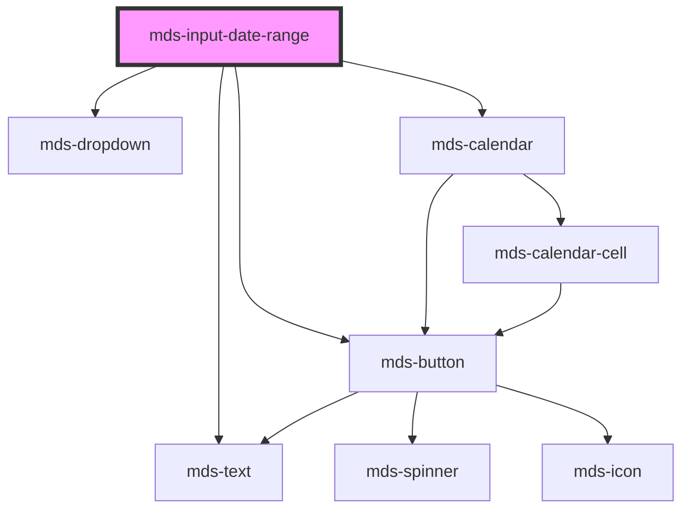

# mds-input-date-range

<!-- Auto Generated Below -->

## Properties

| Property    | Attribute    | Description                                                                 | Type             | Default |
| ----------- | ------------ | --------------------------------------------------------------------------- | ---------------- | ------- |
| `delay`     | `delay`      | Specifies the delay in milliseconds before closing the calendar dropdown    | `number`         | `500`   |
| `endDate`   | `end-date`   | Specifies the end date of the range                                         | `string`         | `''`    |
| `max`       | `max`        | Specifies the max date of the range, user cannot set dates after this date  | `null \| string` | `null`  |
| `min`       | `min`        | Specifies the min date of the range, user cannot set dates before this date | `null \| string` | `null`  |
| `startDate` | `start-date` | Specifies the start date of the range                                       | `string`         | `''`    |

## Events

| Event               | Description | Type                                                   |
| ------------------- | ----------- | ------------------------------------------------------ |
| `dateRangeSelected` |             | `CustomEvent<{ startDate: string; endDate: string; }>` |

## Methods

### `preselect(event: EventDate) => Promise<void>`

#### Parameters

| Name    | Type        | Description |
| ------- | ----------- | ----------- |
| `event` | `EventDate` |             |

#### Returns

Type: `Promise<void>`

## Dependencies

### Depends on

- [mds-text](../mds-text)
- [mds-button](../mds-button)
- [mds-dropdown](../mds-dropdown)
- [mds-calendar](../mds-calendar)

### Graph

----------------------------------------------

Built with love @ [Gruppo Maggioli](https://www.maggioli.com) from [R&D Department](https://www.maggioli.com/it-it/chi-siamo/ricerca-sviluppo)
