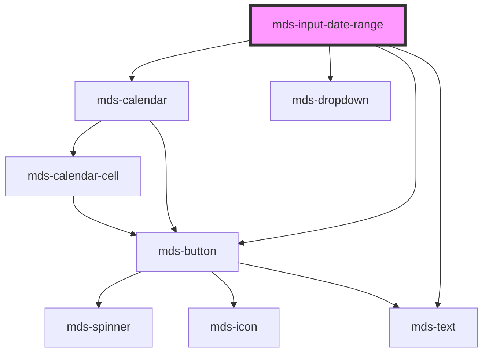

# mds-input-date-range

<!-- Auto Generated Below -->

## Properties

| Property       | Attribute       | Description                                                                                                             | Type                  | Default     |
| -------------- | --------------- | ----------------------------------------------------------------------------------------------------------------------- | --------------------- | ----------- |
| `delay`        | `delay`         | Specifies the delay in milliseconds before closing the calendar dropdown, if the value is 0 the dropdown will not close | `number`              | `500`       |
| `dualCalendar` | `dual-calendar` | Enables the linked dual-calendar range picker behavior.                                                                 | `boolean`             | `false`     |
| `endDate`      | `end-date`      | Specifies the end date of the range                                                                                     | `string`              | `''`        |
| `max`          | `max`           | Specifies the max date of the range, user cannot set dates after this date                                              | `null \| string`      | `null`      |
| `min`          | `min`           | Specifies the min date of the range, user cannot set dates before this date                                             | `null \| string`      | `null`      |
| `name`         | `name`          | Is needed to reference the form data after the form is submitted                                                        | `string \| undefined` | `undefined` |
| `startDate`    | `start-date`    | Specifies the start date of the range                                                                                   | `string`              | `''`        |

## Events

| Event                          | Description | Type                                                   |
| ------------------------------ | ----------- | ------------------------------------------------------ |
| `mdsInputDateRangeSelect`      |             | `CustomEvent<{ startDate: string; endDate: string; }>` |
| `mdsInputDateRangeValueChange` |             | `CustomEvent<{ startDate: string; endDate: string; }>` |

## Methods

### `preselect(event: EventDate) => Promise<void>`

#### Parameters

| Name    | Type        | Description |
| ------- | ----------- | ----------- |
| `event` | `EventDate` |             |

#### Returns

Type: `Promise<void>`

### `updateLang() => Promise<void>`

#### Returns

Type: `Promise<void>`

## CSS Custom Properties

| Name                                                    | Description                                                             |
| ------------------------------------------------------- | ----------------------------------------------------------------------- |
| `--mds-input-date-range-background`                     | Sets the background-color of the component                              |
| `--mds-input-date-range-fields-firefox-justify-content` | Sets the justify-content of the component in Firefox                    |
| `--mds-input-date-range-fields-gap`                     | Sets the gap between the fields of the component                        |
| `--mds-input-date-range-icon-color`                     | Sets the icon color of the component                                    |
| `--mds-input-date-range-ring`                           | Sets the box-shadow of the component's input to perform the ring effect |
| `--mds-input-date-range-shadow`                         | Sets the box-shadow of the component's input                            |
| `--mds-input-date-range-variant-color`                  | Sets the variant colors of the component                                |

## Dependencies

### Depends on

- [mds-calendar](../mds-calendar)
- [mds-text](../mds-text)
- [mds-button](../mds-button)
- [mds-dropdown](../mds-dropdown)

### Graph

----------------------------------------------

Built with love @ [Gruppo Maggioli](https://www.maggioli.com) from [R&D Department](https://www.maggioli.com/it-it/chi-siamo/ricerca-sviluppo)
