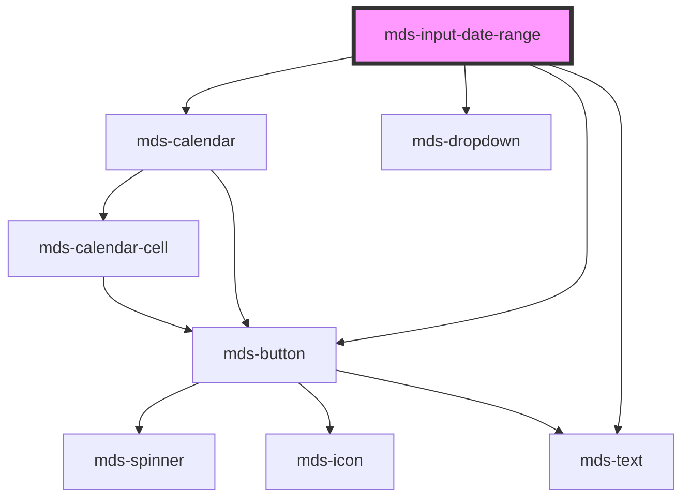

# mds-input-date-range


<!-- Auto Generated Below -->


## Usage

### 1. Description

The `<mds-input-date-range>` web component is the Magma Design System control for capturing a start/end date pair, composing two slotted `<mds-input-date>` fields with a shared pop-up `mds-calendar` (in range-picker mode) and optional quick-pick presets. It is a form-associated compound parent that orchestrates its children rather than rendering its own native inputs.

#### Semantic Behavior

- **Compound parent**: Expects exactly two `<mds-input-date>` children assigned to the `start` and `end` named slots; the host keeps both in sync as a single range - it is not meant to be used with a default (text) slot.
- **Form association**: The submitted value is a JSON string `{ startDate, endDate }`; an empty range submits no value. On form reset it restores the start/end dates present at first load.
- **Range coercion**: When both dates are valid and the end falls before the start, the end is snapped to equal the start, so the committed range is never inverted.
- **Min/max guard**: If `max` is earlier than `min` at load, `max` is clamped up to `min`; both bounds are forwarded to the calendar to block out-of-range selection.
- **Commit on blur**: Leaving the component validates the range, syncs the form value, and - when both dates are valid - emits selection.
- **Calendar selection**: Picking a complete range in the pop-up calendar emits selection and, unless `delay` is `0`, auto-closes the dropdown after the delay.
- **Preselection sync**: Slotted `mds-input-date-range-preselection` children act as quick-picks; activating one applies its range, and any external/calendar change re-evaluates which preset (if any) is marked selected.
- **Emitted events**: `mdsInputDateRangeValueChange` fires when a full, valid range is committed (calendar pick or focus-out with two valid dates) and either bound actually changed since the last emit.
- **Focus management**: Clicking the host or either field label focuses the corresponding date input; a built-in calendar icon button toggles the calendar dropdown.
- **Localization**: The "from"/"to" field labels and the calendar honor the resolved language (el/en/es/it).

#### Properties & Visual Configurations

- **`startDate` / `endDate`** are the controlled range bounds in ISO `YYYY-MM-DD` form; changing them externally re-syncs the slotted inputs and the calendar.
- **`min` / `max`** define the selectable window and are enforced both in the calendar and via the coercion rules above.
- **`delay`** is the auto-close grace period (ms) after a complete selection; set it to `0` to keep the calendar open until the user dismisses it manually.


### 2. Pattern

Correct and idiomatic ways to use the `<mds-input-date-range>` component, ordered from most common to most specialized. Patterns assume a working knowledge of the slot conventions documented in [`docs/COMPONENTS.md`](../../../../../../docs/COMPONENTS.md) and the generic stencil rules in [`projects/stencil/SPEC.md`](../../../../SPEC.md).

#### Minimal Range Picker

The canonical form. Slot one [`mds-input-date`](../../mds-input-date) as `start` and another as `end`; the host wires them together, drives the shared calendar, and handles range validation automatically.

```html
<mds-input-date-range>
  <mds-input-date slot="start"></mds-input-date>
  <mds-input-date slot="end"></mds-input-date>
</mds-input-date-range>
```

#### Pre-filling the Range

Use the `start-date` and `end-date` attributes to set an initial selection. Both expect ISO `YYYY-MM-DD` strings. Changing them later re-syncs the slotted inputs and the calendar automatically.

```html
<mds-input-date-range start-date="2026-01-01" end-date="2026-01-31">
  <mds-input-date slot="start"></mds-input-date>
  <mds-input-date slot="end"></mds-input-date>
</mds-input-date-range>
```

#### Constraining the Selectable Window

Use `min` and `max` to block out-of-window dates in both the text inputs and the calendar. Both are ISO `YYYY-MM-DD` strings.

```html
<mds-input-date-range min="2026-01-01" max="2026-12-31">
  <mds-input-date slot="start"></mds-input-date>
  <mds-input-date slot="end"></mds-input-date>
</mds-input-date-range>
```

#### Listening to Range Events

`mdsInputDateRangeValueChange` fires when a full, valid range is committed (calendar pick or focus-out with two valid dates) and either bound actually changed since the last emit. It delivers `{ startDate, endDate }` in `event.detail`.

```html
<mds-input-date-range id="periodo">
  <mds-input-date slot="start"></mds-input-date>
  <mds-input-date slot="end"></mds-input-date>
</mds-input-date-range>

<script>
  document.querySelector('#periodo').addEventListener('mdsInputDateRangeValueChange', (e) => {
    console.log('Intervallo selezionato:', e.detail.startDate, '-', e.detail.endDate);
  });
</script>
```

#### Form Participation

`<mds-input-date-range>` is form-associated. Add `name` and place it inside a `<form>`; the submitted value is a JSON string `{ startDate, endDate }`. An empty range submits no value. Form reset restores the dates set at first load.

```html
<form action="/filtra" method="get">
  <mds-input-date-range name="periodo" start-date="2026-01-01" end-date="2026-01-31">
    <mds-input-date slot="start"></mds-input-date>
    <mds-input-date slot="end"></mds-input-date>
  </mds-input-date-range>
  <mds-button type="submit" label="Applica filtro" variant="primary" tone="strong"></mds-button>
  <mds-button type="reset" label="Reimposta" variant="dark" tone="outline"></mds-button>
</form>
```

#### Quick-Pick Preselections

Slot one or more [`mds-input-date-range-preselection`](../../mds-input-date-range-preselection) elements into the component. They appear inside the calendar dropdown and act as one-click range shortcuts. The host marks the matching preset as selected whenever the current range matches.

```html
<mds-input-date-range>
  <mds-input-date slot="start"></mds-input-date>
  <mds-input-date slot="end"></mds-input-date>
  <mds-input-date-range-preselection start="2026-06-02" end="2026-06-08">
    Questa settimana
  </mds-input-date-range-preselection>
  <mds-input-date-range-preselection start="2026-06-01" end="2026-06-30">
    Questo mese
  </mds-input-date-range-preselection>
</mds-input-date-range>
```

#### Controlling the Auto-Close Delay

By default the calendar closes 500 ms after a complete range is picked. Set `delay="0"` to keep it open until the user dismisses it manually, or increase the value for a longer grace period.

```html
<!-- Keep the calendar open after selection -->
<mds-input-date-range delay="0">
  <mds-input-date slot="start"></mds-input-date>
  <mds-input-date slot="end"></mds-input-date>
</mds-input-date-range>

<!-- Longer grace period: 1 second -->
<mds-input-date-range delay="1000">
  <mds-input-date slot="start"></mds-input-date>
  <mds-input-date slot="end"></mds-input-date>
</mds-input-date-range>
```

#### Styling Customization

Style the component only through its documented `--mds-input-date-range-*` CSS custom properties. Set them on the host or a parent selector; use Magma color tokens via `rgb(var(--<token>))` so dark mode keeps working.

```css
.filtro-avanzato mds-input-date-range {
  --mds-input-date-range-background: rgb(var(--tone-neutral-02));
  --mds-input-date-range-icon-color: rgb(var(--variant-secondary-03));
  --mds-input-date-range-fields-gap: 0 var(--spacing-400);
}
```


### 3. Antipattern

Common incorrect uses of `<mds-input-date-range>`. Each entry pairs the wrong form with the right one and a one-line reason. System-wide rules (boolean-as-string, shadow piercing, Tailwind color utilities, raw native event listening) live in [`docs/COMPONENTS.md`](../../../../../../docs/COMPONENTS.md#system-level-anti-patterns) - they apply here too but are not repeated.

#### Do Not Omit the Named Slots

The host renders two named slots (`start` and `end`) and wires them together internally. Without slotted `<mds-input-date>` children the component has no visible inputs and no data to commit.

```html
<!-- 🚫 INCORRECT -->
<mds-input-date-range start-date="2026-01-01" end-date="2026-01-31">
</mds-input-date-range>

<!-- ✅ CORRECT -->
<mds-input-date-range start-date="2026-01-01" end-date="2026-01-31">
  <mds-input-date slot="start"></mds-input-date>
  <mds-input-date slot="end"></mds-input-date>
</mds-input-date-range>
```

#### Do Not Slot Raw `<input>` Elements

The `start` and `end` slots expect [`mds-input-date`](../../mds-input-date) children. The host calls `.setValue()` and `.focusInput()` on the assigned element; a native `<input>` does not expose those methods and will break internal orchestration.

```html
<!-- 🚫 INCORRECT -->
<mds-input-date-range>
  <input type="date" slot="start" />
  <input type="date" slot="end" />
</mds-input-date-range>

<!-- ✅ CORRECT -->
<mds-input-date-range>
  <mds-input-date slot="start"></mds-input-date>
  <mds-input-date slot="end"></mds-input-date>
</mds-input-date-range>
```

#### Do Not Use Non-ISO Date Strings

`startDate`, `endDate`, `min`, and `max` all require `YYYY-MM-DD` ISO format. Passing a locale-formatted string (e.g. `"01/06/2026"`) is silently invalid for Luxon's `DateTime.fromISO()` and leaves the range empty or unguarded.

```html
<!-- 🚫 INCORRECT -->
<mds-input-date-range start-date="01/06/2026" end-date="30/06/2026" min="01/01/2026">
  <mds-input-date slot="start"></mds-input-date>
  <mds-input-date slot="end"></mds-input-date>
</mds-input-date-range>

<!-- ✅ CORRECT -->
<mds-input-date-range start-date="2026-06-01" end-date="2026-06-30" min="2026-01-01">
  <mds-input-date slot="start"></mds-input-date>
  <mds-input-date slot="end"></mds-input-date>
</mds-input-date-range>
```

#### Do Not Listen to Native `change` or `input` Events

The component emits `mdsInputDateRangeValueChange` as a documented custom event. Native `change` / `input` events originate from inside the shadow DOM and do not bubble out reliably.

```html
<!-- 🚫 INCORRECT -->
<mds-input-date-range id="range">
  <mds-input-date slot="start"></mds-input-date>
  <mds-input-date slot="end"></mds-input-date>
</mds-input-date-range>
<script>
  document.querySelector('#range').addEventListener('change', handler);
</script>

<!-- ✅ CORRECT -->
<mds-input-date-range id="range">
  <mds-input-date slot="start"></mds-input-date>
  <mds-input-date slot="end"></mds-input-date>
</mds-input-date-range>
<script>
  document.querySelector('#range').addEventListener('mdsInputDateRangeValueChange', handler);
</script>
```

#### Do Not Set `delay="false"` to Disable Auto-Close

`delay` is a numeric prop, not a boolean. Setting it to the string `"false"` is truthy and parsed as `NaN`, which produces unexpected behavior. Use `delay="0"` to keep the calendar open after selection.

```html
<!-- 🚫 INCORRECT -->
<mds-input-date-range delay="false">
  <mds-input-date slot="start"></mds-input-date>
  <mds-input-date slot="end"></mds-input-date>
</mds-input-date-range>

<!-- ✅ CORRECT -->
<mds-input-date-range delay="0">
  <mds-input-date slot="start"></mds-input-date>
  <mds-input-date slot="end"></mds-input-date>
</mds-input-date-range>
```

#### Do Not Slot Preselection Elements Without the Component's Calendar

[`mds-input-date-range-preselection`](../../mds-input-date-range-preselection) children must be direct slotted children of `<mds-input-date-range>`. Placing them outside the component, or inside a wrapper div, breaks the internal query that wires preset clicks to the range.

```html
<!-- 🚫 INCORRECT -->
<mds-input-date-range>
  <mds-input-date slot="start"></mds-input-date>
  <mds-input-date slot="end"></mds-input-date>
</mds-input-date-range>
<mds-input-date-range-preselection start="2026-06-01" end="2026-06-30">
  Questo mese
</mds-input-date-range-preselection>

<!-- ✅ CORRECT -->
<mds-input-date-range>
  <mds-input-date slot="start"></mds-input-date>
  <mds-input-date slot="end"></mds-input-date>
  <mds-input-date-range-preselection start="2026-06-01" end="2026-06-30">
    Questo mese
  </mds-input-date-range-preselection>
</mds-input-date-range>
```

#### Do Not Omit `name` When Inside a Form

Without `name` the component is form-associated but submits no named field, so the date range is invisible to the server and to `FormData`.

```html
<!-- 🚫 INCORRECT -->
<form action="/filtra" method="get">
  <mds-input-date-range>
    <mds-input-date slot="start"></mds-input-date>
    <mds-input-date slot="end"></mds-input-date>
  </mds-input-date-range>
</form>

<!-- ✅ CORRECT -->
<form action="/filtra" method="get">
  <mds-input-date-range name="periodo">
    <mds-input-date slot="start"></mds-input-date>
    <mds-input-date slot="end"></mds-input-date>
  </mds-input-date-range>
</form>
```


## Properties

| Property       | Attribute       | Description                                                                                                             | Type                  | Default     |
| -------------- | --------------- | ----------------------------------------------------------------------------------------------------------------------- | --------------------- | ----------- |
| `delay`        | `delay`         | Specifies the delay in milliseconds before closing the calendar dropdown, if the value is 0 the dropdown will not close | `number`              | `500`       |
| `dualCalendar` | `dual-calendar` | Enables the linked dual-calendar range picker behavior.                                                                 | `boolean`             | `false`     |
| `endDate`      | `end-date`      | Specifies the end date of the range                                                                                     | `string`              | `''`        |
| `max`          | `max`           | Specifies the max date of the range, user cannot set dates after this date                                              | `null \| string`      | `null`      |
| `min`          | `min`           | Specifies the min date of the range, user cannot set dates before this date                                             | `null \| string`      | `null`      |
| `name`         | `name`          | Is needed to reference the form data after the form is submitted                                                        | `string \| undefined` | `undefined` |
| `startDate`    | `start-date`    | Specifies the start date of the range                                                                                   | `string`              | `''`        |


## Events

| Event                          | Description                                          | Type                                                   |
| ------------------------------ | ---------------------------------------------------- | ------------------------------------------------------ |
| `mdsInputDateRangeValueChange` | Emitted when the selected start or end date changes. | `CustomEvent<{ startDate: string; endDate: string; }>` |


## Methods

### `preselect(event: EventDate) => Promise<void>`

Applies the given preselection range to the input.

#### Parameters

| Name    | Type        | Description                     |
| ------- | ----------- | ------------------------------- |
| `event` | `EventDate` | the preselection range to apply |

#### Returns

Type: `Promise<void>`


### `updateLang() => Promise<void>`

Updates the component's texts to the locale currently set on the host element.

#### Returns

Type: `Promise<void>`


## Slots

| Slot                      | Description                                       |
| ------------------------- | ------------------------------------------------- |
| `"calendar-preselection"` | Add `HTML elements` or `components` to this slot. |
| `"end"`                   | Add `HTML elements` or `components` to this slot. |
| `"start"`                 | Add `HTML elements` or `components` to this slot. |


## CSS Custom Properties

| Name                                                    | Description                                                             |
| ------------------------------------------------------- | ----------------------------------------------------------------------- |
| `--mds-input-date-range-background`                     | Sets the background-color of the component                              |
| `--mds-input-date-range-calendar-width`                 | Sets the width of each calendar shown in the dropdown                   |
| `--mds-input-date-range-fields-firefox-justify-content` | Sets the justify-content of the component in Firefox                    |
| `--mds-input-date-range-fields-gap`                     | Sets the gap between the fields of the component                        |
| `--mds-input-date-range-icon-color`                     | Sets the icon color of the component                                    |
| `--mds-input-date-range-ring`                           | Sets the box-shadow of the component's input to perform the ring effect |
| `--mds-input-date-range-shadow`                         | Sets the box-shadow of the component's input                            |
| `--mds-input-date-range-variant-color-rgb`              | Sets the variant colors of the component                                |


## Dependencies

### Depends on

- [mds-calendar](../mds-calendar)
- [mds-text](../mds-text)
- [mds-button](../mds-button)
- [mds-dropdown](../mds-dropdown)

### Graph


----------------------------------------------

Built with love @ [Gruppo Maggioli](https://www.maggioli.com) from [R&D Department](https://www.maggioli.com/it-it/chi-siamo/ricerca-sviluppo)
