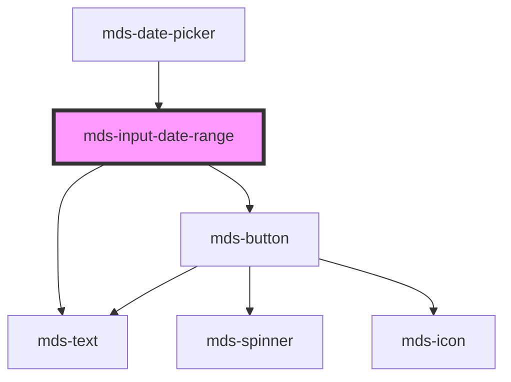

# mds-input-date-range

<!-- Auto Generated Below -->

## Properties

| Property    | Attribute    | Description | Type     | Default |
| ----------- | ------------ | ----------- | -------- | ------- |
| `endDate`   | `end-date`   |             | `string` | `''`    |
| `startDate` | `start-date` |             | `string` | `''`    |

## Events

| Event                 | Description | Type                   |
| --------------------- | ----------- | ---------------------- |
| `buttonToggleEmitter` |             | `CustomEvent<boolean>` |

## Dependencies

### Used by

 - [mds-date-picker](../mds-date-picker)

### Depends on

- [mds-text](../mds-text)
- [mds-button](../mds-button)

### Graph

----------------------------------------------

Built with love @ [Gruppo Maggioli](https://www.maggioli.com) from [R&D Department](https://www.maggioli.com/it-it/chi-siamo/ricerca-sviluppo)
