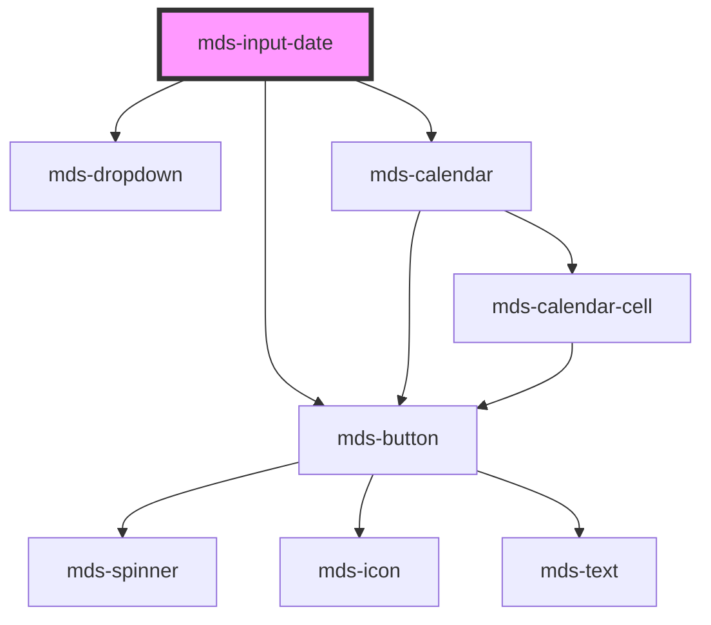

# mds-input-date

<!-- Auto Generated Below -->

## Properties

| Property | Attribute | Description                                                                                                             | Type             | Default |
| -------- | --------- | ----------------------------------------------------------------------------------------------------------------------- | ---------------- | ------- |
| `delay`  | `delay`   | Specifies the delay in milliseconds before closing the calendar dropdown, if the value is 0 the dropdown will not close | `number`         | `500`   |
| `max`    | `max`     | Specifies the max date of the range, user cannot set dates after this date                                              | `null \| string` | `null`  |
| `min`    | `min`     | Specifies the min date of the range, user cannot set dates before this date                                             | `null \| string` | `null`  |
| `value`  | `value`   | Specifies the value of the input                                                                                        | `string`         | `''`    |

## Events

| Event                | Description | Type                  |
| -------------------- | ----------- | --------------------- |
| `mdsInputDateSelect` |             | `CustomEvent<string>` |

## Methods

### `focusInput() => Promise<void>`

#### Returns

Type: `Promise<void>`

### `setValue(value: string) => Promise<void>`

#### Parameters

| Name    | Type     | Description |
| ------- | -------- | ----------- |
| `value` | `string` |             |

#### Returns

Type: `Promise<void>`

### `updateLang() => Promise<void>`

#### Returns

Type: `Promise<void>`

## Shadow Parts

| Part           | Description |
| -------------- | ----------- |
| `"input-date"` |             |

## Dependencies

### Depends on

- [mds-button](../mds-button)
- [mds-dropdown](../mds-dropdown)
- [mds-calendar](../mds-calendar)

### Graph

----------------------------------------------

Built with love @ [Gruppo Maggioli](https://www.maggioli.com) from [R&D Department](https://www.maggioli.com/it-it/chi-siamo/ricerca-sviluppo)
