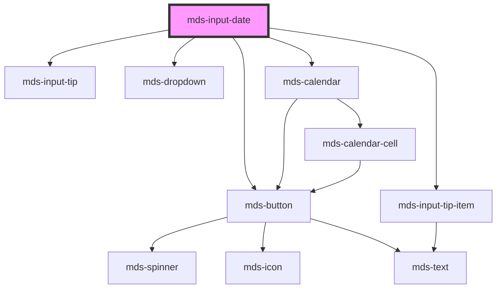

# mds-input-date

<!-- Auto Generated Below -->

## Properties

| Property   | Attribute  | Description                                                                                                             | Type                                                                            | Default     |
| ---------- | ---------- | ----------------------------------------------------------------------------------------------------------------------- | ------------------------------------------------------------------------------- | ----------- |
| `delay`    | `delay`    | Specifies the delay in milliseconds before closing the calendar dropdown, if the value is 0 the dropdown will not close | `number`                                                                        | `500`       |
| `disabled` | `disabled` | If true, the element is displayed as disabled                                                                           | `boolean \| undefined`                                                          | `false`     |
| `max`      | `max`      | Specifies the max date of the range, user cannot set dates after this date                                              | `null \| string`                                                                | `null`      |
| `min`      | `min`      | Specifies the min date of the range, user cannot set dates before this date                                             | `null \| string`                                                                | `null`      |
| `name`     | `name`     | Is needed to reference the form data after the form is submitted                                                        | `string \| undefined`                                                           | `undefined` |
| `readonly` | `readonly` | Specifies that the element is read-only                                                                                 | `boolean \| undefined`                                                          | `false`     |
| `required` | `required` | Specifies that the element must be filled out before submitting the form                                                | `boolean \| undefined`                                                          | `false`     |
| `value`    | `value`    | Specifies the value of the input                                                                                        | `string`                                                                        | `''`        |
| `variant`  | `variant`  | Sets the variant of the input field                                                                                     | `"ai" \| "error" \| "info" \| "primary" \| "success" \| "warning" \| undefined` | `'primary'` |

## Events

| Event                | Description                                           | Type                   |
| -------------------- | ----------------------------------------------------- | ---------------------- |
| `mdsInputDateSelect` |                                                       | `CustomEvent<string>`  |
| `mdsInputValidation` | Emits a boolean event when a input execute validation | `CustomEvent<boolean>` |

## Methods

### `focusInput() => Promise<void>`

#### Returns

Type: `Promise<void>`

### `getErrors() => Promise<MdsValidationErrors | null>`

#### Returns

Type: `Promise<MdsValidationErrors | null>`

### `setValue(value: string) => Promise<void>`

#### Parameters

| Name    | Type     | Description |
| ------- | -------- | ----------- |
| `value` | `string` |             |

#### Returns

Type: `Promise<void>`

### `updateLang() => Promise<void>`

#### Returns

Type: `Promise<void>`

## Shadow Parts

| Part           | Description |
| -------------- | ----------- |
| `"input-date"` |             |

## Dependencies

### Depends on

- [mds-button](../mds-button)
- [mds-input-tip](../mds-input-tip)
- [mds-input-tip-item](../mds-input-tip-item)
- [mds-dropdown](../mds-dropdown)
- [mds-calendar](../mds-calendar)

### Graph

----------------------------------------------

Built with love @ [Gruppo Maggioli](https://www.maggioli.com) from [R&D Department](https://www.maggioli.com/it-it/chi-siamo/ricerca-sviluppo)
