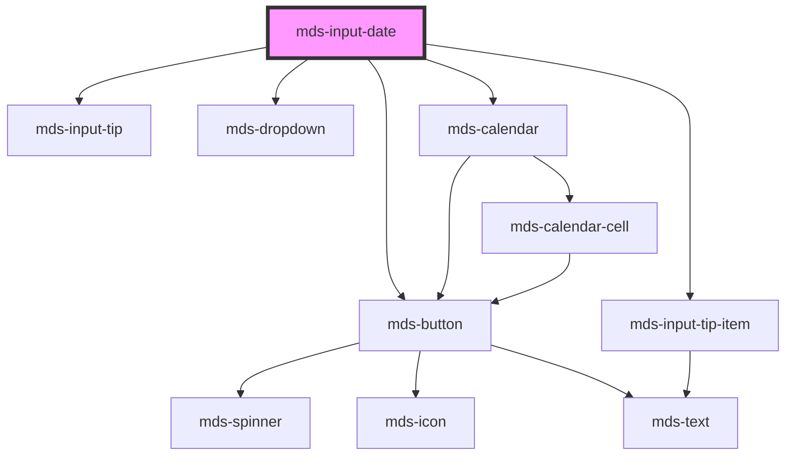

# mds-input-date


<!-- Auto Generated Below -->


## Usage

### 1. Description

The `<mds-input-date>` web component is the Magma Design System control for capturing a single calendar date. It wraps a native `<input type="date">`, adding form association, ISO value validation against an optional `min`/`max` range, contextual tips, and a button-triggered calendar dropdown for visual date picking.

#### Semantic Behavior

- **Form association**: The host participates natively in form submission and exposes its `value` under `name`; on form reset it clears the submitted value.
- **ISO value contract**: `value`, `min`, and `max` are all ISO date strings (`YYYY-MM-DD`); other formats are not accepted.
- **Validation on change**: Every value change runs validation and emits `mdsInputValidation` with a boolean. When the date is invalid (and `required`) or falls outside the `min`/`max` range, the component forces `variant` to `'error'` and submits no value; otherwise it restores `'primary'` and submits the value.
- **Range self-correction**: If `max` is earlier than `min` at load, `max` is snapped to equal `min`.
- **Selection event**: `mdsInputDateSelect` fires with the new string value whenever `value` changes, whether typed or picked from the calendar.
- **Calendar dropdown**: The trailing calendar button opens a single-date calendar; picking a day writes back the value and, after `delay`, auto-closes.
- **Slotted mode**: When the host carries a `slot` attribute it is treated as embedded - the calendar button, dropdown, and calendar are not rendered, leaving only the bare input for composition inside a larger field.
- **Contextual tips**: A tip surfaces `disabled`, `readonly`, and `required` states; the required tip expands on focus and reflects success once the value is valid.
- **Read-only**: A read-only field auto-selects its text on focus instead of allowing edits.

#### Properties & Visual Configurations

The shared `variant` ladder is defined in [`projects/stencil/SPEC.md`](../../../../SPEC.md#tone-and-variant-system). Note that `variant` is mutable here: the component overrides it to `'error'` / `'primary'` as validation dictates, so an externally set variant is not authoritative once the user interacts.

#### Other behavioral props

- **`min`** / **`max`** bound the selectable range; dates outside it invalidate the field rather than being silently clamped.
- **`delay`** is the milliseconds to wait before auto-closing the calendar dropdown after a pick; setting it to `0` keeps the dropdown open.
- **`required`** makes an empty or invalid value fail validation and drives the required/required-success tip.


### 2. Pattern

Correct and idiomatic ways to use the `<mds-input-date>` component, ordered from most common to most specialized. Patterns assume a working knowledge of the variant ladder documented in [`docs/COMPONENTS.md`](../../../../../../docs/COMPONENTS.md) and the generic stencil rules in [`projects/stencil/SPEC.md`](../../../../SPEC.md).

#### Basic Date Input

The simplest form. Wrap in [`mds-input-field`](../../mds-input-field) to attach a visible label. Use `name` so the value is submitted with the form.

```html
<mds-input-field label="Data di nascita">
  <mds-input-date name="birthdate" slot="field"></mds-input-date>
</mds-input-field>
```

#### Pre-filled Value

Set `value` to an ISO date string (`YYYY-MM-DD`) to initialize the picker with a known date. Do not use other date formats.

```html
<mds-input-date name="dataScadenza" value="2026-12-31"></mds-input-date>
```

#### Required Field

Add `required` to make an empty or invalid date fail validation. The component surfaces a tip on focus and auto-flips `variant` to `'error'` until the user enters a valid date.

```html
<mds-input-field label="Data di inizio *">
  <mds-input-date name="startDate" required slot="field"></mds-input-date>
</mds-input-field>
```

#### Bounded Date Range

Use `min` and `max` (both ISO strings) to restrict the selectable range. Dates outside the range invalidate the field and emit `mdsInputValidation` with `false`. If `max` is earlier than `min` at load time, the component snaps `max` to equal `min`.

```html
<mds-input-date
  name="dataSopralluogo"
  min="2026-01-01"
  max="2026-12-31"
></mds-input-date>
```

#### Listening to Value Changes

Listen to `mdsInputDateSelect` (fires with the new ISO string) for every value change - whether typed or picked from the calendar. Listen to `mdsInputValidation` to react to validity changes.

```html
<mds-input-date id="picker" name="dataEvento"></mds-input-date>

<script>
  const picker = document.getElementById('picker');

  picker.addEventListener('mdsInputDateSelect', (e) => {
    console.log('Data selezionata:', e.detail); // "2026-06-15"
  });

  picker.addEventListener('mdsInputValidation', (e) => {
    console.log('Valido:', e.detail); // true | false
  });
</script>
```

#### Programmatic Value via `setValue`

Use the `setValue` method to set the value from JavaScript; it runs validation and emits both events, identical to a user interaction.

```html
<mds-input-date id="datePicker" name="dataConsegna"></mds-input-date>

<script>
  document.getElementById('datePicker').setValue('2026-09-01');
</script>
```

#### Controlling Calendar Auto-close Delay

The calendar dropdown closes `delay` milliseconds after a date is picked (default 500 ms). Set `delay="0"` to keep it open after selection - useful when the picker is used inside a form where the user might want to confirm before the overlay disappears.

```html
<!-- Default: closes 500 ms after pick -->
<mds-input-date name="dataRiunione" delay="500"></mds-input-date>

<!-- Keep open until the user dismisses manually -->
<mds-input-date name="dataRiunione" delay="0"></mds-input-date>
```

#### Disabled and Read-only States

`disabled` blocks all interaction and removes the field from the tab sequence. `readonly` allows focus and text selection but prevents editing. Both surface a contextual tip.

```html
<!-- Disabled: no interaction at all -->
<mds-input-date name="dataArchiviazione" disabled value="2025-01-01"></mds-input-date>

<!-- Read-only: selectable, not editable -->
<mds-input-date name="dataCreazione" readonly value="2024-06-01"></mds-input-date>
```

#### Form Participation

`<mds-input-date>` is form-associated and submits its ISO value under `name`. On form reset the submitted value is cleared.

```html
<form action="/prenota" method="post">
  <mds-input-field label="Data prenotazione">
    <mds-input-date name="bookingDate" required slot="field"></mds-input-date>
  </mds-input-field>
  <mds-button type="submit" label="Conferma" variant="primary" tone="strong"></mds-button>
</form>
```

#### Slotted Mode Inside a Compound Field

When the host carries a `slot` attribute, the component renders only the bare native input - the calendar button, dropdown, and calendar are suppressed. This is the correct way to embed the date input inside [`mds-input-date-range`](../../mds-input-date-range) or a custom compound field.

```html
<mds-input-date-range>
  <mds-input-date slot="start" name="rangeStart"></mds-input-date>
  <mds-input-date slot="end" name="rangeEnd"></mds-input-date>
</mds-input-date-range>
```

#### Variant Override for External State Signalling

`variant` is driven automatically by validation (`'error'` on invalid, `'primary'` on valid), but you can set it initially to communicate an external state before the user interacts. Values follow the theme input ladder: `primary` (default), `error`, `success`, `warning`, `info`, `ai`.

```html
<!-- Pre-mark as success when the date was already validated server-side -->
<mds-input-date name="dataConferma" variant="success" value="2026-03-15"></mds-input-date>
```

#### Styling Customization

Style the component only through its documented `--mds-input-date-*` CSS custom properties. Use Magma color tokens via `rgb(var(--<token>))` so dark mode and high-contrast work automatically.

```css
.booking-widget mds-input-date {
  --mds-input-date-background: rgb(var(--tone-neutral-09));
  --mds-input-date-icon-color: rgb(var(--variant-primary-04));
  --mds-input-date-ring: 0 0 0 2px rgb(var(--variant-primary-04) / 0.5);
}
```


### 3. Antipattern

Common incorrect uses of `<mds-input-date>`. Each entry pairs the wrong form with the right one and a one-line reason. System-wide rules (boolean-as-string, shadow piercing, Tailwind color utilities, raw native event listening) live in [`docs/COMPONENTS.md`](../../../../../../docs/COMPONENTS.md#system-level-anti-patterns) - they apply here too but are not repeated.

#### Do Not Use Non-ISO Date Strings

`value`, `min`, and `max` must be ISO 8601 date strings (`YYYY-MM-DD`). Any other format is passed to `DateTime.fromISO`, which marks the date invalid and immediately trips validation.

```html
<!-- 🚫 INCORRECT -->
<mds-input-date value="31/12/2026" max="31-12-2026"></mds-input-date>

<!-- ✅ CORRECT -->
<mds-input-date value="2026-12-31" max="2026-12-31"></mds-input-date>
```

#### Do Not Hardcode `variant="error"` to Signal Validation

The component manages `variant` automatically: it sets `'error'` when validation fails and restores `'primary'` when it passes. Hardcoding `variant="error"` is overwritten on the first user interaction and does not persist.

```html
<!-- 🚫 INCORRECT -->
<mds-input-date name="dataScadenza" variant="error"></mds-input-date>

<!-- ✅ CORRECT - let validation drive variant; listen to mdsInputValidation instead -->
<mds-input-date name="dataScadenza" required></mds-input-date>
```

#### Do Not Listen to the Native `change` or `input` Events

The component emits `mdsInputDateSelect` (value string) and `mdsInputValidation` (boolean). Listening to native `change` or `input` may not bubble reliably through Shadow DOM and will miss calendar-driven picks.

```html
<!-- 🚫 INCORRECT -->
<mds-input-date id="picker" name="data"></mds-input-date>
<script>
  document.getElementById('picker').addEventListener('change', handler);
</script>

<!-- ✅ CORRECT -->
<mds-input-date id="picker" name="data"></mds-input-date>
<script>
  document.getElementById('picker').addEventListener('mdsInputDateSelect', handler);
</script>
```

#### Do Not Use a Raw `<input type="date">` as a Drop-in Replacement

Replacing `<mds-input-date>` with a plain `<input type="date">` loses form-association conventions, theming, the calendar overlay, the contextual tip, and all Magma accessibility defaults.

```html
<!-- 🚫 INCORRECT -->
<input type="date" name="dataEvento" />

<!-- ✅ CORRECT -->
<mds-input-date name="dataEvento"></mds-input-date>
```

#### Do Not Set `disabled="false"` or `readonly="false"` to Remove the State

Boolean attributes must be absent to be off. Setting them to the string `"false"` is truthy in HTML and keeps the state active.

```html
<!-- 🚫 INCORRECT -->
<mds-input-date name="data" disabled="false" readonly="false"></mds-input-date>

<!-- ✅ CORRECT - remove the attribute entirely -->
<mds-input-date name="data"></mds-input-date>
```

#### Do Not Pierce Shadow DOM to Style the Inner Input

The documented customization surface is `--mds-input-date-*` CSS custom properties plus the `::part(input-date)` part. Targeting internals with `>>>`, `/deep/`, or undocumented selectors will break on any minor release.

```css
/* 🚫 INCORRECT */
mds-input-date >>> .input {
  border: 2px solid red;
}

/* ✅ CORRECT */
mds-input-date {
  --mds-input-date-ring: 0 0 0 2px rgb(var(--status-error-04) / 0.8);
}
mds-input-date::part(input-date) {
  font-size: var(--font-size-sm);
}
```

#### Do Not Set `value` to Clear the Field

Setting `value=""` is the correct way to clear; do not set `value` to a non-ISO string expecting the component to silently ignore it - it passes through validation and trips an error state.

```html
<!-- 🚫 INCORRECT (non-ISO value to "reset") -->
<mds-input-date name="data" value="clear"></mds-input-date>

<!-- ✅ CORRECT -->
<mds-input-date name="data" value=""></mds-input-date>
```


## Properties

| Property   | Attribute  | Description                                                                                                             | Type                                                                            | Default     |
| ---------- | ---------- | ----------------------------------------------------------------------------------------------------------------------- | ------------------------------------------------------------------------------- | ----------- |
| `delay`    | `delay`    | Specifies the delay in milliseconds before closing the calendar dropdown, if the value is 0 the dropdown will not close | `number`                                                                        | `500`       |
| `disabled` | `disabled` | If true, the element is displayed as disabled                                                                           | `boolean \| undefined`                                                          | `false`     |
| `max`      | `max`      | Specifies the max date of the range, user cannot set dates after this date                                              | `null \| string`                                                                | `null`      |
| `min`      | `min`      | Specifies the min date of the range, user cannot set dates before this date                                             | `null \| string`                                                                | `null`      |
| `name`     | `name`     | Is needed to reference the form data after the form is submitted                                                        | `string \| undefined`                                                           | `undefined` |
| `readonly` | `readonly` | Specifies that the element is read-only                                                                                 | `boolean \| undefined`                                                          | `false`     |
| `required` | `required` | Specifies that the element must be filled out before submitting the form                                                | `boolean \| undefined`                                                          | `false`     |
| `value`    | `value`    | Specifies the value of the input                                                                                        | `string`                                                                        | `''`        |
| `variant`  | `variant`  | Sets the variant of the input field                                                                                     | `"ai" \| "error" \| "info" \| "primary" \| "success" \| "warning" \| undefined` | `'primary'` |


## Events

| Event                | Description                                           | Type                   |
| -------------------- | ----------------------------------------------------- | ---------------------- |
| `mdsInputDateSelect` |                                                       | `CustomEvent<string>`  |
| `mdsInputValidation` | Emits a boolean event when a input execute validation | `CustomEvent<boolean>` |


## Methods

### `focusInput() => Promise<void>`


#### Returns

Type: `Promise<void>`


### `getErrors() => Promise<MdsValidationErrors | null>`


#### Returns

Type: `Promise<MdsValidationErrors | null>`


### `setValue(value: string) => Promise<void>`


#### Parameters

| Name    | Type     | Description |
| ------- | -------- | ----------- |
| `value` | `string` |             |

#### Returns

Type: `Promise<void>`


### `updateLang() => Promise<void>`


#### Returns

Type: `Promise<void>`


## Shadow Parts

| Part           | Description |
| -------------- | ----------- |
| `"input-date"` |             |


## CSS Custom Properties

| Name                                        | Description                                         |
| ------------------------------------------- | --------------------------------------------------- |
| `--mds-input-date-background`               | The background of the date input                    |
| `--mds-input-date-field-background-empty`   | The background when the date field is empty         |
| `--mds-input-date-field-color-empty`        | The text/icon color when the date field is empty    |
| `--mds-input-date-icon-color`               | The color of the date input icon                    |
| `--mds-input-date-icon-color-rgb`           | The RGB channels used for the icon color            |
| `--mds-input-date-ring`                     | The focus ring of the date input                    |
| `--mds-input-date-shadow`                   | The shadow applied to the date input                |
| `--mds-input-date-variant-color-rgb`        | The base RGB value for the date input variant       |
| `--mds-input-tip-background`                | The background of the input tip                     |
| `--mds-input-tip-horizontal-offset`         | The horizontal offset for the input tip             |
| `--mds-input-tip-horizontal-offset-focused` | The horizontal offset when the input tip is focused |
| `--mds-input-tip-vertical-offset`           | The vertical offset for the input tip               |


## Dependencies

### Depends on

- [mds-button](../mds-button)
- [mds-input-tip](../mds-input-tip)
- [mds-input-tip-item](../mds-input-tip-item)
- [mds-dropdown](../mds-dropdown)
- [mds-calendar](../mds-calendar)

### Graph


----------------------------------------------

Built with love @ [Gruppo Maggioli](https://www.maggioli.com) from [R&D Department](https://www.maggioli.com/it-it/chi-siamo/ricerca-sviluppo)
