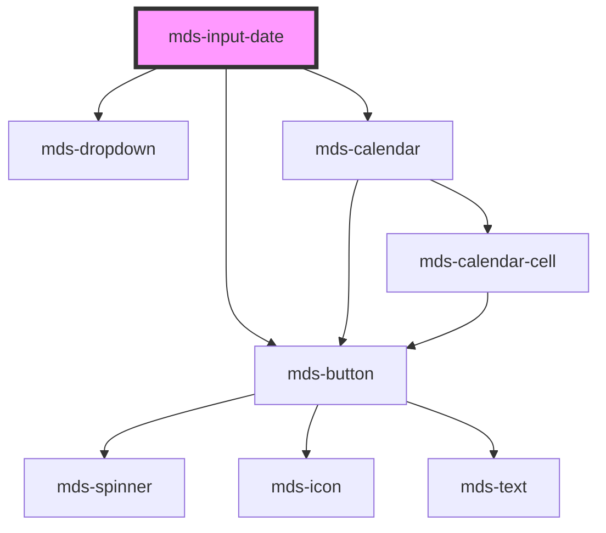

# mds-input-date

<!-- Auto Generated Below -->

## Properties

| Property | Attribute | Description | Type                   | Default     |
| -------- | --------- | ----------- | ---------------------- | ----------- |
| `empty`  | `empty`   |             | `boolean \| undefined` | `undefined` |
| `max`    | `max`     |             | `null \| string`       | `null`      |
| `min`    | `min`     |             | `null \| string`       | `null`      |
| `value`  | `value`   |             | `string`               | `''`        |

## Events

| Event         | Description | Type                  |
| ------------- | ----------- | --------------------- |
| `valueChange` |             | `CustomEvent<string>` |

## Methods

### `focusInput() => Promise<void>`

#### Returns

Type: `Promise<void>`

## CSS Custom Properties

| Name                                     | Description                                                                                                               |
| ---------------------------------------- | ------------------------------------------------------------------------------------------------------------------------- |
| `--mds-input-date-background`            | Sets the background-color of the component                                                                                |
| `--mds-input-date-icon-color`            | Sets the icon color of the component                                                                                      |
| `--mds-input-date-ring`                  | Sets the box-shadow of the component's input                                                                              |
| `--mds-input-date-shadow`                | Sets the box-shadow of the component's input                                                                              |
| `--mds-input-date-textarea-field-sizing` | Sets the height of the textarea automatically, this is an EXPERIMENTAL css property, so it couldn't work in every browser |
| `--mds-input-date-textarea-max-height`   | Sets the `max-height` of the component when attribute `type` is set to `textarea`                                         |
| `--mds-input-date-textarea-min-height`   | Sets the `min-height` of the component when attribute `type` is set to `textarea`                                         |
| `--mds-input-date-tip-background`        | Sets the background color of the tip message at the bottom right of the component                                         |
| `--mds-input-date-variant-color`         | Sets the variant colors of the component                                                                                  |

## Dependencies

### Depends on

- [mds-button](../mds-button)
- [mds-dropdown](../mds-dropdown)
- [mds-calendar](../mds-calendar)

### Graph

----------------------------------------------

Built with love @ [Gruppo Maggioli](https://www.maggioli.com) from [R&D Department](https://www.maggioli.com/it-it/chi-siamo/ricerca-sviluppo)
