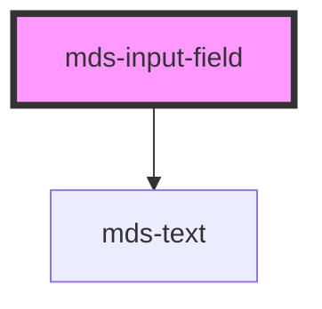

# mds-input-field

This is a web-component from Maggioli Design System [Magma](https://magma.maggiolicloud.it), built with StencilJS, TypeScript, Storybook. It's based on the web-component standard and it's designed to be agnostic from the JavaScript framework you are using.

<!-- Auto Generated Below -->

## Properties

| Property  | Attribute | Description                                                            | Type                                                       | Default     |
| --------- | --------- | ---------------------------------------------------------------------- | ---------------------------------------------------------- | ----------- |
| `label`   | `label`   | Display a text on the top of the input text field                      | `string \| undefined`                                      | `undefined` |
| `message` | `message` | Display a message at the bottom of the input text field                | `string \| undefined`                                      | `undefined` |
| `tip`     | `tip`     | Display the variant of a message at the bottom of the input text field | `string \| undefined`                                      | `undefined` |
| `variant` | `variant` | Display the variant of a message at the bottom of the input text field | `"error" \| "info" \| "success" \| "warning" \| undefined` | `undefined` |

## CSS Custom Properties

| Name                                   | Description                                                                                                                      |
| -------------------------------------- | -------------------------------------------------------------------------------------------------------------------------------- |
| `--mds-input-field-message-background` | Sets the message background color of the component, will be visible only if there is a text defined by `tip` component attribute |
| `--mds-input-field-message-color`      | Sets the message text color of the component                                                                                     |

## Dependencies

### Depends on

- [mds-text](../mds-text)

### Graph

----------------------------------------------

Built with love @ [Gruppo Maggioli](https://www.maggioli.com) from [R&D Department](https://www.maggioli.com/it-it/chi-siamo/ricerca-sviluppo)
