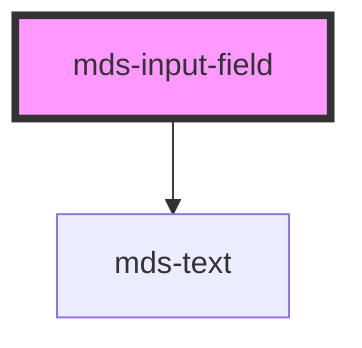

# mds-input-field


This is a web-component from Maggioli Design System [Magma](https://magma.maggiolicloud.it), built with StencilJS, TypeScript, Storybook. It's based on the web-component standard and it's designed to be agnostic from the JavaScript framework you are using.

<!-- Auto Generated Below -->


## Usage

### 1. Description

The `<mds-input-field>` web component is the form-field wrapper of the Magma Design System. It does not render an input itself; instead it decorates a slotted `<mds-input>` (or similar control) with a top label and a bottom message area, and reacts to the control's validation lifecycle. It plays the role the native `<label>` + helper-text grouping plays around an `<input>`.

#### Semantic Behavior

- **Compound parent**: The interactive control is supplied through the default slot; the field is not used standalone, and an empty slot throws `Mds input not found` at load.
- **Form association**: The field participates in the surrounding `<form>` through the control it wraps, requiring no extra wiring.
- **Validation-driven state**: It listens for the slotted control's `mdsInputValidation` event. When the control reports errors it switches `variant` to `'error'` and shows the joined error strings in `message`; otherwise it sets `variant` to `'success'` and clears `message`.
- **Message rendering**: `message` is split on `;` and each segment is rendered as a separate caption line, so multiple validation messages stack vertically.

#### Properties & Visual Configurations

- **`message`** is the helper/error text shown under the control. It is author-set initially but is overwritten by the validation cycle once the slotted control emits validation, so a manually set message persists only while the control reports no errors.
- **`variant`** drives the field's status colouring. It is not the full theme ladder: the allowed set is the input-specific variant ladder (`'ai'`, `'primary'`, plus the status values `'error'`, `'info'`, `'success'`, `'warning'`) defined in [`projects/stencil/SPEC.md`](../../../../SPEC.md#tone-and-variant-system). It defaults to `'primary'` and is normally managed automatically by validation rather than set by hand.


### 2. Pattern

Correct and idiomatic ways to use the `<mds-input-field>` component, ordered from most common to most specialized. Patterns assume a working knowledge of the variant / tone ladders documented in [`docs/COMPONENTS.md`](../../../../../../docs/COMPONENTS.md) and the generic stencil rules in [`projects/stencil/SPEC.md`](../../../../SPEC.md).

#### Basic Labeled Input

The canonical form. Wrap [`mds-input`](../../mds-input) in `<mds-input-field>` and set `label` for the visible field caption. The slot must contain exactly one `<mds-input>` - the field throws at load if the slot is empty.

```html
<mds-input-field label="Nome e cognome">
  <mds-input name="fullName" placeholder="Es: Mario Rossi"></mds-input>
</mds-input-field>
```

#### Input with a Static Helper Message

Set `message` to show a persistent hint below the control. The message disappears once the slotted input emits its first `mdsInputValidation` event, so use this only for pre-validation guidance.

```html
<mds-input-field label="Codice fiscale" message="16 caratteri alfanumerici">
  <mds-input name="cf" type="cf" placeholder="Es: MRCRSS83B21D704L"></mds-input>
</mds-input-field>
```

#### Validation-Driven State

When `<mds-input>` carries validation rules (e.g. `required`, `type="cf"`, or `pattern`), `<mds-input-field>` listens for `mdsInputValidation` and automatically sets `variant` to `'error'` (showing joined error messages) or `'success'` (clearing the message). No event wiring is needed - just add the validation attributes to the slotted input.

```html
<mds-input-field label="Indirizzo email">
  <mds-input name="email" type="email" required placeholder="Es: mario@esempio.it"></mds-input>
</mds-input-field>
```

#### Explicit Variant for Initial Status

If the field must start in a known non-default state - for example a server-side validation result rendered on page load - set `variant` directly. The validation cycle will overwrite it once the user interacts.

```html
<!-- Server returned an error before page load -->
<mds-input-field
  label="Username"
  variant="error"
  message="Username gia in uso"
>
  <mds-input name="username" value="mario.rossi"></mds-input>
</mds-input-field>
```

#### Field with an Action Button

The default slot accepts multiple elements. The first child grows to fill the available width; subsequent children shrink to their natural size. Use this to pair an input with a companion [`mds-button`](../../mds-button).

```html
<mds-input-field label="Cerca per nome">
  <mds-input name="query" placeholder="Es: Mario Rossi"></mds-input>
  <mds-button icon="mi/baseline/search" size="lg" aria-label="Cerca"></mds-button>
</mds-input-field>
```

#### Inside a Form

`<mds-input-field>` is form-associated and passes native form participation through to the slotted control. Place it inside a `<form>` with a submit button; the field requires no extra wiring.

```html
<form action="/registrazione" method="post">
  <mds-input-field label="Nome">
    <mds-input name="firstName" required placeholder="Es: Mario"></mds-input>
  </mds-input-field>

  <mds-input-field label="Cognome">
    <mds-input name="lastName" required placeholder="Es: Rossi"></mds-input>
  </mds-input-field>

  <mds-button type="submit" label="Registrati" variant="primary" tone="strong"></mds-button>
</form>
```

#### Styling Customization

Adjust the message area colors through the two documented `--mds-input-field-*` CSS custom properties. Use Magma color tokens via `rgb(var(--<token>))` so dark mode and high-contrast modes keep working.

```css
.field-highlight mds-input-field {
  --mds-input-field-message-color: rgb(var(--variant-primary-02));
  --mds-input-field-message-background: rgb(var(--variant-primary-09));
}
```


### 3. Antipattern

Common incorrect uses of `<mds-input-field>`. Each entry pairs the wrong form with the right one and a one-line reason. System-wide rules (boolean-as-string, shadow piercing, Tailwind color utilities, raw native event listening) live in [`docs/COMPONENTS.md`](../../../../../../docs/COMPONENTS.md#system-level-anti-patterns) - they apply here too but are not repeated.

#### Do Not Use It Without a Slotted Input

`<mds-input-field>` requires exactly one slotted input-compatible element. An empty slot throws `Mds input not found` at load and leaves the field non-functional. Always slot an [`mds-input`](../../mds-input) as the first child.

```html
<!-- 🚫 INCORRECT -->
<mds-input-field label="Nome"></mds-input-field>

<!-- ✅ CORRECT -->
<mds-input-field label="Nome">
  <mds-input name="firstName" placeholder="Es: Mario"></mds-input>
</mds-input-field>
```

#### Do Not Use a Native `<input>` in the Slot

The component binds to `mdsInputValidation`, which only `<mds-input>` emits. Slotting a raw `<input>` skips the validation lifecycle entirely - the field will never switch to `error` or `success`.

```html
<!-- 🚫 INCORRECT -->
<mds-input-field label="Email">
  <input type="email" name="email" required>
</mds-input-field>

<!-- ✅ CORRECT -->
<mds-input-field label="Email">
  <mds-input type="email" name="email" required></mds-input>
</mds-input-field>
```

#### Do Not Manage `variant` and `message` Manually During Validation

`variant` and `message` are mutable and will be overwritten by the validation cycle the moment the slotted control emits `mdsInputValidation`. Trying to manage them via script in parallel leads to race conditions. Set validation attributes on `<mds-input>` and let the field drive state automatically.

```html
<!-- 🚫 INCORRECT -->
<mds-input-field id="nameField" label="Nome">
  <mds-input name="firstName" required></mds-input>
</mds-input-field>
<script>
  document.getElementById('nameField').variant = 'error';
  document.getElementById('nameField').message = 'Campo obbligatorio';
</script>

<!-- ✅ CORRECT -->
<mds-input-field label="Nome">
  <mds-input name="firstName" required></mds-input>
</mds-input-field>
```

#### Do Not Listen for Native `change` or `input` Events to Detect Validation

Native DOM events (`change`, `input`) do not carry validation state and may not bubble out of shadow DOM as expected. Listen for the documented `mdsInputValidation` event on the slotted `<mds-input>` if you need to react to validation results in your own code.

```html
<!-- 🚫 INCORRECT -->
<mds-input-field label="Codice fiscale">
  <mds-input id="cfInput" name="cf" type="cf" required></mds-input>
</mds-input-field>
<script>
  document.getElementById('cfInput').addEventListener('change', handleChange);
</script>

<!-- ✅ CORRECT -->
<mds-input-field label="Codice fiscale">
  <mds-input id="cfInput" name="cf" type="cf" required></mds-input>
</mds-input-field>
<script>
  document.getElementById('cfInput').addEventListener('mdsInputValidation', handleValidation);
</script>
```

#### Do Not Apply an Invalid `variant` Value

`<mds-input-field>` uses `ThemeInputVariantType`, which only accepts `'ai'`, `'primary'`, `'error'`, `'info'`, `'success'`, and `'warning'`. Values from the broader tone ladder (e.g. `'secondary'`, `'dark'`) silently fall back to the default and produce no coloring change.

```html
<!-- 🚫 INCORRECT (variant from the full theme ladder) -->
<mds-input-field label="Stato" variant="secondary" message="Valore non valido">
  <mds-input name="stato"></mds-input>
</mds-input-field>

<!-- ✅ CORRECT -->
<mds-input-field label="Stato" variant="warning" message="Valore non valido">
  <mds-input name="stato"></mds-input>
</mds-input-field>
```

#### Do Not Pierce the Shadow DOM to Style the Message Area

The only supported customization surface is `--mds-input-field-message-color` and `--mds-input-field-message-background`, plus the `content` shadow part. Targeting internal elements via `>>>` or undocumented class names couples your code to the implementation and will break on minor releases.

```css
/* 🚫 INCORRECT */
mds-input-field >>> .message {
  color: red;
}

/* ✅ CORRECT */
mds-input-field {
  --mds-input-field-message-color: rgb(var(--status-error-02));
  --mds-input-field-message-background: rgb(var(--status-error-09));
}
```


## Properties

| Property  | Attribute | Description                                                            | Type                                                                            | Default     |
| --------- | --------- | ---------------------------------------------------------------------- | ------------------------------------------------------------------------------- | ----------- |
| `label`   | `label`   | Display a text on the top of the input text field                      | `string \| undefined`                                                           | `undefined` |
| `message` | `message` | Display a message at the bottom of the input text field                | `string \| undefined`                                                           | `undefined` |
| `variant` | `variant` | Display the variant of a message at the bottom of the input text field | `"ai" \| "error" \| "info" \| "primary" \| "success" \| "warning" \| undefined` | `'primary'` |


## Slots

| Slot | Description                                       |
| ---- | ------------------------------------------------- |
|      | Add the native input `HTML element` to this slot. |


## Shadow Parts

| Part        | Description |
| ----------- | ----------- |
| `"content"` |             |


## CSS Custom Properties

| Name                                   | Description                                                                                                                      |
| -------------------------------------- | -------------------------------------------------------------------------------------------------------------------------------- |
| `--mds-input-field-message-background` | Sets the message background color of the component, will be visible only if there is a text defined by `tip` component attribute |
| `--mds-input-field-message-color`      | Sets the message text color of the component                                                                                     |


## Dependencies

### Depends on

- [mds-text](../mds-text)

### Graph


----------------------------------------------

Built with love @ [Gruppo Maggioli](https://www.maggioli.com) from [R&D Department](https://www.maggioli.com/it-it/chi-siamo/ricerca-sviluppo)
