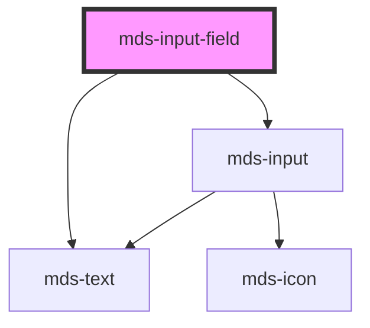

# mds-input-field

<!-- Auto Generated Below -->

## Properties

| Property       | Attribute      | Description                                                                                                     | Type                                                                                                          | Default     |
| -------------- | -------------- | --------------------------------------------------------------------------------------------------------------- | ------------------------------------------------------------------------------------------------------------- | ----------- |
| `autocomplete` | `autocomplete` | Specifies whether the element should have autocomplete enabled                                                  | `AutocompleteType \| undefined`                                                                               | `'off'`     |
| `autofocus`    | `autofocus`    | Specifies that the element should automatically get focus when the page loads                                   | `boolean`                                                                                                     | `false`     |
| `disabled`     | `disabled`     | If true, the element is displayed as disabled                                                                   | `boolean \| undefined`                                                                                        | `false`     |
| `icon`         | `icon`         | An icon displayed at the right of the input                                                                     | `string \| undefined`                                                                                         | `undefined` |
| `label`        | `label`        | Display a text on the top of the input text field                                                               | `string \| undefined`                                                                                         | `undefined` |
| `max`          | `max`          | Specifies the maximum value use it with input type="number" or type="date" Example: max="180", max="2046-12-04" | `string \| undefined`                                                                                         | `undefined` |
| `maxlength`    | `maxlength`    | Specifies the maximum number of characters allowed in an element use it with input type="number"                | `number \| undefined`                                                                                         | `undefined` |
| `message`      | `message`      | Display a message at the bottom of the input text field                                                         | `string \| undefined`                                                                                         | `undefined` |
| `min`          | `min`          | Specifies the minimum value use it with input type="number" or type="date" Example: min="-3", min="1988-04-15"  | `string \| undefined`                                                                                         | `undefined` |
| `minlength`    | `minlength`    | Specifies the minimum number of characters allowed in an element use it with input type="number"                | `number \| undefined`                                                                                         | `undefined` |
| `name`         | `name`         | Is needed to reference the form data after the form is submitted                                                | `string \| undefined`                                                                                         | `undefined` |
| `pattern`      | `pattern`      | Specifies a regular expression that element\'s value is checked against                                         | `string \| undefined`                                                                                         | `undefined` |
| `placeholder`  | `placeholder`  | Specifies a short hint that describes the expected value of the element                                         | `string`                                                                                                      | `''`        |
| `readonly`     | `readonly`     | Specifies that the element is read-only                                                                         | `boolean \| undefined`                                                                                        | `false`     |
| `required`     | `required`     | Specifies that the element must be filled out before submitting the form                                        | `boolean \| undefined`                                                                                        | `false`     |
| `step`         | `step`         | Specifies the interval between legal numbers in an input field                                                  | `string \| undefined`                                                                                         | `undefined` |
| `tip`          | `tip`          | Display the variant of a message at the bottom of the input text field                                          | `string \| undefined`                                                                                         | `undefined` |
| `type`         | `type`         | Specifies the type of input element                                                                             | `"date" \| "email" \| "number" \| "password" \| "search" \| "tel" \| "text" \| "textarea" \| "time" \| "url"` | `'text'`    |
| `validate`     | `validate`     | Specifies the type of model data to be automatically validated                                                  | `"cf" \| "email" \| "isbn" \| "piva" \| undefined`                                                            | `undefined` |
| `value`        | `value`        | Specifies the value of the input element                                                                        | `string \| undefined`                                                                                         | `''`        |
| `variant`      | `variant`      | Display the variant of a message at the bottom of the input text field                                          | `"error" \| "info" \| "success" \| "warning" \| undefined`                                                    | `undefined` |

## Events

| Event                  | Description                                                                      | Type                               |
| ---------------------- | -------------------------------------------------------------------------------- | ---------------------------------- |
| `mdsInputFieldBlur`    | Emits a void event when input element is blurred                                 | `CustomEvent<void>`                |
| `mdsInputFieldChange`  | Emits an InputValue when the value of the input element changes                  | `CustomEvent<MdsInputEventDetail>` |
| `mdsInputFieldFocus`   | Emits a void event when input element is focused                                 | `CustomEvent<void>`                |
| `mdsInputFieldKeydown` | Emits a KeyboardEvent when a keboard key is pressed on the focused input element | `CustomEvent<KeyboardEvent>`       |

## Methods

### `getInputElement() => Promise<HTMLMdsInputElement>`

Returns the native `<input>` element used under the hood.

#### Returns

Type: `Promise<HTMLMdsInputElement>`

### `setFocus() => Promise<void>`

Sets focus on the specified `my-input`.
Use this method instead
of the global `input.focus()`.

#### Returns

Type: `Promise<void>`

## Dependencies

### Depends on

- [mds-text](../mds-text)
- [mds-input](../mds-input)

### Graph

----------------------------------------------

Built with love @ [Gruppo Maggioli](https://www.maggioli.com) from [R&D Department](https://www.maggioli.com/it-it/chi-siamo/ricerca-sviluppo)
