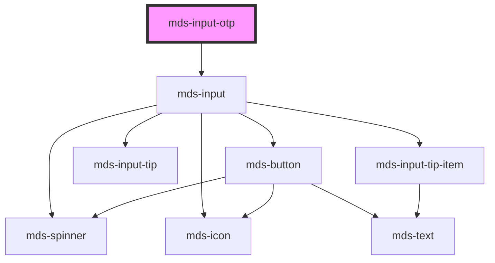

# mds-input-otp

<!-- Auto Generated Below -->

## Properties

| Property     | Attribute    | Description                                                  | Type                  | Default |
| ------------ | ------------ | ------------------------------------------------------------ | --------------------- | ------- |
| `autosubmit` | `autosubmit` | Automatically submits the form when the OTP code is complete | `boolean`             | `false` |
| `length`     | `length`     | Number of digits in the OTP code                             | `number`              | `6`     |
| `value`      | `value`      | The current value of the OTP code                            | `string \| undefined` | `''`    |

## Dependencies

### Depends on

- [mds-input](../mds-input)

### Graph

----------------------------------------------

Built with love @ [Gruppo Maggioli](https://www.maggioli.com) from [R&D Department](https://www.maggioli.com/it-it/chi-siamo/ricerca-sviluppo)
