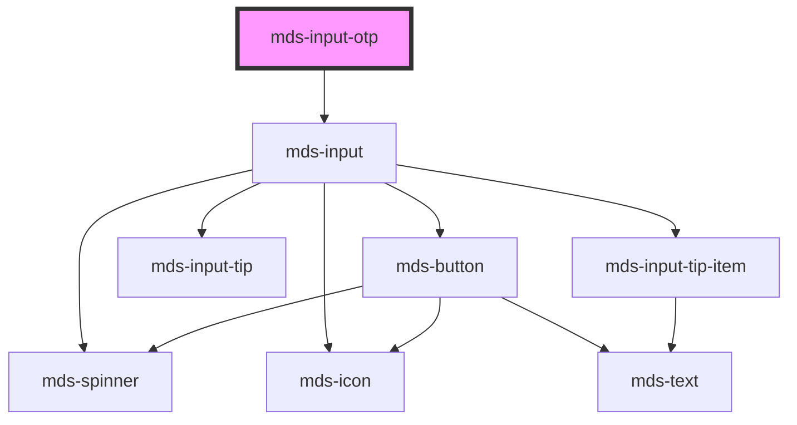

# mds-input-otp


<!-- Auto Generated Below -->


## Usage

### 1. Description

The `<mds-input-otp>` web component is the Magma Design System control for entering one-time passcodes, rendering a row of single-digit fields that together compose a single form value. It is form-associated, so it behaves like a native input whose value is the concatenated OTP code.

#### Semantic Behavior

- **Form association**: The joined digits are exposed as the form value, so it submits with the surrounding `<form>` with no extra wiring.
- **Single-digit cells**: Renders `length` digit cells, each capped at one character; the host value is the concatenation of every cell.
- **Numeric-only entry**: Non-digit keys produce no value change.
- **Auto-advance focus**: After a valid digit, focus moves to the next cell automatically; entering a digit in the last cell blurs it.
- **Paste handling**: Pasting numeric text distributes the digits across consecutive cells starting from the focused one; non-numeric pastes are ignored.
- **Completion + submit**: When all `length` digits are present and `autosubmit` is set, the owning form is submitted.

#### Properties & Visual Configurations

- **`length`** sets how many digit cells are rendered and therefore the expected code length; it doubles as the completeness threshold for auto-submit. Defaults to `6`.
- **`autosubmit`** opts into automatic form submission the moment the code is complete - use it for flows where the OTP is the only field and no explicit confirm button is needed; leave it off when the user should review or trigger submission manually.
- **`value`** holds the current concatenated code; read it to observe progress or set it to seed an initial value.


### 2. Pattern

Correct and idiomatic ways to use the `<mds-input-otp>` component, ordered from most common to most specialized. Patterns assume a working knowledge of the generic stencil rules in [`projects/stencil/SPEC.md`](../../../../SPEC.md) and the component catalogue in [`docs/COMPONENTS.md`](../../../../../../docs/COMPONENTS.md).

#### Default Six-Digit Code

The component renders six single-digit cells by default. Drop it into a form with a `name` attribute so the concatenated value is submitted as a named field.

```html
<form action="/verify" method="post">
  <mds-input-otp name="otp"></mds-input-otp>
  <mds-button type="submit" label="Verifica" variant="primary" tone="strong"></mds-button>
</form>
```

#### Custom Code Length

Set `length` to match the expected OTP length - 4 digits for a short PIN, 8 for a longer token.

```html
<!-- Four-digit PIN -->
<mds-input-otp name="pin" length="4"></mds-input-otp>

<!-- Eight-digit token -->
<mds-input-otp name="token" length="8"></mds-input-otp>
```

#### Auto-Submit on Completion

Add the `autosubmit` boolean attribute when the OTP is the only field and no explicit confirm button is needed. The owning form is submitted the moment all cells are filled - do not set `autosubmit="false"` to disable it; remove the attribute instead.

```html
<form action="/verify" method="post">
  <mds-input-otp name="otp" autosubmit></mds-input-otp>
</form>
```

#### Seeding an Initial Value

Set `value` to pre-fill the cells - useful when recovering a partially entered code or when testing with a known fixture.

```html
<mds-input-otp name="otp" value="123456"></mds-input-otp>
```

#### Reading the Value Programmatically

`value` is a reflected attribute that updates as the user types. Read it directly from the element or listen for form data.

```javascript
const otp = document.querySelector('mds-input-otp');

// Poll current state
console.log(otp.value); // e.g. "12_456" while in progress

// React on form submit
document.querySelector('form').addEventListener('submit', (e) => {
  e.preventDefault();
  const data = new FormData(e.target);
  console.log('Codice OTP:', data.get('otp'));
});
```

#### Full Authentication Flow

Combine `autosubmit` with a submit handler to verify the code and reflect the result - pair with [`mds-button`](../../mds-button) in await state while the request is in flight.

```html
<form id="otp-form" action="/auth/otp" method="post">
  <mds-input-otp name="otp" length="6" autosubmit></mds-input-otp>

  <mds-button
    id="submit-btn"
    type="submit"
    label="Conferma codice"
    variant="primary"
    tone="strong"
    disabled
  ></mds-button>
</form>

<script>
  const form = document.getElementById('otp-form');
  const btn = document.getElementById('submit-btn');
  const otpEl = form.querySelector('mds-input-otp');

  // Enable the button only once all digits are entered
  setInterval(() => {
    btn.disabled = otpEl.value.length < 6 ? true : undefined;
  }, 100);

  form.addEventListener('submit', async (e) => {
    e.preventDefault();
    btn.setAttribute('await', '');
    // ... send request, then remove await
  });
</script>
```

#### Layout Alignment

The host is an `inline-flex` container. Use a utility class to center it inside a card or modal.

```html
<div class="flex justify-center py-600">
  <mds-input-otp name="otp"></mds-input-otp>
</div>
```


### 3. Antipattern

Common incorrect uses of `<mds-input-otp>`. Each entry pairs the wrong form with the right one and a one-line reason. System-wide rules (boolean-as-string, shadow piercing, Tailwind color utilities, raw native event listening) live in [`docs/COMPONENTS.md`](../../../../../../docs/COMPONENTS.md#system-level-anti-patterns) - they apply here too but are not repeated.

#### Do Not Set `autosubmit="false"` to Disable Auto-Submit

Any non-empty string attribute is truthy in HTML and Stencil. Setting `autosubmit="false"` does not turn the feature off - it turns it on. Remove the attribute entirely to opt out.

```html
<!-- 🚫 INCORRECT -->
<mds-input-otp name="otp" autosubmit="false"></mds-input-otp>

<!-- ✅ CORRECT -->
<mds-input-otp name="otp"></mds-input-otp>
```

#### Do Not Build a Row of Native `<input>` Elements Instead

Hand-rolling digit cells with native `<input type="text" maxlength="1">` elements duplicates focus management, paste handling, and form association that `<mds-input-otp>` already provides, and breaks Magma theming.

```html
<!-- 🚫 INCORRECT -->
<div class="otp-row">
  <input type="text" maxlength="1">
  <input type="text" maxlength="1">
  <input type="text" maxlength="1">
  <input type="text" maxlength="1">
  <input type="text" maxlength="1">
  <input type="text" maxlength="1">
</div>

<!-- ✅ CORRECT -->
<mds-input-otp name="otp"></mds-input-otp>
```

#### Do Not Pierce Shadow DOM to Style Inner Cells

The inner `mds-input` cells are Shadow DOM internals. Targeting them with descendant selectors or `>>>` will break silently on any internal refactor.

```css
/* 🚫 INCORRECT */
mds-input-otp mds-input {
  --mds-input-background: red;
}
mds-input-otp >>> .input {
  border-radius: 0;
}

/* ✅ CORRECT - style the host layout only */
mds-input-otp {
  gap: var(--spacing-600);
}
```

#### Do Not Use `autosubmit` Without a Parent `<form>`

`autosubmit` calls `internals.form.requestSubmit()`. Outside a `<form>` there is no owning form, so the call is silently ignored and the expected submission never fires.

```html
<!-- 🚫 INCORRECT - no owning form, submit never fires -->
<mds-input-otp name="otp" autosubmit></mds-input-otp>

<!-- ✅ CORRECT - wrapped in a form that handles the submit -->
<form action="/verify" method="post">
  <mds-input-otp name="otp" autosubmit></mds-input-otp>
</form>
```

#### Do Not Listen for the Native `input` or `change` Event

Native DOM events may not propagate out of shadow DOM the way you expect. Read the reflected `value` attribute or use form data on submit instead.

```javascript
// 🚫 INCORRECT
document.querySelector('mds-input-otp').addEventListener('input', (e) => {
  console.log(e.target.value); // unreliable from outside shadow DOM
});

// ✅ CORRECT - read the reflected prop directly
const otpEl = document.querySelector('mds-input-otp');
document.querySelector('form').addEventListener('submit', (e) => {
  e.preventDefault();
  console.log('Codice OTP:', otpEl.value);
});
```

#### Do Not Set `length` as a Non-Integer or to Zero

`length` controls how many cells are rendered. A fractional or zero value produces no cells or the wrong number. Always pass a positive integer.

```html
<!-- 🚫 INCORRECT -->
<mds-input-otp name="otp" length="0"></mds-input-otp>
<mds-input-otp name="otp" length="4.5"></mds-input-otp>

<!-- ✅ CORRECT -->
<mds-input-otp name="otp" length="4"></mds-input-otp>
```


## Properties

| Property     | Attribute    | Description                                                  | Type                  | Default |
| ------------ | ------------ | ------------------------------------------------------------ | --------------------- | ------- |
| `autosubmit` | `autosubmit` | Automatically submits the form when the OTP code is complete | `boolean`             | `false` |
| `length`     | `length`     | Number of digits in the OTP code                             | `number`              | `6`     |
| `value`      | `value`      | The current value of the OTP code                            | `string \| undefined` | `''`    |


## Dependencies

### Depends on

- [mds-input](../mds-input)

### Graph


----------------------------------------------

Built with love @ [Gruppo Maggioli](https://www.maggioli.com) from [R&D Department](https://www.maggioli.com/it-it/chi-siamo/ricerca-sviluppo)
