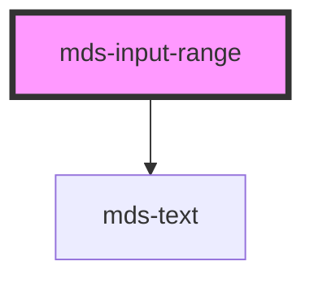

# mds-input-range

<!-- Auto Generated Below -->

## Properties

| Property | Attribute | Description                                                                                                                                      | Type                  | Default |
| -------- | --------- | ------------------------------------------------------------------------------------------------------------------------------------------------ | --------------------- | ------- |
| `max`    | `max`     | The greatest value in the range of permitted values                                                                                              | `number \| undefined` | `100`   |
| `min`    | `min`     | The lowest value in the range of permitted values                                                                                                | `number \| undefined` | `0`     |
| `step`   | `step`    | The step attribute is a number that specifies the granularity that the value must adhere to, or the special value any, which is described below. | `number \| undefined` | `1`     |
| `value`  | `value`   | The value attribute contains a number which contains a representation of the selected number.                                                    | `number \| undefined` | `50`    |

## Events

| Event                 | Description                           | Type                  |
| --------------------- | ------------------------------------- | --------------------- |
| `mdsInputRangeChange` | Emits when the input range is changed | `CustomEvent<number>` |

## CSS Custom Properties

| Name                          | Description                                      |
| ----------------------------- | ------------------------------------------------ |
| `--thumb-background`          |                                                  |
| `--thumb-size`                | Sets the thumb width and height of the component |
| `--track-background`          |                                                  |
| `--track-progress-background` |                                                  |
| `--track-size`                |                                                  |

## Dependencies

### Depends on

- [mds-text](../mds-text)

### Graph

----------------------------------------------

Built with love @ **Maggioli Informatica / R&D Department**
