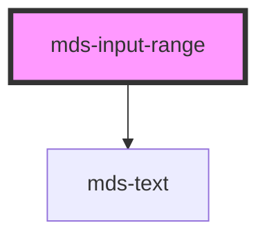

# mds-input-range


This is a web-component from Maggioli Design System [Magma](https://magma.maggiolicloud.it), built with StencilJS, TypeScript, Storybook. It's based on the web-component standard and it's designed to be agnostic from the JavaScript framework you are using.

<!-- Auto Generated Below -->


## Usage

### 1. Description

The `<mds-input-range>` web component is the Magma Design System slider control for picking a single numeric value from a continuous interval. It wraps a native `<input type="range">`, adding a labelled header, a styled track with a live progress fill, form association, and value formatting.

#### Semantic Behavior

- **Form association**: Inside a `<form>` the selected number is reported under `name` with no extra wiring.
- **Value clamping and snapping**: On input the value is clamped into `[min, max]` and snapped to the nearest `step` increment, so the committed `value` is always valid even when set programmatically out of range.
- **Decimal awareness**: The number of decimal places is derived from `step`, letting fractional steps snap correctly; a `step` of zero or negative throws.
- **Disabled state**: Blocks interaction and clears the reported form value while disabled.
- **Emitted event**: `mdsInputRangeChange` carries the new numeric value whenever `value` actually changes.
- **Accessibility**: The control takes its accessible name from the slotted label text.
- **Default slot is the label**: The default slot holds the field's text label, rendered in the header alongside the formatted current value.

#### Properties & Visual Configurations

- **`min` / `max` / `step`** define the permitted interval and granularity; `step` also controls how fractional values are snapped and how many decimals are preserved.
- **`value`** is the committed numeric selection, kept clamped and snapped - set it programmatically to move the thumb.
- **`formatValue`** is a function `(value: number) => string` for presentation only: use it to render the header value as currency, a percentage, or a unit-suffixed label without changing the underlying numeric `value`.

This component does not use the shared `variant` / `tone` ladders ([`projects/stencil/SPEC.md`](../../../../SPEC.md#tone-and-variant-system)); appearance is tuned through the documented CSS custom properties (thumb and track colors and sizes) listed in `readme.md`.


### 2. Pattern

Correct and idiomatic ways to use the `<mds-input-range>` component, ordered from most common to most specialized. Patterns assume a working knowledge of the generic stencil rules in [`projects/stencil/SPEC.md`](../../../../SPEC.md) and the catalogue in [`docs/COMPONENTS.md`](../../../../../../docs/COMPONENTS.md).

#### Basic Slider with a Label

The minimum viable form. Put the field's text label in the default slot - it is rendered in the header and used as the accessible name for the underlying input. The default range is 0-100 with a step of 1.

```html
<mds-input-range name="volume">Volume</mds-input-range>
```

#### Setting `min`, `max`, and `step`

Constrain the range to a meaningful interval. Use `step` to enforce granularity - the component snaps the selected value to the nearest multiple automatically.

```html
<!-- Percentage slider, 5-point increments -->
<mds-input-range name="completamento" min="0" max="100" step="5">Completamento (%)</mds-input-range>

<!-- Temperature slider, half-degree steps -->
<mds-input-range name="temperatura" min="16" max="30" step="0.5">Temperatura (C)</mds-input-range>
```

#### Pre-selected Value via `value`

Pass `value` to initialize the thumb at a specific position. The prop is reflected, so it also stays in sync when the user drags.

```html
<mds-input-range name="priorita" min="1" max="10" value="7">Priorita</mds-input-range>
```

#### Listening to `mdsInputRangeChange`

The component emits `mdsInputRangeChange` with the new numeric value in `event.detail` whenever the committed value changes. Do not listen to the raw `input` or `change` events - they may not bubble out of shadow DOM as expected.

```html
<mds-input-range id="rating" name="valutazione" min="1" max="5">Valutazione</mds-input-range>

<script>
  document.querySelector('#rating').addEventListener('mdsInputRangeChange', (event) => {
    console.log('Nuovo valore:', event.detail);
  });
</script>
```

#### Custom Value Display with `formatValue`

Supply a `(value: number) => string` function to `formatValue` to change how the current value is shown in the header label - for example to add a unit suffix, format as currency, or humanize byte counts. The underlying numeric `value` is not affected.

```html
<mds-input-range id="prezzo" name="prezzo" min="0" max="10000" step="50">Prezzo massimo</mds-input-range>

<script>
  document.querySelector('#prezzo').formatValue = (v) =>
    v.toLocaleString('it-IT', { style: 'currency', currency: 'EUR' });
</script>
```

#### Disabled Slider

Set the boolean `disabled` attribute to prevent interaction. The component applies disabled visual tokens and clears the reported form value automatically. Do not use `disabled="false"` to re-enable - remove the attribute instead.

```html
<mds-input-range name="soglia" min="0" max="100" value="40" disabled>Soglia (disabilitato)</mds-input-range>
```

#### Form Participation

`<mds-input-range>` is form-associated. Place it inside a `<form>` with a `name` attribute and the selected value is submitted automatically alongside other fields.

```html
<form action="/impostazioni" method="post">
  <mds-input-range name="luminosita" min="0" max="100" value="75">Luminosita</mds-input-range>
  <mds-input-range name="contrasto" min="0" max="100" value="50">Contrasto</mds-input-range>

  <mds-button type="submit" label="Salva impostazioni" variant="primary" tone="strong"></mds-button>
</form>
```

#### Hiding the Header via `::part(header)`

Use `::part(header)` to hide the label-and-value header when the surrounding UI already provides that context - for example in a compact settings row where the label lives outside the component.

```css
.slider-compatto mds-input-range::part(header) {
  display: none;
}
```

#### Styling Customization via CSS Custom Properties

Override the documented `--mds-input-range-*` custom properties on the host or a parent selector to change thumb and track appearance. Use Magma color tokens via `rgb(var(--<token>))` so dark mode and high-contrast work correctly.

```css
.slider-brand mds-input-range {
  --mds-input-range-thumb-background: rgb(var(--variant-secondary-03));
  --mds-input-range-track-progress-background: rgb(var(--variant-secondary-03));
  --mds-input-range-track-background: rgb(var(--tone-neutral-09));
  --mds-input-range-thumb-size: var(--spacing-500);
  --mds-input-range-track-size: var(--spacing-200);
}
```


### 3. Antipattern

Common incorrect uses of `<mds-input-range>`. Each entry pairs the wrong form with the right one and a one-line reason. System-wide rules (boolean-as-string, shadow piercing, Tailwind color utilities, raw native event listening) live in [`docs/COMPONENTS.md`](../../../../../../docs/COMPONENTS.md#system-level-anti-patterns) - they apply here too but are not repeated.

#### Do Not Use a Raw `<input type="range">` Instead of the Component

Reaching for the native element bypasses the Magma-styled track, the progress fill, the labelled header, form association wiring, and the snapping logic.

```html
<!-- 🚫 INCORRECT -->
<label for="v">Volume</label>
<input type="range" id="v" name="volume" min="0" max="100">

<!-- ✅ CORRECT -->
<mds-input-range name="volume" min="0" max="100">Volume</mds-input-range>
```

#### Do Not Omit the Label Slot

Without slotted text the slider has no accessible name - screen readers cannot announce the control's purpose. Always put a meaningful text label in the default slot.

```html
<!-- 🚫 INCORRECT -->
<mds-input-range name="luminosita" min="0" max="100"></mds-input-range>

<!-- ✅ CORRECT -->
<mds-input-range name="luminosita" min="0" max="100">Luminosita</mds-input-range>
```

#### Do Not Use `disabled="false"` to Enable the Slider

In HTML any non-empty string attribute is truthy, so `disabled="false"` keeps the component disabled. Remove the attribute entirely to enable it.

```html
<!-- 🚫 INCORRECT -->
<mds-input-range name="soglia" disabled="false">Soglia</mds-input-range>

<!-- ✅ CORRECT -->
<mds-input-range name="soglia">Soglia</mds-input-range>
```

#### Do Not Listen to Raw `input` / `change` Events

Native events may not bubble out of shadow DOM the way you expect. Listen to `mdsInputRangeChange`, which the component emits on every committed value change.

```html
<!-- 🚫 INCORRECT -->
<mds-input-range id="r" name="valore">Valore</mds-input-range>
<script>
  document.querySelector('#r').addEventListener('change', (e) => {
    console.log(e.target.value); // unreliable across shadow DOM
  });
</script>

<!-- ✅ CORRECT -->
<mds-input-range id="r" name="valore">Valore</mds-input-range>
<script>
  document.querySelector('#r').addEventListener('mdsInputRangeChange', (e) => {
    console.log(e.detail); // numeric value, always reliable
  });
</script>
```

#### Do Not Set `step` to Zero or a Negative Number

A `step` of zero or negative is invalid and throws at runtime. Use a positive integer or decimal.

```html
<!-- 🚫 INCORRECT -->
<mds-input-range name="q" step="0">Quantita</mds-input-range>
<mds-input-range name="q" step="-1">Quantita</mds-input-range>

<!-- ✅ CORRECT -->
<mds-input-range name="q" step="1">Quantita</mds-input-range>
```

#### Do Not Pierce the Shadow DOM to Style the Track or Thumb

The component exposes `::part(header)` and `::part(track)` plus the `--mds-input-range-*` CSS custom properties for all supported customization. Targeting internal class names via `>>>` or undocumented `::part()` names couples your code to the implementation and will break on minor releases.

```css
/* 🚫 INCORRECT */
mds-input-range >>> .track-progress {
  background-color: hotpink;
}
mds-input-range::part(thumb) { /* "thumb" is not a documented part */
  border-radius: 0;
}

/* ✅ CORRECT */
mds-input-range {
  --mds-input-range-track-progress-background: rgb(var(--variant-secondary-03));
  --mds-input-range-thumb-size: var(--spacing-500);
}
mds-input-range::part(track) { /* "track" is a documented part */
  opacity: 0.8;
}
```

#### Do Not Use `formatValue` to Change the Submitted Form Value

`formatValue` is purely presentational - it only changes the header display string. The submitted form value is always the raw number. Do not rely on it for data transformation.

```html
<!-- 🚫 INCORRECT: expecting the form to submit the formatted string -->
<mds-input-range id="p" name="prezzo">Prezzo</mds-input-range>
<script>
  // This changes what is shown but NOT what is submitted
  document.querySelector('#p').formatValue = (v) => v + ' EUR';
  // form.submit() still sends a plain number for "prezzo"
</script>

<!-- ✅ CORRECT: format on the server or in a submit handler using event.detail -->
<mds-input-range id="p" name="prezzo">Prezzo</mds-input-range>
<script>
  document.querySelector('#p').formatValue = (v) =>
    v.toLocaleString('it-IT', { style: 'currency', currency: 'EUR' });
  // The display is formatted; handle raw numeric value on submit separately
</script>
```


## Properties

| Property      | Attribute  | Description                                                                                                                                      | Type                                       | Default     |
| ------------- | ---------- | ------------------------------------------------------------------------------------------------------------------------------------------------ | ------------------------------------------ | ----------- |
| `disabled`    | `disabled` | Sets if the component is disabled                                                                                                                | `boolean \| undefined`                     | `undefined` |
| `formatValue` | --         | A function to custom how value is represented                                                                                                    | `((value: number) => string) \| undefined` | `undefined` |
| `max`         | `max`      | The greatest value in the range of permitted values                                                                                              | `number`                                   | `100`       |
| `min`         | `min`      | The lowest value in the range of permitted values                                                                                                | `number`                                   | `0`         |
| `name`        | `name`     | Is needed to reference the form data after the form is submitted                                                                                 | `string \| undefined`                      | `undefined` |
| `step`        | `step`     | The step attribute is a number that specifies the granularity that the value must adhere to, or the special value any, which is described below. | `number`                                   | `1`         |
| `value`       | `value`    | The value attribute contains a number which contains a representation of the selected number.                                                    | `number`                                   | `undefined` |


## Events

| Event                 | Description                           | Type                  |
| --------------------- | ------------------------------------- | --------------------- |
| `mdsInputRangeChange` | Emits when the input range is changed | `CustomEvent<number>` |


## Shadow Parts

| Part       | Description                                                        |
| ---------- | ------------------------------------------------------------------ |
| `"header"` | The element containing the labels displayed over the input element |
| `"track"`  | The element containing the track of the input range                |


## Dependencies

### Depends on

- [mds-text](../mds-text)

### Graph


----------------------------------------------

Built with love @ [Gruppo Maggioli](https://www.maggioli.com) from [R&D Department](https://www.maggioli.com/it-it/chi-siamo/ricerca-sviluppo)
