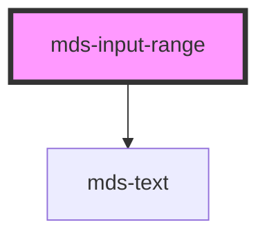

# mds-input-range

This is a web-component from Maggioli Design System [Magma](https://magma.maggiolicloud.it), built with StencilJS, TypeScript, Storybook. It's based on the web-component standard and it's designed to be agnostic from the JavaScirpt framework you are using.

<!-- Auto Generated Below -->

## Properties

| Property | Attribute | Description                                                                                                                                      | Type     | Default     |
| -------- | --------- | ------------------------------------------------------------------------------------------------------------------------------------------------ | -------- | ----------- |
| `max`    | `max`     | The greatest value in the range of permitted values                                                                                              | `number` | `100`       |
| `min`    | `min`     | The lowest value in the range of permitted values                                                                                                | `number` | `0`         |
| `step`   | `step`    | The step attribute is a number that specifies the granularity that the value must adhere to, or the special value any, which is described below. | `number` | `1`         |
| `value`  | `value`   | The value attribute contains a number which contains a representation of the selected number.                                                    | `number` | `undefined` |

## Events

| Event                 | Description                           | Type                  |
| --------------------- | ------------------------------------- | --------------------- |
| `mdsInputRangeChange` | Emits when the input range is changed | `CustomEvent<number>` |

## Dependencies

### Depends on

- [mds-text](../mds-text)

### Graph

----------------------------------------------

Built with love @ [Gruppo Maggioli](https://www.maggioli.com) from [R&D Department](https://www.maggioli.com/it-it/chi-siamo/ricerca-sviluppo)
