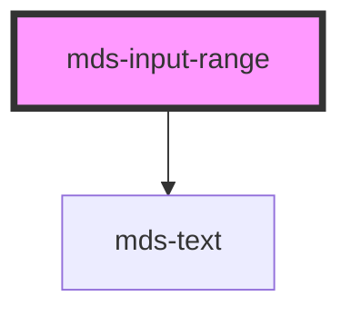

# mds-input-range

This is a web-component from Maggioli Design System [Magma](https://magma.maggiolicloud.it), built with StencilJS, TypeScript, Storybook. It's based on the web-component standard and it's designed to be agnostic from the JavaScript framework you are using.

<!-- Auto Generated Below -->

## Properties

| Property      | Attribute  | Description                                                                                                                                      | Type                                       | Default     |
| ------------- | ---------- | ------------------------------------------------------------------------------------------------------------------------------------------------ | ------------------------------------------ | ----------- |
| `disabled`    | `disabled` | Sets if the component is disabled                                                                                                                | `boolean \| undefined`                     | `undefined` |
| `formatValue` | --         | A function to custom how value is represented                                                                                                    | `((value: number) => string) \| undefined` | `undefined` |
| `max`         | `max`      | The greatest value in the range of permitted values                                                                                              | `number`                                   | `100`       |
| `min`         | `min`      | The lowest value in the range of permitted values                                                                                                | `number`                                   | `0`         |
| `step`        | `step`     | The step attribute is a number that specifies the granularity that the value must adhere to, or the special value any, which is described below. | `number`                                   | `1`         |
| `value`       | `value`    | The value attribute contains a number which contains a representation of the selected number.                                                    | `number`                                   | `undefined` |

## Events

| Event                 | Description                           | Type                  |
| --------------------- | ------------------------------------- | --------------------- |
| `mdsInputRangeChange` | Emits when the input range is changed | `CustomEvent<number>` |

## Shadow Parts

| Part       | Description                                                        |
| ---------- | ------------------------------------------------------------------ |
| `"header"` | The element containing the labels displayed over the input element |
| `"track"`  | The element containing the track of the input range                |

## CSS Custom Properties

| Name                                                   | Description                                                             |
| ------------------------------------------------------ | ----------------------------------------------------------------------- |
| `--mds-input-range-thumb-background`                   | Sets the thumb background color                                         |
| `--mds-input-range-thumb-background-disabled`          | Sets the thumb background color when the component is disabled          |
| `--mds-input-range-thumb-cursor`                       | Sets the thumb cursor                                                   |
| `--mds-input-range-thumb-shadow`                       | Sets the thumb shadow                                                   |
| `--mds-input-range-thumb-size`                         | Sets the thumb width and height of the component                        |
| `--mds-input-range-track-background`                   | Sets the track background color                                         |
| `--mds-input-range-track-background-disabled`          | Sets the track background color when the component is disabled          |
| `--mds-input-range-track-progress-background`          | Sets the track progress background color                                |
| `--mds-input-range-track-progress-background-disabled` | Sets the track progress background color when the component is disabled |
| `--mds-input-range-track-size`                         | Sets the track width and height                                         |

## Dependencies

### Depends on

- [mds-text](../mds-text)

### Graph

----------------------------------------------

Built with love @ [Gruppo Maggioli](https://www.maggioli.com) from [R&D Department](https://www.maggioli.com/it-it/chi-siamo/ricerca-sviluppo)
