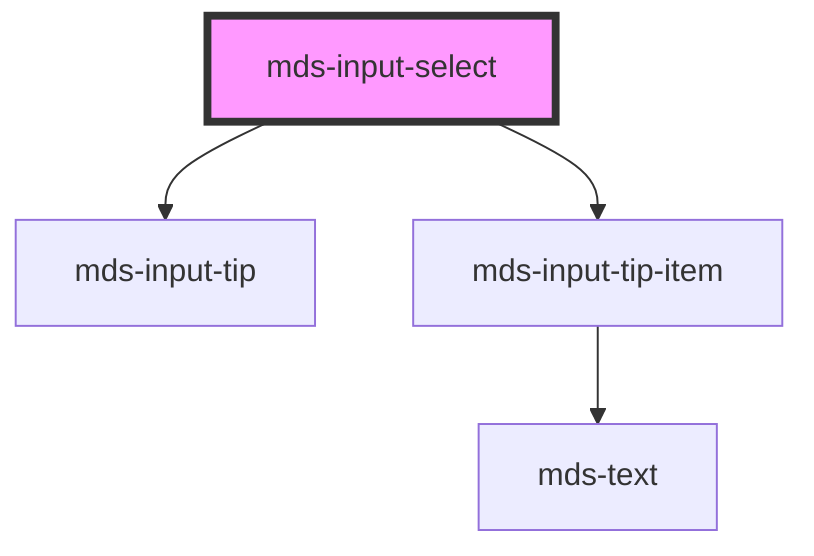

# mds-input-select

This is a web-component from Maggioli Design System [Magma](https://magma.maggiolicloud.it), built with StencilJS, TypeScript, Storybook. It's based on the web-component standard and it's designed to be agnostic from the JavaScirpt framework you are using.

<!-- Auto Generated Below -->

## Properties

| Property       | Attribute      | Description                                                                                        | Type                                                       | Default     |
| -------------- | -------------- | -------------------------------------------------------------------------------------------------- | ---------------------------------------------------------- | ----------- |
| `autoFocus`    | `auto-focus`   | Specifies a short hint that describes the expected value of the element                            | `boolean \| undefined`                                     | `undefined` |
| `autocomplete` | `autocomplete` | Specifies a short hint that describes the expected value of the element                            | `"on" \| undefined`                                        | `undefined` |
| `disabled`     | `disabled`     | If true, the element is displayed as disabled                                                      | `boolean \| undefined`                                     | `false`     |
| `multiple`     | `multiple`     | Specifies if the select should allow multiple options to be selected in the list                   | `boolean \| undefined`                                     | `false`     |
| `name`         | `name`         | Is needed to reference the form data after the form is submitted                                   | `string \| undefined`                                      | `undefined` |
| `placeholder`  | `placeholder`  | Specifies a short hint that describes the expected value of the element                            | `string \| undefined`                                      | `undefined` |
| `required`     | `required`     | Specifies that the element must be filled out before submitting the form                           | `boolean \| undefined`                                     | `false`     |
| `size`         | `size`         | When `multiple` is set to `true`, represents the number or rows in the list that should be visible | `number \| undefined`                                      | `0`         |
| `value`        | `value`        | Specifies the value of the component                                                               | `null \| number \| string \| undefined`                    | `''`        |
| `variant`      | `variant`      | Sets the variant of the component                                                                  | `"error" \| "info" \| "success" \| "warning" \| undefined` | `undefined` |

## Events

| Event                  | Description                                                                 | Type                      |
| ---------------------- | --------------------------------------------------------------------------- | ------------------------- |
| `mdsInputSelectChange` | Emits an InputChangeEventDetail when the value of the input element changes | `CustomEvent<InputValue>` |

## Shadow Parts

| Part       | Description             |
| ---------- | ----------------------- |
| `"select"` | The select HTML element |

## Dependencies

### Depends on

- [mds-input-tip](../mds-input-tip)
- [mds-input-tip-item](../mds-input-tip-item)

### Graph

----------------------------------------------

Built with love @ [Gruppo Maggioli](https://www.maggioli.com) from [R&D Department](https://www.maggioli.com/it-it/chi-siamo/ricerca-sviluppo)
