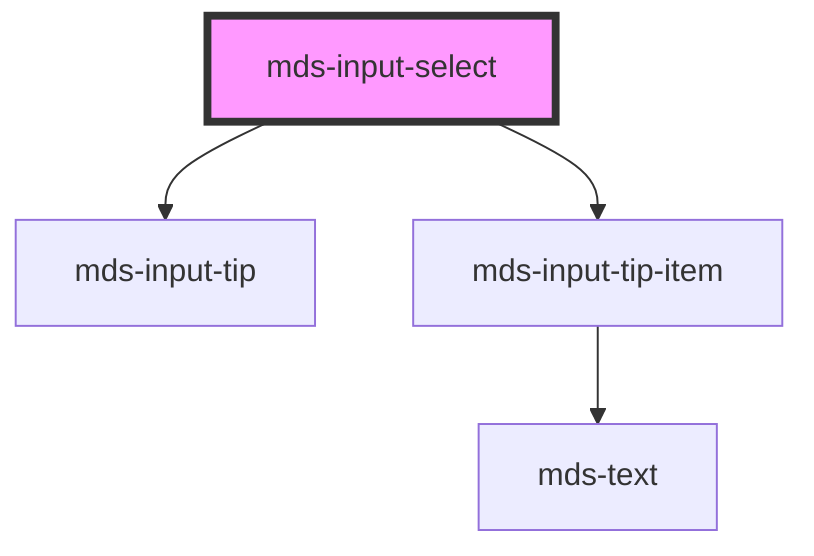

# mds-input-select


This is a web-component from Maggioli Design System [Magma](https://magma.maggiolicloud.it), built with StencilJS, TypeScript, Storybook. It's based on the web-component standard and it's designed to be agnostic from the JavaScript framework you are using.

<!-- Auto Generated Below -->


## Usage

### 1. Description

The `<mds-input-select>` web component is the Magma Design System single- and multi-choice dropdown control. It wraps a native `<select>` element, adding form association, accessible status feedback, and themed chrome while accepting plain `<option>` elements through its default slot.

#### Semantic Behavior

- **Native select wrapping**: It renders a real `<select>` (exposed as the `select` part) so keyboard, type-ahead, and platform option lists work natively; the host owns theming and status only.
- **Slotted options**: The default slot accepts `<option>` (and `<optgroup>`) markup; the current selection re-syncs whenever the slotted content changes.
- **Form association**: The current `value` is pushed to the host form, a form reset clears it, and toggling `disabled` removes the value from the submitted form data.
- **Value syncing**: Changing `value` (by user input, the `setValue()` method, or the prop) emits `mdsInputSelectChange` with the new value as a string and marks the matching `<option>` as selected.
- **Placeholder option**: When `placeholder` is set, a leading empty-value `<option>` is injected as the first entry; if `required` is set that placeholder is disabled so it cannot be re-selected after a valid choice.
- **Default selection fallback**: With no placeholder and no explicit value, the first available option becomes the value; a `defaultValue` seeds `value` at load.
- **Status tip**: A status tip surfaces verbose state - a disabled notice, and for required fields a `required` / `required-success` message that expands while the control has focus.

#### Properties & Visual Configurations

The `variant` prop applies a status appearance drawn from the shared status ladder in [`projects/stencil/SPEC.md`](../../../../SPEC.md#tone-and-variant-system) - use it to reflect validation outcome (`'error'`, `'success'`, `'warning'`, `'info'`) rather than decorative styling. This component exposes no separate `tone` prop.

#### Other behavioral props

- **`multiple`** turns the control into a multi-select list box; **`size`** then sets how many option rows are visible at once and is only meaningful when `multiple` is enabled.
- **`defaultValue`** is the initial selection used to seed the value at load (notably for the React wrapper), distinct from the live `value` that reflects the current choice.
- **`required`** both enforces a non-empty submission and locks the placeholder option so the empty entry cannot be chosen again.


### 2. Pattern

Correct and idiomatic ways to use the `<mds-input-select>` component, ordered from most common to most specialized. Patterns assume a working knowledge of the variant / tone ladders documented in [`docs/COMPONENTS.md`](../../../../../../docs/COMPONENTS.md) and the generic stencil rules in [`projects/stencil/SPEC.md`](../../../../SPEC.md).

#### Basic Select with Placeholder

The canonical form. Slot plain `<option>` elements as direct children. Set `placeholder` to inject a leading empty-value entry that prompts the user before a choice is made.

```html
<mds-input-select name="categoria" placeholder="Seleziona una categoria...">
  <option value="news">Notizie</option>
  <option value="eventi">Eventi</option>
  <option value="avvisi">Avvisi</option>
</mds-input-select>
```

#### Required Select Inside a Form

Adding `required` enforces a non-empty submission and disables the placeholder option once a valid choice exists, so users cannot revert to the empty entry. Place the component inside a `<form>` - it is form-associated and submits natively.

```html
<form action="/salva" method="post">
  <mds-input-select name="regione" required placeholder="Scegli la regione...">
    <option value="lombardia">Lombardia</option>
    <option value="veneto">Veneto</option>
    <option value="toscana">Toscana</option>
  </mds-input-select>
  <mds-button type="submit" label="Invia" variant="primary" tone="strong"></mds-button>
</form>
```

#### Pre-selected Value via `value`

Pass `value` to open the component with a specific option already chosen. The matching `<option>` is marked selected automatically. Use `default-value` instead when the initial selection is set once at load and you do not need live two-way binding (notably in the React wrapper).

```html
<!-- Live controlled value -->
<mds-input-select name="priorita" value="alta">
  <option value="bassa">Bassa</option>
  <option value="media">Media</option>
  <option value="alta">Alta</option>
</mds-input-select>

<!-- Initial seed value for React / SSR -->
<mds-input-select name="priorita" default-value="media">
  <option value="bassa">Bassa</option>
  <option value="media">Media</option>
  <option value="alta">Alta</option>
</mds-input-select>
```

#### Listening to Value Changes

Listen to `mdsInputSelectChange` - do not rely on the native `change` event, which may not bubble out of shadow DOM reliably. The event detail carries the chosen value as a string.

```html
<mds-input-select id="stato-pratica" name="stato" placeholder="Seleziona stato...">
  <option value="bozza">Bozza</option>
  <option value="in-lavorazione">In lavorazione</option>
  <option value="chiusa">Chiusa</option>
</mds-input-select>

<script>
  document.getElementById('stato-pratica')
    .addEventListener('mdsInputSelectChange', (event) => {
      console.log('Nuovo stato:', event.detail.value);
    });
</script>
```

#### Programmatic Value via `setValue()`

Use the `setValue()` async method when you need to change the selection from JavaScript after the component has rendered - for example when a related control resets the form state.

```html
<mds-input-select id="provincia" name="provincia" placeholder="Seleziona provincia...">
  <option value="MI">Milano</option>
  <option value="RM">Roma</option>
  <option value="TO">Torino</option>
</mds-input-select>

<script>
  async function resetSelezione() {
    const el = document.getElementById('provincia');
    await el.setValue('MI');
  }
</script>
```

#### Disabled State

Set `disabled` as a boolean attribute to block interaction and remove the value from the submitted form data. A status tip is shown automatically while the component is disabled.

```html
<mds-input-select name="tipo-contratto" disabled placeholder="Non disponibile">
  <option value="td">Tempo determinato</option>
  <option value="ti">Tempo indeterminato</option>
</mds-input-select>
```

#### Multi-select List Box

`multiple` switches the component to a scrollable list that allows zero or more simultaneous selections. Use `size` to control how many rows are visible without scrolling; this attribute is only meaningful when `multiple` is set.

```html
<mds-input-select name="competenze" multiple size="4" placeholder="Seleziona competenze...">
  <option value="js">JavaScript</option>
  <option value="ts">TypeScript</option>
  <option value="css">CSS</option>
  <option value="html">HTML</option>
  <option value="react">React</option>
</mds-input-select>
```

#### Grouped Options via `<optgroup>`

The default slot also accepts `<optgroup>` elements. Use them to group related options under a visible label.

```html
<mds-input-select name="comune" placeholder="Seleziona comune...">
  <optgroup label="Lombardia">
    <option value="MI">Milano</option>
    <option value="BS">Brescia</option>
  </optgroup>
  <optgroup label="Veneto">
    <option value="VE">Venezia</option>
    <option value="VR">Verona</option>
  </optgroup>
</mds-input-select>
```

#### Variant for Validation Feedback

Set `variant` to one of the status values (`error`, `success`, `warning`, `info`) to communicate the validation outcome visually. Use this after a form submission or inline validation, not as decorative styling.

```html
<!-- Errore di validazione -->
<mds-input-select name="tipologia" variant="error" required placeholder="Seleziona tipologia...">
  <option value="A">Tipo A</option>
  <option value="B">Tipo B</option>
</mds-input-select>

<!-- Selezione valida confermata -->
<mds-input-select name="tipologia" variant="success" value="A">
  <option value="A">Tipo A</option>
  <option value="B">Tipo B</option>
</mds-input-select>
```

#### Styling Customization

Customize the component only through its documented `--mds-input-select-*` CSS custom properties. Set them on the host or a parent selector; use the Magma color tokens via `rgb(var(--<token>))` so dark mode and high-contrast modes continue to work correctly.

```css
.sidebar-filter mds-input-select {
  --mds-input-select-variant-color-rgb: var(--variant-secondary-04);
  --mds-input-select-arrow-icon-hover-color: rgb(var(--variant-secondary-03));
  --mds-input-select-arrow-icon-hover-background-color: rgb(var(--variant-secondary-08));
  --mds-input-select-ring: 0 0 0 2px rgb(var(--variant-secondary-04) / 0.8);
}
```


### 3. Antipattern

Common incorrect uses of `<mds-input-select>`. Each entry pairs the wrong form with the right one and a one-line reason. System-wide rules (boolean-as-string, shadow piercing, Tailwind color utilities, raw native event listening) live in [`docs/COMPONENTS.md`](../../../../../../docs/COMPONENTS.md#system-level-anti-patterns) - they apply here too but are not repeated.

#### Do Not Slot Non-Option Elements

The default slot is reserved for `<option>` and `<optgroup>` elements. The component clones slot children into the inner `<select>`; any other element is copied verbatim and makes the native select malformed.

```html
<!-- 🚫 INCORRECT -->
<mds-input-select name="categoria">
  <div class="option-group">
    <span>Notizie</span>
    <span>Eventi</span>
  </div>
</mds-input-select>

<!-- ✅ CORRECT -->
<mds-input-select name="categoria" placeholder="Seleziona...">
  <option value="news">Notizie</option>
  <option value="eventi">Eventi</option>
</mds-input-select>
```

#### Do Not Listen to the Native `change` Event

`<mds-input-select>` wraps a shadow-DOM `<select>`; the native `change` event does not bubble out of shadow DOM reliably. Always listen to the documented `mdsInputSelectChange` custom event instead.

```html
<!-- 🚫 INCORRECT -->
<mds-input-select id="sel" name="tipo"></mds-input-select>
<script>
  document.getElementById('sel').addEventListener('change', (e) => {
    console.log(e.target.value); // may be undefined or stale
  });
</script>

<!-- ✅ CORRECT -->
<mds-input-select id="sel" name="tipo"></mds-input-select>
<script>
  document.getElementById('sel').addEventListener('mdsInputSelectChange', (e) => {
    console.log(e.detail.value);
  });
</script>
```

#### Do Not Set `size` Without `multiple`

`size` controls how many rows are visible in the list box. Outside of `multiple` mode the native `<select>` ignores this attribute, so it has no visual effect and signals a misunderstanding of the API.

```html
<!-- 🚫 INCORRECT -->
<mds-input-select name="stato" size="5">
  <option value="A">Aperta</option>
  <option value="C">Chiusa</option>
</mds-input-select>

<!-- ✅ CORRECT - size is meaningful only with multiple -->
<mds-input-select name="stati" multiple size="5">
  <option value="A">Aperta</option>
  <option value="C">Chiusa</option>
  <option value="S">Sospesa</option>
</mds-input-select>
```

#### Do Not Use `variant` for Decorative Styling

`variant` maps to `ThemeStatusVariantType` (`error`, `success`, `warning`, `info`). It is meant to communicate a validation outcome, not to apply a brand color. Using a status variant to make the component visually match a section's color theme misleads users about the control's validation state.

```html
<!-- 🚫 INCORRECT - using 'info' just for a blue accent -->
<mds-input-select name="argomento" variant="info">
  <option value="A">Argomento A</option>
</mds-input-select>

<!-- ✅ CORRECT - set variant only to reflect real validation state -->
<mds-input-select name="argomento" variant="error" required placeholder="Obbligatorio">
  <option value="A">Argomento A</option>
</mds-input-select>
```

#### Do Not Pierce the Shadow DOM to Style the Inner `<select>`

The supported customization surface is the documented `--mds-input-select-*` CSS custom properties and the two shadow parts (`select`, `tip-top`). Targeting internal elements with `>>>` or undocumented selectors couples your code to the implementation and breaks on minor releases.

```css
/* 🚫 INCORRECT */
mds-input-select >>> select {
  font-size: 1rem;
  border: 2px solid red;
}

/* ✅ CORRECT */
mds-input-select {
  --mds-input-select-ring: 0 0 0 2px rgb(var(--status-error-05));
  --mds-input-select-variant-color-rgb: var(--status-error-05);
}
mds-input-select::part(select) {
  font-size: 1rem;
}
```

#### Do Not Set `placeholder` When You Need a Real Default Selection

`placeholder` injects an empty-value leading option that disappears from valid choices once `required` is set. If you want the component to open with a specific option pre-selected, use `value` or `default-value` instead.

```html
<!-- 🚫 INCORRECT - a real value supplied as placeholder text -->
<mds-input-select name="priorita" placeholder="Media">
  <option value="bassa">Bassa</option>
  <option value="media">Media</option>
  <option value="alta">Alta</option>
</mds-input-select>

<!-- ✅ CORRECT - use value to pre-select a real option -->
<mds-input-select name="priorita" value="media">
  <option value="bassa">Bassa</option>
  <option value="media">Media</option>
  <option value="alta">Alta</option>
</mds-input-select>
```

#### Do Not Replace with a Raw `<select>`

`<mds-input-select>` provides theming, accessible status tips, form-reset integration, and dark/high-contrast support. Reaching for a plain `<select>` bypasses all of that and breaks visual consistency across themes.

```html
<!-- 🚫 INCORRECT -->
<select name="categoria" class="form-select">
  <option value="">Seleziona...</option>
  <option value="A">Categoria A</option>
</select>

<!-- ✅ CORRECT -->
<mds-input-select name="categoria" placeholder="Seleziona...">
  <option value="A">Categoria A</option>
</mds-input-select>
```


## Properties

| Property       | Attribute       | Description                                                                                        | Type                                                       | Default     |
| -------------- | --------------- | -------------------------------------------------------------------------------------------------- | ---------------------------------------------------------- | ----------- |
| `autoFocus`    | `auto-focus`    | Specifies a short hint that describes the expected value of the element                            | `boolean \| undefined`                                     | `undefined` |
| `autocomplete` | `autocomplete`  | Specifies a short hint that describes the expected value of the element                            | `"on" \| undefined`                                        | `undefined` |
| `defaultValue` | `default-value` | Specifies the default value of the component                                                       | `null \| number \| string \| undefined`                    | `undefined` |
| `disabled`     | `disabled`      | If true, the element is displayed as disabled                                                      | `boolean \| undefined`                                     | `false`     |
| `multiple`     | `multiple`      | Specifies if the select should allow multiple options to be selected in the list                   | `boolean \| undefined`                                     | `false`     |
| `name`         | `name`          | Is needed to reference the form data after the form is submitted                                   | `string \| undefined`                                      | `undefined` |
| `placeholder`  | `placeholder`   | Specifies a short hint that describes the expected value of the element                            | `string \| undefined`                                      | `undefined` |
| `required`     | `required`      | Specifies that the element must be filled out before submitting the form                           | `boolean \| undefined`                                     | `false`     |
| `size`         | `size`          | When `multiple` is set to `true`, represents the number or rows in the list that should be visible | `number \| undefined`                                      | `0`         |
| `value`        | `value`         | Specifies the value of the component                                                               | `null \| number \| string \| undefined`                    | `''`        |
| `variant`      | `variant`       | Sets the variant of the component                                                                  | `"error" \| "info" \| "success" \| "warning" \| undefined` | `undefined` |


## Events

| Event                  | Description                                                                 | Type                               |
| ---------------------- | --------------------------------------------------------------------------- | ---------------------------------- |
| `mdsInputSelectChange` | Emits an InputChangeEventDetail when the value of the input element changes | `CustomEvent<MdsInputEventDetail>` |


## Methods

### `setValue(value: string | number | null) => Promise<void>`

Sets the value of the component

#### Parameters

| Name    | Type                       | Description |
| ------- | -------------------------- | ----------- |
| `value` | `string \| number \| null` |             |

#### Returns

Type: `Promise<void>`


### `updateLang() => Promise<void>`

Updates the component's texts to the locale currently set on the host element.

#### Returns

Type: `Promise<void>`


## Slots

| Slot | Description                                                |
| ---- | ---------------------------------------------------------- |
|      | Add `option` `HTML elements` or `components` to this slot. |


## Shadow Parts

| Part        | Description                                           |
| ----------- | ----------------------------------------------------- |
| `"select"`  | The select HTML element                               |
| `"tip-top"` | Selects the verbose status of input on top of element |


## CSS Custom Properties

| Name                                                   | Description                                                      |
| ------------------------------------------------------ | ---------------------------------------------------------------- |
| `--mds-input-select-arrow-icon-background-color`       | Background color behind the arrow icon                           |
| `--mds-input-select-arrow-icon-blur-background-color`  | Transparent background used for blurred states of the arrow icon |
| `--mds-input-select-arrow-icon-blur-color`             | Color applied to the arrow icon in blurred states                |
| `--mds-input-select-arrow-icon-color`                  | Default arrow icon color                                         |
| `--mds-input-select-arrow-icon-hover-background-color` | Background color of the arrow icon when hovered                  |
| `--mds-input-select-arrow-icon-hover-color`            | Color of the arrow icon when hovered                             |
| `--mds-input-select-ring`                              | Focus ring applied around the select component                   |
| `--mds-input-select-shadow`                            | Shadow applied to the select component                           |
| `--mds-input-select-variant-color-rgb`                 | Base color used to derive all select component visual states     |


## Dependencies

### Depends on

- [mds-input-tip](../mds-input-tip)
- [mds-input-tip-item](../mds-input-tip-item)

### Graph


----------------------------------------------

Built with love @ [Gruppo Maggioli](https://www.maggioli.com) from [R&D Department](https://www.maggioli.com/it-it/chi-siamo/ricerca-sviluppo)
