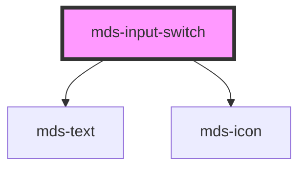

# mds-input-switch

<!-- Auto Generated Below -->

## Properties

| Property        | Attribute       | Description                                                                                                        | Type                                                                                | Default     |
| --------------- | --------------- | ------------------------------------------------------------------------------------------------------------------ | ----------------------------------------------------------------------------------- | ----------- |
| `autofocus`     | `autofocus`     | Sets or returns whether a checkbox should automatically get focus when the page loads                              | `boolean`                                                                           | `undefined` |
| `checked`       | `checked`       | Specifies that an <input> element should be pre-selected when the page loads (for type="checkbox" or type="radio") | `boolean \| undefined`                                                              | `undefined` |
| `disabled`      | `disabled`      | Sets or returns whether a checkbox is disabled, or not                                                             | `boolean \| undefined`                                                              | `undefined` |
| `icon`          | `icon`          | The checked icon displayed                                                                                         | `string`                                                                            | `''`        |
| `indeterminate` | `indeterminate` | Sets or returns the indeterminate state of the checkbox                                                            | `boolean`                                                                           | `false`     |
| `name`          | `name`          | Specifies the name of an <input> element                                                                           | `string`                                                                            | `''`        |
| `size`          | `size`          | Specifies the size for the switch toggle, it works only if attribute 'type' is set to 'switch'                     | `"lg" \| "md" \| "sm"`                                                              | `'md'`      |
| `type`          | `type`          | Specifies switch type: switch (default), checkbox and radio                                                        | `"checkbox" \| "radio" \| "switch"`                                                 | `'switch'`  |
| `typography`    | `typography`    | Specifies the font typography of the element                                                                       | `"caption" \| "detail" \| "label" \| "option" \| "paragraph" \| "tip" \| undefined` | `'detail'`  |
| `value`         | `value`         | Specifies the value of the input element                                                                           | `null \| number \| string \| undefined`                                             | `''`        |
| `variant`       | `variant`       | Specifies the variant for `typography`                                                                             | `"code" \| "info" \| "read" \| "title" \| undefined`                                | `undefined` |

## Events

| Event                  | Description                  | Type                                                    |
| ---------------------- | ---------------------------- | ------------------------------------------------------- |
| `mdsInputSwitchChange` | Emits when the value changes | `CustomEvent<{ name: string; value: InputValueType; }>` |

## CSS Custom Properties

| Name                                       | Description                                                                  |
| ------------------------------------------ | ---------------------------------------------------------------------------- |
| `--animation-timing-adjust`                | Set the size multiplier when the switch toggle is resizing by animation      |
| `--animation-timing-function`              | Set the timing function of the animation                                     |
| `--duration`                               | Set the duration of the animation                                            |
| `--icon-color-checked`                     | Set the color of the icon when the switch is checked                         |
| `--icon-color-checked-disabled`            | Set the color of the icon when the switch is disabled and checked            |
| `--icon-color-indeterminate`               | Set the color of the icon when the switch is indeterminate                   |
| `--icon-color-indeterminate-disabled`      | Set the color of the icon when the switch is disabled and indeterminate      |
| `--icon-color-unchecked`                   | Set the color of the icon when the switch is unchecked                       |
| `--icon-color-unchecked-disabled`          | Set the color of the icon when the switch is disabled and unchecked          |
| `--switch-color-checked`                   | Set the color of the switch when the switch is checked                       |
| `--switch-color-disabled-checked`          | Set the color of the switch when the switch is disabled and checked          |
| `--switch-color-disabled-unchecked`        | Set the color of the switch when the switch is disabled and unchecked        |
| `--switch-color-unchecked`                 | Set the color of the switch when the switch is unchecked                     |
| `--switch-padding`                         | Set the padding of the switch toggle's container                             |
| `--switch-toggle-color-checked`            | Set the color of the switch toggle when the switch is checked                |
| `--switch-toggle-color-disabled-checked`   | Set the color of the switch toggle when the switch is disabled and checked   |
| `--switch-toggle-color-disabled-unchecked` | Set the color of the switch toggle when the switch is disabled and unchecked |
| `--switch-toggle-color-unchecked`          | Set the color of the switch toggle when the switch is unchecked              |
| `--switch-toggle-size`                     | Sets the size of the switch toggle                                           |

## Dependencies

### Depends on

- [mds-text](../mds-text)
- [mds-icon](../mds-icon)

### Graph

----------------------------------------------

Built with love @ [Gruppo Maggioli](https://www.maggioli.com) from [R&D Department](https://www.maggioli.com/it-it/chi-siamo/ricerca-sviluppo)
