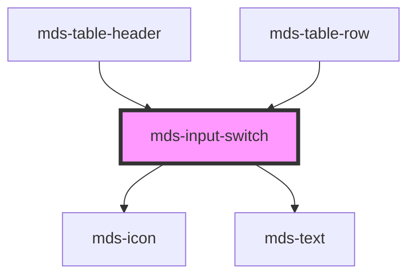

# mds-input-switch


This is a web-component from Maggioli Design System [Magma](https://magma.maggiolicloud.it), built with StencilJS, TypeScript, Storybook. It's based on the web-component standard and it's designed to be agnostic from the JavaScript framework you are using.

<!-- Auto Generated Below -->


## Usage

### 1. Description

The `<mds-input-switch>` web component is the binary/selectable input control of the Magma Design System. A single tag covers three native primitives - it renders as a toggle switch by default and re-renders as a native `checkbox` or `radio` depending on `type`, wrapping `<input type="checkbox|radio">` with form association, accessibility, and iconography handled natively.

#### Semantic Behavior

- **Type-driven rendering**: `type` selects the visual primitive. `'switch'` (default) renders the sliding toggle; `'checkbox'` and `'radio'` render the corresponding native control.
- **Form association**: The host participates in a `<form>` natively - the form value is set to `value` when `checked` and cleared otherwise, including on form reset.
- **Radio grouping**: When `type="radio"`, checking one instance unchecks every other `<mds-input-switch>` sharing the same `name` in the document.
- **Checked / indeterminate**: `checked` reflects selection; toggling it always clears `indeterminate`. The indeterminate glyph is only meaningful for `checkbox`.
- **Disabled state**: Blocks interaction and clears the submitted form value while disabled.
- **Keyboard operable**: The control responds to keyboard activation in addition to pointer clicks.
- **Accessibility**: The control exposes a localized accessible label ("select"/"unselect") derived from slotted text (it/en/es/el).
- **Change event**: `mdsInputSwitchChange` fires with `{ name, checked, value }` whenever the selection changes.
- **Default slot**: The default slot is the visible text label rendered beside the control; when empty, the label region collapses.

#### Properties & Visual Configurations

- **`type`** is the primary configuration: pick `'switch'` for on/off settings, `'checkbox'` for multi-select selections, `'radio'` for mutually exclusive choices within a `name` group.
- **`explicit`** applies only to `type="switch"`: it surfaces a check/remove glyph inside the toggle knob so the on/off state is readable without relying on color alone.
- **`size`** (`'sm'` / `'md'` / `'lg'`) scales the toggle and is honored only when `type="switch"`.
- **`icon`** overrides the default checked glyph (checkbox/radio variants); leave empty to use the type's built-in icon set.

#### Other behavioral props

- **`typography`** and **`variant`** style the slotted text label; they map to the shared typography ladders rather than the system tone/variant ladder defined in [`projects/stencil/SPEC.md`](../../../../SPEC.md#tone-and-variant-system).


### 2. Pattern

Correct and idiomatic ways to use the `<mds-input-switch>` component, ordered from most common to most specialized. Patterns assume a working knowledge of the rules documented in [`docs/COMPONENTS.md`](../../../../../../docs/COMPONENTS.md) and the generic stencil rules in [`projects/stencil/SPEC.md`](../../../../SPEC.md).

#### Toggle Switch with a Text Label

The canonical form. Slot a plain text string as the visible label. The component collapses the label region automatically when the slot is empty.

```html
<mds-input-switch name="notifiche" value="1">Notifiche via e-mail</mds-input-switch>
```

#### Pre-selected and Disabled States

Use `checked` to pre-select the control on load. Use `disabled` to block interaction. Both are boolean attributes - remove them to turn them off; never write `checked="false"` or `disabled="false"`.

```html
<!-- Pre-selected -->
<mds-input-switch name="newsletter" value="1" checked>Iscrizione alla newsletter</mds-input-switch>

<!-- Disabled and unchecked -->
<mds-input-switch name="sms" value="1" disabled>Notifiche via SMS (non disponibili)</mds-input-switch>

<!-- Disabled and checked -->
<mds-input-switch name="email" value="1" checked disabled>Notifiche via e-mail (obbligatorio)</mds-input-switch>
```

#### Explicit Icon Mode

Add `explicit` to surface a check/remove glyph inside the toggle knob. This makes the on/off state readable without relying on color alone, which is required in high-contrast contexts. Only effective when `type="switch"`.

```html
<mds-input-switch name="modalita" value="1" explicit>Modalita scura</mds-input-switch>
<mds-input-switch name="animazioni" value="1" explicit checked>Animazioni ridotte</mds-input-switch>
```

#### Sizing the Toggle

Use the `size` prop to scale the switch knob. Sizing only applies to `type="switch"`.

```html
<mds-input-switch name="sm" value="1" size="sm">Piccolo</mds-input-switch>
<mds-input-switch name="md" value="1" size="md">Medio (predefinito)</mds-input-switch>
<mds-input-switch name="lg" value="1" size="lg">Grande</mds-input-switch>
```

#### Checkbox Type

Set `type="checkbox"` for multi-select use cases. The component renders the standard checkbox glyph set; `indeterminate` shows the partial-selection glyph, which is meaningful only for this type.

```html
<!-- Basic checkboxes -->
<mds-input-switch type="checkbox" name="opt" value="a">Opzione A</mds-input-switch>
<mds-input-switch type="checkbox" name="opt" value="b" checked>Opzione B</mds-input-switch>

<!-- Indeterminate (parent of a mixed selection) -->
<mds-input-switch type="checkbox" name="tutti" value="all" indeterminate>Seleziona tutto</mds-input-switch>
```

#### Radio Group

Set `type="radio"` and share the same `name` across instances. Checking one automatically unchecks all others with the same name in the document.

```html
<mds-input-switch type="radio" name="piano" value="base">Piano base</mds-input-switch>
<mds-input-switch type="radio" name="piano" value="pro" checked>Piano Pro</mds-input-switch>
<mds-input-switch type="radio" name="piano" value="enterprise">Piano Enterprise</mds-input-switch>
```

#### Form Participation

`<mds-input-switch>` is form-associated. The form receives `value` when `checked`; if unchecked, no value is submitted. The control resets to its initial state on form reset.

```html
<form action="/preferenze" method="post">
  <mds-input-switch name="notifiche" value="attivo" checked>Notifiche push</mds-input-switch>
  <mds-input-switch name="newsletter" value="attivo">Newsletter settimanale</mds-input-switch>
  <mds-button type="submit" label="Salva preferenze" variant="primary" tone="strong"></mds-button>
</form>
```

#### Listening to Changes

Listen for the `mdsInputSwitchChange` event - it carries `{ name, checked, value }` in `event.detail`. Do not listen for the native `change` event; it does not bubble out of Shadow DOM reliably.

```html
<mds-input-switch id="toggle" name="tema" value="scuro">Tema scuro</mds-input-switch>

<script>
  document.querySelector('#toggle').addEventListener('mdsInputSwitchChange', (e) => {
    console.log(e.detail.name, e.detail.checked, e.detail.value);
  });
</script>
```

#### Custom Checked Icon (Checkbox / Radio)

Set `icon` to any slug from the Magma icon library to override the default checked glyph for `type="checkbox"` or `type="radio"`. Leave `icon` empty to use the built-in glyph.

```html
<mds-input-switch type="checkbox" name="preferito" value="1" icon="mi/baseline/star" checked>
  Segna come preferito
</mds-input-switch>
```

#### Typography Customization of the Label

`typography` and `variant` style the slotted text label and map to the shared typography ladder - not the tone/variant system.

```html
<mds-input-switch name="opzione" value="1" typography="caption">Testo piccolo</mds-input-switch>
<mds-input-switch name="titolo" value="1" typography="label" variant="title">Voce di titolo</mds-input-switch>
```

#### CSS Custom Property Customization

Style the switch only through the documented `--mds-input-switch-*` CSS custom properties. Use Magma color tokens via `rgb(var(--<token>))` so dark mode and high-contrast modes keep working.

```css
.settings-panel mds-input-switch {
  --mds-input-switch-box-color-enabled-checked: rgb(var(--variant-success-04));
  --mds-input-switch-toggle-color-enabled-checked: rgb(var(--tone-neutral));
  --mds-input-switch-duration: 200ms;
  --mds-input-switch-toggle-size: var(--mds-input-switch-toggle-size-lg);
}
```


### 3. Antipattern

Common incorrect uses of `<mds-input-switch>`. Each entry pairs the wrong form with the right one and a one-line reason. System-wide rules (boolean-as-string, shadow piercing, Tailwind color utilities, raw native event listening) live in [`docs/COMPONENTS.md`](../../../../../../docs/COMPONENTS.md#system-level-anti-patterns) - they apply here too but are not repeated.

#### Do Not Set Boolean Props to the String "false"

`checked`, `disabled`, `explicit`, and `indeterminate` are boolean attributes. Any non-empty string - including `"false"` - is truthy in HTML. Remove the attribute entirely to turn it off.

```html
<!-- 🚫 INCORRECT -->
<mds-input-switch checked="false" disabled="false">Notifiche</mds-input-switch>

<!-- ✅ CORRECT -->
<mds-input-switch>Notifiche</mds-input-switch>
```

#### Do Not Use a Native `<input>` Instead of `<mds-input-switch>`

Replacing the component with a raw `<input type="checkbox">` or `<input type="radio">` bypasses the design system's theming, accessibility defaults, label layout, and form integration.

```html
<!-- 🚫 INCORRECT -->
<label>
  <input type="checkbox" name="notifiche" value="1"> Notifiche via e-mail
</label>

<!-- ✅ CORRECT -->
<mds-input-switch name="notifiche" value="1">Notifiche via e-mail</mds-input-switch>
```

#### Do Not Use `explicit` or `size` with `type="checkbox"` or `type="radio"`

`explicit` surfaces a glyph inside the switch knob and `size` scales the knob - both are only honored when `type="switch"`. They are silently ignored on other types.

```html
<!-- 🚫 INCORRECT -->
<mds-input-switch type="checkbox" name="opt" value="1" explicit size="lg">Opzione</mds-input-switch>

<!-- ✅ CORRECT -->
<mds-input-switch type="checkbox" name="opt" value="1">Opzione</mds-input-switch>

<!-- correct use of explicit and size: only with type="switch" -->
<mds-input-switch type="switch" name="opt" value="1" explicit size="lg">Opzione</mds-input-switch>
```

#### Do Not Listen for Native `change` Instead of `mdsInputSwitchChange`

The component stops and prevents the native `change` event internally. Listen for the documented `mdsInputSwitchChange` event, which carries `{ name, checked, value }` in `event.detail`.

```html
<!-- 🚫 INCORRECT -->
<mds-input-switch id="toggle" name="tema" value="scuro">Tema scuro</mds-input-switch>
<script>
  document.querySelector('#toggle').addEventListener('change', handler);
</script>

<!-- ✅ CORRECT -->
<mds-input-switch id="toggle" name="tema" value="scuro">Tema scuro</mds-input-switch>
<script>
  document.querySelector('#toggle').addEventListener('mdsInputSwitchChange', (e) => {
    console.log(e.detail.checked);
  });
</script>
```

#### Do Not Use `indeterminate` on `type="switch"` or `type="radio"`

The indeterminate glyph (`indeterminate-check-box`) is part of the checkbox icon variant only. Setting `indeterminate` on a switch or radio has no visual effect and misleads consumers about the control state.

```html
<!-- 🚫 INCORRECT -->
<mds-input-switch type="switch" name="opt" value="1" indeterminate>Tutti i permessi</mds-input-switch>

<!-- ✅ CORRECT -->
<mds-input-switch type="checkbox" name="tutti" value="all" indeterminate>Seleziona tutto</mds-input-switch>
```

#### Do Not Omit `name` in a Radio Group

Without a shared `name`, sibling radio items cannot uncheck each other. The `uncheckSiblings` behavior queries `[name="..."]` - an empty or missing name prevents mutual exclusivity.

```html
<!-- 🚫 INCORRECT -->
<mds-input-switch type="radio" value="a" checked>Opzione A</mds-input-switch>
<mds-input-switch type="radio" value="b">Opzione B</mds-input-switch>

<!-- ✅ CORRECT -->
<mds-input-switch type="radio" name="scelta" value="a" checked>Opzione A</mds-input-switch>
<mds-input-switch type="radio" name="scelta" value="b">Opzione B</mds-input-switch>
```

#### Do Not Customize with Undocumented CSS Parts or Internal Selectors

The only supported customization surface is the documented `--mds-input-switch-*` CSS custom properties. Targeting shadow internals via `::part()` on undocumented parts or via `>>>` will break on minor releases.

```css
/* 🚫 INCORRECT */
mds-input-switch >>> .switch {
  border-radius: 4px;
}
mds-input-switch::part(toggle) {
  box-shadow: none;
}

/* ✅ CORRECT */
mds-input-switch {
  --mds-input-switch-box-color-enabled-checked: rgb(var(--variant-success-04));
  --mds-input-switch-duration: 150ms;
}
```


## Properties

| Property        | Attribute       | Description                                                                                                        | Type                                                                                | Default     |
| --------------- | --------------- | ------------------------------------------------------------------------------------------------------------------ | ----------------------------------------------------------------------------------- | ----------- |
| `autofocus`     | `autofocus`     | Sets or returns whether a checkbox should automatically get focus when the page loads                              | `boolean`                                                                           | `undefined` |
| `checked`       | `checked`       | Specifies that an <input> element should be pre-selected when the page loads (for type="checkbox" or type="radio") | `boolean \| undefined`                                                              | `undefined` |
| `disabled`      | `disabled`      | Sets or returns whether a checkbox is disabled, or not                                                             | `boolean \| undefined`                                                              | `undefined` |
| `explicit`      | `explicit`      | Sets if the type switch mode shows explicit icons                                                                  | `boolean \| undefined`                                                              | `undefined` |
| `icon`          | `icon`          | The checked icon displayed                                                                                         | `string`                                                                            | `''`        |
| `indeterminate` | `indeterminate` | Sets or returns the indeterminate state of the checkbox                                                            | `boolean \| undefined`                                                              | `undefined` |
| `name`          | `name`          | Specifies the name of an <input> element                                                                           | `string`                                                                            | `''`        |
| `size`          | `size`          | Specifies the size for the switch toggle, it works only if attribute 'type' is set to 'switch'                     | `"lg" \| "md" \| "sm"`                                                              | `'md'`      |
| `type`          | `type`          | Specifies switch type: switch (default), checkbox and radio                                                        | `"checkbox" \| "radio" \| "switch"`                                                 | `'switch'`  |
| `typography`    | `typography`    | Specifies the font typography of the element                                                                       | `"caption" \| "detail" \| "label" \| "option" \| "paragraph" \| "tip" \| undefined` | `'detail'`  |
| `value`         | `value`         | Specifies the value of the input element                                                                           | `string \| undefined`                                                               | `''`        |
| `variant`       | `variant`       | Specifies the variant for `typography`                                                                             | `"code" \| "info" \| "read" \| "title" \| undefined`                                | `undefined` |


## Events

| Event                  | Description                  | Type                                     |
| ---------------------- | ---------------------------- | ---------------------------------------- |
| `mdsInputSwitchChange` | Emits when the value changes | `CustomEvent<MdsInputSwitchEventDetail>` |


## Methods

### `updateLang() => Promise<void>`


#### Returns

Type: `Promise<void>`


## Slots

| Slot        | Description                      |
| ----------- | -------------------------------- |
| `"default"` | Put text string or elements here |


## CSS Custom Properties

| Name                                                   | Description                                                    |
| ------------------------------------------------------ | -------------------------------------------------------------- |
| `--mds-input-switch-animation-timing-adjust`           | Multiplier used to fine-tune animation timing                  |
| `--mds-input-switch-animation-timing-function`         | Easing function applied to switch animations                   |
| `--mds-input-switch-box-color-disabled-checked`        | Background color of the switch box when disabled and checked   |
| `--mds-input-switch-box-color-disabled-unchecked`      | Background color of the switch box when disabled and unchecked |
| `--mds-input-switch-box-color-enabled-checked`         | Background color of the switch box when enabled and checked    |
| `--mds-input-switch-box-color-enabled-unchecked`       | Background color of the switch box when enabled and unchecked  |
| `--mds-input-switch-box-padding`                       | Effective padding used for the switch box                      |
| `--mds-input-switch-box-padding-lg`                    | Padding of the switch container (large size)                   |
| `--mds-input-switch-box-padding-md`                    | Padding of the switch container (medium size)                  |
| `--mds-input-switch-box-padding-sm`                    | Padding of the switch container (small size)                   |
| `--mds-input-switch-duration`                          | Duration of switch state transitions                           |
| `--mds-input-switch-icon-color-checked`                | Icon color when checked                                        |
| `--mds-input-switch-icon-color-checked-disabled`       | Icon color when checked and disabled                           |
| `--mds-input-switch-icon-color-indeterminate`          | Icon color for indeterminate state                             |
| `--mds-input-switch-icon-color-indeterminate-disabled` | Icon color for indeterminate state when disabled               |
| `--mds-input-switch-icon-color-unchecked`              | Icon color when unchecked                                      |
| `--mds-input-switch-icon-color-unchecked-disabled`     | Icon color when unchecked and disabled                         |
| `--mds-input-switch-icon-explicit-color`               | Explicitly forced icon color                                   |
| `--mds-input-switch-toggle-color-disabled-checked`     | Toggle color when disabled and checked                         |
| `--mds-input-switch-toggle-color-disabled-unchecked`   | Toggle color when disabled and unchecked                       |
| `--mds-input-switch-toggle-color-enabled-checked`      | Toggle color when enabled and checked                          |
| `--mds-input-switch-toggle-color-enabled-unchecked`    | Toggle color when enabled and unchecked                        |
| `--mds-input-switch-toggle-container-size`             | Computed size of the toggle container                          |
| `--mds-input-switch-toggle-size`                       | Effective toggle size currently in use                         |
| `--mds-input-switch-toggle-size-lg`                    | Toggle size for large variant                                  |
| `--mds-input-switch-toggle-size-md`                    | Toggle size for medium variant                                 |
| `--mds-input-switch-toggle-size-sm`                    | Toggle size for small variant                                  |


## Dependencies

### Used by

 - [mds-table-header](../mds-table-header)
 - [mds-table-row](../mds-table-row)

### Depends on

- [mds-icon](../mds-icon)
- [mds-text](../mds-text)

### Graph


----------------------------------------------

Built with love @ [Gruppo Maggioli](https://www.maggioli.com) from [R&D Department](https://www.maggioli.com/it-it/chi-siamo/ricerca-sviluppo)
