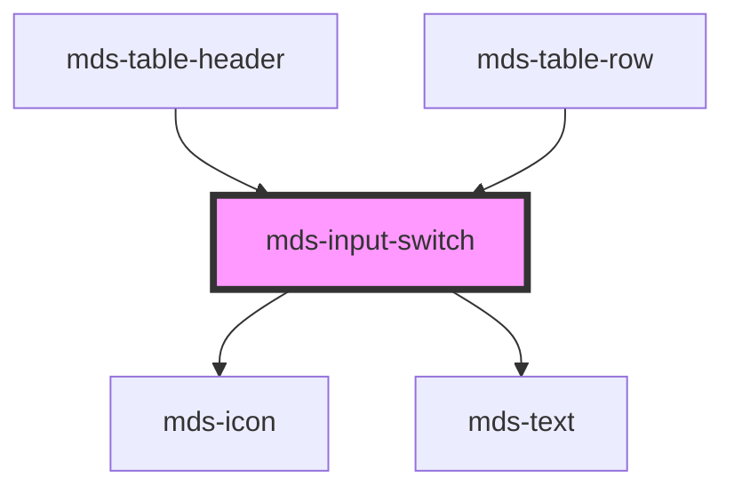

# mds-input-switch

This is a web-component from Maggioli Design System [Magma](https://magma.maggiolicloud.it), built with StencilJS, TypeScript, Storybook. It's based on the web-component standard and it's designed to be agnostic from the JavaScript framework you are using.

<!-- Auto Generated Below -->

## Properties

| Property        | Attribute       | Description                                                                                                        | Type                                                                                | Default     |
| --------------- | --------------- | ------------------------------------------------------------------------------------------------------------------ | ----------------------------------------------------------------------------------- | ----------- |
| `autofocus`     | `autofocus`     | Sets or returns whether a checkbox should automatically get focus when the page loads                              | `boolean`                                                                           | `undefined` |
| `checked`       | `checked`       | Specifies that an <input> element should be pre-selected when the page loads (for type="checkbox" or type="radio") | `boolean \| undefined`                                                              | `undefined` |
| `disabled`      | `disabled`      | Sets or returns whether a checkbox is disabled, or not                                                             | `boolean \| undefined`                                                              | `undefined` |
| `explicit`      | `explicit`      | Sets if the type switch mode shows explicit icons                                                                  | `boolean \| undefined`                                                              | `undefined` |
| `icon`          | `icon`          | The checked icon displayed                                                                                         | `string`                                                                            | `''`        |
| `indeterminate` | `indeterminate` | Sets or returns the indeterminate state of the checkbox                                                            | `boolean \| undefined`                                                              | `undefined` |
| `name`          | `name`          | Specifies the name of an <input> element                                                                           | `string`                                                                            | `''`        |
| `size`          | `size`          | Specifies the size for the switch toggle, it works only if attribute 'type' is set to 'switch'                     | `"lg" \| "md" \| "sm"`                                                              | `'md'`      |
| `type`          | `type`          | Specifies switch type: switch (default), checkbox and radio                                                        | `"checkbox" \| "radio" \| "switch"`                                                 | `'switch'`  |
| `typography`    | `typography`    | Specifies the font typography of the element                                                                       | `"caption" \| "detail" \| "label" \| "option" \| "paragraph" \| "tip" \| undefined` | `'detail'`  |
| `value`         | `value`         | Specifies the value of the input element                                                                           | `string \| undefined`                                                               | `''`        |
| `variant`       | `variant`       | Specifies the variant for `typography`                                                                             | `"code" \| "info" \| "read" \| "title" \| undefined`                                | `undefined` |

## Events

| Event                  | Description                  | Type                                     |
| ---------------------- | ---------------------------- | ---------------------------------------- |
| `mdsInputSwitchChange` | Emits when the value changes | `CustomEvent<MdsInputSwitchEventDetail>` |

## Methods

### `updateLang() => Promise<void>`

#### Returns

Type: `Promise<void>`

## Slots

| Slot        | Description                      |
| ----------- | -------------------------------- |
| `"default"` | Put text string or elements here |

## CSS Custom Properties

| Name                                                   | Description                                                    |
| ------------------------------------------------------ | -------------------------------------------------------------- |
| `--mds-input-switch-animation-timing-adjust`           | Multiplier used to fine-tune animation timing                  |
| `--mds-input-switch-animation-timing-function`         | Easing function applied to switch animations                   |
| `--mds-input-switch-box-color-disabled-checked`        | Background color of the switch box when disabled and checked   |
| `--mds-input-switch-box-color-disabled-unchecked`      | Background color of the switch box when disabled and unchecked |
| `--mds-input-switch-box-color-enabled-checked`         | Background color of the switch box when enabled and checked    |
| `--mds-input-switch-box-color-enabled-unchecked`       | Background color of the switch box when enabled and unchecked  |
| `--mds-input-switch-box-padding`                       | Effective padding used for the switch box                      |
| `--mds-input-switch-box-padding-lg`                    | Padding of the switch container (large size)                   |
| `--mds-input-switch-box-padding-md`                    | Padding of the switch container (medium size)                  |
| `--mds-input-switch-box-padding-sm`                    | Padding of the switch container (small size)                   |
| `--mds-input-switch-duration`                          | Duration of switch state transitions                           |
| `--mds-input-switch-icon-color-checked`                | Icon color when checked                                        |
| `--mds-input-switch-icon-color-checked-disabled`       | Icon color when checked and disabled                           |
| `--mds-input-switch-icon-color-indeterminate`          | Icon color for indeterminate state                             |
| `--mds-input-switch-icon-color-indeterminate-disabled` | Icon color for indeterminate state when disabled               |
| `--mds-input-switch-icon-color-unchecked`              | Icon color when unchecked                                      |
| `--mds-input-switch-icon-color-unchecked-disabled`     | Icon color when unchecked and disabled                         |
| `--mds-input-switch-icon-explicit-color`               | Explicitly forced icon color                                   |
| `--mds-input-switch-toggle-color-disabled-checked`     | Toggle color when disabled and checked                         |
| `--mds-input-switch-toggle-color-disabled-unchecked`   | Toggle color when disabled and unchecked                       |
| `--mds-input-switch-toggle-color-enabled-checked`      | Toggle color when enabled and checked                          |
| `--mds-input-switch-toggle-color-enabled-unchecked`    | Toggle color when enabled and unchecked                        |
| `--mds-input-switch-toggle-container-size`             | Computed size of the toggle container                          |
| `--mds-input-switch-toggle-size`                       | Effective toggle size currently in use                         |
| `--mds-input-switch-toggle-size-lg`                    | Toggle size for large variant                                  |
| `--mds-input-switch-toggle-size-md`                    | Toggle size for medium variant                                 |
| `--mds-input-switch-toggle-size-sm`                    | Toggle size for small variant                                  |

## Dependencies

### Used by

 - [mds-table-header](../mds-table-header)
 - [mds-table-row](../mds-table-row)

### Depends on

- [mds-icon](../mds-icon)
- [mds-text](../mds-text)

### Graph

----------------------------------------------

Built with love @ [Gruppo Maggioli](https://www.maggioli.com) from [R&D Department](https://www.maggioli.com/it-it/chi-siamo/ricerca-sviluppo)
