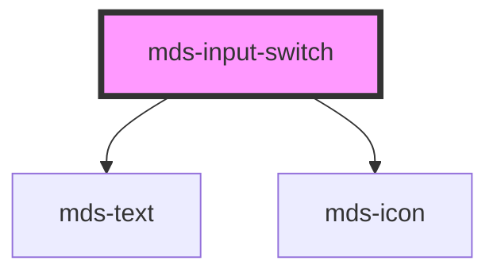

# mds-input-switch

<!-- Auto Generated Below -->

## Properties

| Property        | Attribute       | Description                                                                                                        | Type                                                                   | Default     |
| --------------- | --------------- | ------------------------------------------------------------------------------------------------------------------ | ---------------------------------------------------------------------- | ----------- |
| `autofocus`     | `autofocus`     | Sets or returns whether a checkbox should automatically get focus when the page loads                              | `boolean`                                                              | `undefined` |
| `checked`       | `checked`       | Specifies that an <input> element should be pre-selected when the page loads (for type="checkbox" or type="radio") | `boolean`                                                              | `undefined` |
| `disabled`      | `disabled`      | Sets or returns whether a checkbox is disabled, or not                                                             | `boolean`                                                              | `undefined` |
| `icon`          | `icon`          | The checked icon displayed                                                                                         | `string`                                                               | `null`      |
| `indeterminate` | `indeterminate` | Sets or returns the indeterminate state of the checkbox                                                            | `boolean`                                                              | `undefined` |
| `name`          | `name`          | Specifies the name of an <input> element                                                                           | `string`                                                               | `undefined` |
| `size`          | `size`          | Specifies the size for the switch toggle, it works only if attribute 'type' is set to 'switch'                     | `"lg" \| "md" \| "sm"`                                                 | `'md'`      |
| `type`          | `type`          | Specifies switch type: switch (default), checkbox and radio                                                        | `"checkbox" \| "radio" \| "switch"`                                    | `'switch'`  |
| `typography`    | `typography`    | Specifies the font typography of the element                                                                       | `"caption" \| "detail" \| "label" \| "option" \| "paragraph" \| "tip"` | `'detail'`  |
| `value`         | `value`         | Specifies the value of the input element                                                                           | `number \| string`                                                     | `''`        |
| `variant`       | `variant`       | Specifies the variant for `typography`                                                                             | `"info" \| "mono" \| "primary" \| "read" \| "secondary" \| "title"`    | `undefined` |

## Events

| Event         | Description                  | Type                                                    |
| ------------- | ---------------------------- | ------------------------------------------------------- |
| `valueChange` | Emits when the value changes | `CustomEvent<{ name: string; value: InputValueType; }>` |

## Dependencies

### Depends on

- [mds-text](../mds-text)
- [mds-icon](../mds-icon)

### Graph

----------------------------------------------

Built with love @ **Maggioli Informatica / R&D Department**
