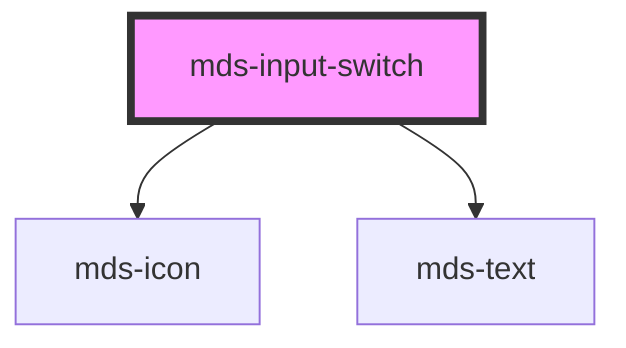

# mds-input-switch

This is a web-component from Maggioli Design System [Magma](https://magma.maggiolicloud.it), built with StencilJS, TypeScript, Storybook. It's based on the web-component standard and it's designed to be agnostic from the JavaScirpt framework you are using.

<!-- Auto Generated Below -->

## Properties

| Property        | Attribute       | Description                                                                                                        | Type                                                                                | Default     |
| --------------- | --------------- | ------------------------------------------------------------------------------------------------------------------ | ----------------------------------------------------------------------------------- | ----------- |
| `autofocus`     | `autofocus`     | Sets or returns whether a checkbox should automatically get focus when the page loads                              | `boolean`                                                                           | `undefined` |
| `checked`       | `checked`       | Specifies that an <input> element should be pre-selected when the page loads (for type="checkbox" or type="radio") | `boolean \| undefined`                                                              | `undefined` |
| `disabled`      | `disabled`      | Sets or returns whether a checkbox is disabled, or not                                                             | `boolean \| undefined`                                                              | `undefined` |
| `explicit`      | `explicit`      | Sets if the type switch mode shows explicit icons                                                                  | `boolean \| undefined`                                                              | `undefined` |
| `icon`          | `icon`          | The checked icon displayed                                                                                         | `string`                                                                            | `''`        |
| `indeterminate` | `indeterminate` | Sets or returns the indeterminate state of the checkbox                                                            | `boolean`                                                                           | `false`     |
| `name`          | `name`          | Specifies the name of an <input> element                                                                           | `string`                                                                            | `''`        |
| `size`          | `size`          | Specifies the size for the switch toggle, it works only if attribute 'type' is set to 'switch'                     | `"lg" \| "md" \| "sm"`                                                              | `'md'`      |
| `type`          | `type`          | Specifies switch type: switch (default), checkbox and radio                                                        | `"checkbox" \| "radio" \| "switch"`                                                 | `'switch'`  |
| `typography`    | `typography`    | Specifies the font typography of the element                                                                       | `"caption" \| "detail" \| "label" \| "option" \| "paragraph" \| "tip" \| undefined` | `'detail'`  |
| `value`         | `value`         | Specifies the value of the input element                                                                           | `string \| undefined`                                                               | `''`        |
| `variant`       | `variant`       | Specifies the variant for `typography`                                                                             | `"code" \| "info" \| "read" \| "title" \| undefined`                                | `undefined` |

## Events

| Event                  | Description                  | Type                                     |
| ---------------------- | ---------------------------- | ---------------------------------------- |
| `mdsInputSwitchChange` | Emits when the value changes | `CustomEvent<MdsInputSwitchEventDetail>` |

## Slots

| Slot        | Description                      |
| ----------- | -------------------------------- |
| `"default"` | Put text string or elements here |

## CSS Custom Properties

| Name                                                   | Description                                                                  |
| ------------------------------------------------------ | ---------------------------------------------------------------------------- |
| `--mds-input-switch-animation-timing-adjust`           | Set the size multiplier when the switch toggle is resizing by animation      |
| `--mds-input-switch-animation-timing-function`         | Set the timing function of the animation                                     |
| `--mds-input-switch-box-color-checked`                 | Set the color of the switch when the switch is checked                       |
| `--mds-input-switch-box-color-disabled-checked`        | Set the color of the switch when the switch is disabled and checked          |
| `--mds-input-switch-box-color-disabled-unchecked`      | Set the color of the switch when the switch is disabled and unchecked        |
| `--mds-input-switch-box-color-unchecked`               | Set the color of the switch when the switch is unchecked                     |
| `--mds-input-switch-box-padding-lg`                    | Set the padding of the switch toggle's container                             |
| `--mds-input-switch-box-padding-md`                    | Set the padding of the switch toggle's container                             |
| `--mds-input-switch-box-padding-sm`                    | Set the padding of the switch toggle's container                             |
| `--mds-input-switch-duration`                          | Set the duration of the animation                                            |
| `--mds-input-switch-icon-color-checked`                | Set the color of the icon when the switch is checked                         |
| `--mds-input-switch-icon-color-checked-disabled`       | Set the color of the icon when the switch is disabled and checked            |
| `--mds-input-switch-icon-color-indeterminate`          | Set the color of the icon when the switch is indeterminate                   |
| `--mds-input-switch-icon-color-indeterminate-disabled` | Set the color of the icon when the switch is disabled and indeterminate      |
| `--mds-input-switch-icon-color-unchecked`              | Set the color of the icon when the switch is unchecked                       |
| `--mds-input-switch-icon-color-unchecked-disabled`     | Set the color of the icon when the switch is disabled and unchecked          |
| `--mds-input-switch-toggle-color-checked`              | Set the color of the switch toggle when the switch is checked                |
| `--mds-input-switch-toggle-color-disabled-checked`     | Set the color of the switch toggle when the switch is disabled and checked   |
| `--mds-input-switch-toggle-color-disabled-unchecked`   | Set the color of the switch toggle when the switch is disabled and unchecked |
| `--mds-input-switch-toggle-color-unchecked`            | Set the color of the switch toggle when the switch is unchecked              |
| `--mds-input-switch-toggle-size-lg`                    | Sets the size of the switch toggle                                           |
| `--mds-input-switch-toggle-size-md`                    | Sets the size of the switch toggle                                           |
| `--mds-input-switch-toggle-size-sm`                    | Sets the size of the switch toggle                                           |

## Dependencies

### Depends on

- [mds-icon](../mds-icon)
- [mds-text](../mds-text)

### Graph

----------------------------------------------

Built with love @ [Gruppo Maggioli](https://www.maggioli.com) from [R&D Department](https://www.maggioli.com/it-it/chi-siamo/ricerca-sviluppo)
