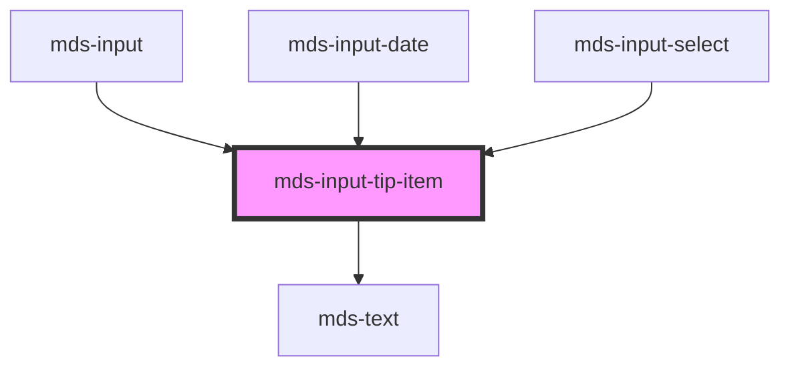

# mds-input-tip-item


<!-- Auto Generated Below -->


## Usage

### 1. Description

The `<mds-input-tip-item>` web component is a single contextual hint row rendered inside the [`<mds-input-tip>`](../../mds-input-tip) container. It represents one validation/status message of a form field (required, read-only, disabled, character count, or free text) and is orchestrated by the input components (`<mds-input>`, `<mds-input-date>`, `<mds-input-select>`) that own the tip; it has no standalone HTML equivalent.

#### Semantic Behavior

- **Compound child only**: It must be a direct slot child of `<mds-input-tip>` and is not used standalone; the host input decides which items exist and toggles their `expanded` state.
- **Variant drives the entire render**: The `variant` is not a style modifier but a content switch - each value produces a different body (slotted text, a localized status label, or the `done` success icon), so changing `variant` changes what the item shows, not just how it looks.
- **Self-localized labels**: For `required`, `readonly`, and `disabled` the visible text comes from the component's own i18n dictionary (en/it/es/el); these variants ignore slotted content. `text` and the `count-*` variants instead render the default slot provided by the parent.
- **Expanded toggling**: `expanded` is driven by the parent (often bound to the field's focus state).
- **No interactivity**: It carries no role, ARIA state, focus handling, or emitted events - it is a passive display row whose state is fully driven from above.

#### Properties & Visual Configurations

- **`variant`** is the only meaningful prop and selects both the message type and its source of text. Use `required` / `required-success` for required-field feedback (the success value swaps the label for a checkmark icon), `readonly` and `disabled` for field-state notices (auto-labeled from the dictionary), `text` for an arbitrary slotted hint, and the `count-*` family (`count-empty`, `count-incomplete`, `count-almost`, `count-almost-full`, `count-full`) for character-count feedback whose label text is slotted in by the parent. The full enumerated list lives in `readme.md` and the typed dictionary under `meta/`.
- **`expanded`** controls visibility/expansion within the tip and is intended to be driven by the parent rather than set by hand.

Styling hooks (`--mds-input-tip-item-background`, `--mds-input-tip-item-color`, `--mds-input-tip-item-icon-color`) are documented in `readme.md`.


### 2. Pattern

Correct and idiomatic ways to use the `<mds-input-tip-item>` component, ordered from most common to most specialized. Patterns assume a working knowledge of the variant system documented in [`docs/COMPONENTS.md`](../../../../../../docs/COMPONENTS.md) and the generic stencil rules in [`projects/stencil/SPEC.md`](../../../../SPEC.md).

#### Required-Field Hint

The most common use. Place one `<mds-input-tip-item variant="required">` inside the parent [`<mds-input-tip>`](../../mds-input-tip) to signal that the field is mandatory. The localized label ("Required" / "Obbligatorio" / ...) comes from the component's own i18n dictionary - do not slot text.

```html
<mds-input-tip active>
  <mds-input-tip-item variant="required" expanded></mds-input-tip-item>
</mds-input-tip>
```

#### Required Field Satisfied (Success State)

When the required condition is met, switch to `variant="required-success"`. The text label is replaced by a checkmark icon - no slot is needed or expected.

```html
<mds-input-tip active>
  <mds-input-tip-item variant="required-success" expanded></mds-input-tip-item>
</mds-input-tip>
```

#### Read-Only and Disabled State Notices

Use `variant="readonly"` or `variant="disabled"` to communicate field-state context. Both are self-labeled from the i18n dictionary and ignore any slotted content.

```html
<!-- Campo in sola lettura -->
<mds-input-tip active>
  <mds-input-tip-item variant="readonly" expanded></mds-input-tip-item>
</mds-input-tip>

<!-- Campo disabilitato -->
<mds-input-tip active>
  <mds-input-tip-item variant="disabled" expanded></mds-input-tip-item>
</mds-input-tip>
```

#### Arbitrary Hint Text via `variant="text"`

Use `variant="text"` when you need to show a free-form helper message. Slot the text string directly; no nested HTML is accepted.

```html
<mds-input-tip active>
  <mds-input-tip-item variant="text" expanded>Inserisci il tuo nome completo</mds-input-tip-item>
</mds-input-tip>
```

#### Character-Count Feedback

The `count-*` variants express how full a character-limited field is. The parent input computes the label text and slots it in; you choose the variant that matches the fill stage.

```html
<mds-input-tip active>
  <!-- Campo vuoto -->
  <mds-input-tip-item variant="count-empty" expanded>0 / 100</mds-input-tip-item>

  <!-- In corso, entro i limiti -->
  <mds-input-tip-item variant="count-incomplete" expanded>42 / 100</mds-input-tip-item>

  <!-- Vicino al limite -->
  <mds-input-tip-item variant="count-almost" expanded>80 / 100</mds-input-tip-item>

  <!-- Quasi al limite -->
  <mds-input-tip-item variant="count-almost-full" expanded>95 / 100</mds-input-tip-item>

  <!-- Limite raggiunto -->
  <mds-input-tip-item variant="count-full" expanded>100 / 100</mds-input-tip-item>
</mds-input-tip>
```

#### Toggling Visibility with `expanded`

The `expanded` attribute controls the reveal animation. Drive it from the parent's logic - for example, show the required hint only while the field is focused.

```html
<!-- Visibile: campo focalizzato -->
<mds-input-tip-item variant="required" expanded></mds-input-tip-item>

<!-- Nascosto: campo non focalizzato (rimuovere l'attributo, non impostarlo a false) -->
<mds-input-tip-item variant="required"></mds-input-tip-item>
```

#### Styling Customization

Override the visual appearance only through the three documented CSS custom properties. Set them on the host element or a parent selector; use Magma color tokens via `rgb(var(--<token>))` so dark mode keeps working.

```css
.campo-personalizzato mds-input-tip-item {
  --mds-input-tip-item-background: rgb(var(--variant-primary-05));
  --mds-input-tip-item-color: rgb(var(--variant-primary-01));
  --mds-input-tip-item-icon-color: rgb(var(--variant-primary-02));
}
```


### 3. Antipattern

Common incorrect uses of `<mds-input-tip-item>`. Each entry pairs the wrong form with the right one and a one-line reason. System-wide rules (boolean-as-string, shadow piercing, Tailwind color utilities, raw native event listening) live in [`docs/COMPONENTS.md`](../../../../../../docs/COMPONENTS.md#system-level-anti-patterns) - they apply here too but are not repeated.

#### Do Not Slot Text into Auto-Labeled Variants

`variant="required"`, `variant="readonly"`, and `variant="disabled"` each produce their own localized label from the internal i18n dictionary. Slotted text is silently ignored for these variants, so any copy inside the element is dead markup.

```html
<!-- 🚫 INCORRECT -->
<mds-input-tip-item variant="required" expanded>Obbligatorio</mds-input-tip-item>

<!-- ✅ CORRECT -->
<mds-input-tip-item variant="required" expanded></mds-input-tip-item>
```

#### Do Not Slot Content into `required-success`

`variant="required-success"` renders a hardcoded checkmark icon (no text). Any slot content is also silently ignored, just like the auto-labeled variants above.

```html
<!-- 🚫 INCORRECT -->
<mds-input-tip-item variant="required-success" expanded>
  <mds-icon name="mi/baseline/done"></mds-icon>
</mds-input-tip-item>

<!-- ✅ CORRECT -->
<mds-input-tip-item variant="required-success" expanded></mds-input-tip-item>
```

#### Do Not Set `expanded="false"` to Hide the Item

`expanded` is a boolean attribute. Setting it to the string `"false"` is truthy in HTML and keeps the item expanded. Remove the attribute entirely to hide it.

```html
<!-- 🚫 INCORRECT -->
<mds-input-tip-item variant="required" expanded="false"></mds-input-tip-item>

<!-- ✅ CORRECT -->
<mds-input-tip-item variant="required"></mds-input-tip-item>
```

#### Do Not Use Outside `<mds-input-tip>`

`<mds-input-tip-item>` is a compound child - it is designed to live as a direct slot child of [`<mds-input-tip>`](../../mds-input-tip). Using it standalone produces a collapsed, invisible chip with no context driving its state.

```html
<!-- 🚫 INCORRECT -->
<div class="hint-area">
  <mds-input-tip-item variant="text" expanded>Suggerimento</mds-input-tip-item>
</div>

<!-- ✅ CORRECT -->
<mds-input-tip active>
  <mds-input-tip-item variant="text" expanded>Suggerimento</mds-input-tip-item>
</mds-input-tip>
```

#### Do Not Put HTML Elements in the Default Slot

The default slot accepts plain text only (`variant="text"` and the `count-*` variants). Nested elements such as `<span>` or `<strong>` are not rendered correctly and may break the layout.

```html
<!-- 🚫 INCORRECT -->
<mds-input-tip-item variant="text" expanded>
  <strong>Nota:</strong> massimo 100 caratteri
</mds-input-tip-item>

<!-- ✅ CORRECT -->
<mds-input-tip-item variant="text" expanded>Nota: massimo 100 caratteri</mds-input-tip-item>
```

#### Do Not Pierce the Shadow DOM to Change Appearance

The only supported customization surface is the three `--mds-input-tip-item-*` CSS custom properties. Targeting internal elements with `::part()`, `>>>`, or undocumented selectors will break on future releases.

```css
/* 🚫 INCORRECT */
mds-input-tip-item >>> .content {
  border-radius: 0;
}
mds-input-tip-item::part(icon) {
  fill: hotpink;
}

/* ✅ CORRECT */
mds-input-tip-item {
  --mds-input-tip-item-background: rgb(var(--variant-primary-05));
  --mds-input-tip-item-icon-color: rgb(var(--status-success-02));
}
```


## Properties

| Property   | Attribute  | Description                          | Type                                                                                                                                                                                  | Default      |
| ---------- | ---------- | ------------------------------------ | ------------------------------------------------------------------------------------------------------------------------------------------------------------------------------------- | ------------ |
| `expanded` | `expanded` | Specifies if the element is expanded | `boolean \| undefined`                                                                                                                                                                | `undefined`  |
| `variant`  | `variant`  | Specifies the variant of the element | `"count-almost" \| "count-almost-full" \| "count-empty" \| "count-full" \| "count-incomplete" \| "disabled" \| "readonly" \| "required" \| "required-success" \| "text" \| undefined` | `'required'` |


## Methods

### `updateLang() => Promise<void>`

Updates the component's texts to the locale currently set on the host element.

#### Returns

Type: `Promise<void>`


## Slots

| Slot | Description                                                      |
| ---- | ---------------------------------------------------------------- |
|      | Add `text string`, `HTML elements` or `components` to this slot. |


## CSS Custom Properties

| Name                              | Description                                |
| --------------------------------- | ------------------------------------------ |
| `--mds-input-tip-item-background` | Sets the background color of the tip item. |
| `--mds-input-tip-item-color`      | Sets the text color of the tip item.       |
| `--mds-input-tip-item-icon-color` | Sets the icon color fill of the tip item.  |


## Dependencies

### Used by

 - [mds-input](../mds-input)
 - [mds-input-date](../mds-input-date)
 - [mds-input-select](../mds-input-select)

### Depends on

- [mds-text](../mds-text)

### Graph


----------------------------------------------

Built with love @ [Gruppo Maggioli](https://www.maggioli.com) from [R&D Department](https://www.maggioli.com/it-it/chi-siamo/ricerca-sviluppo)
