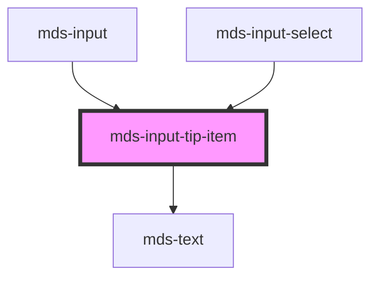

# mds-input-tip-item

<!-- Auto Generated Below -->

## Properties

| Property   | Attribute  | Description                          | Type                                                                                                                                                                                  | Default      |
| ---------- | ---------- | ------------------------------------ | ------------------------------------------------------------------------------------------------------------------------------------------------------------------------------------- | ------------ |
| `expanded` | `expanded` | Specifies if the element is expanded | `boolean \| undefined`                                                                                                                                                                | `undefined`  |
| `variant`  | `variant`  | Specifies the variant of the element | `"count-almost" \| "count-almost-full" \| "count-empty" \| "count-full" \| "count-incomplete" \| "disabled" \| "readonly" \| "required" \| "required-success" \| "text" \| undefined` | `'required'` |

## Methods

### `updateLang() => Promise<void>`

#### Returns

Type: `Promise<void>`

## Dependencies

### Used by

 - [mds-input](../mds-input)
 - [mds-input-select](../mds-input-select)

### Depends on

- [mds-text](../mds-text)

### Graph

----------------------------------------------

Built with love @ [Gruppo Maggioli](https://www.maggioli.com) from [R&D Department](https://www.maggioli.com/it-it/chi-siamo/ricerca-sviluppo)
