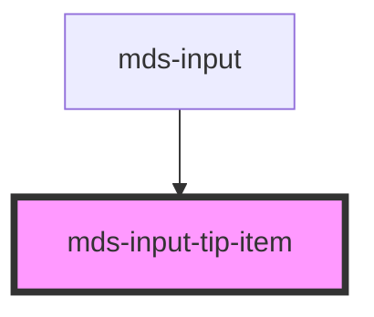

# mds-input-tip-item

<!-- Auto Generated Below -->

## Properties

| Property  | Attribute | Description                          | Type                                                                                     | Default      |
| --------- | --------- | ------------------------------------ | ---------------------------------------------------------------------------------------- | ------------ |
| `variant` | `variant` | Specifies the variant of the element | `"disabled" \| "message" \| "readonly" \| "required" \| "required-success" \| undefined` | `'required'` |

## Dependencies

### Used by

 - [mds-input](../mds-input)

### Graph

----------------------------------------------

Built with love @ [Gruppo Maggioli](https://www.maggioli.com) from [R&D Department](https://www.maggioli.com/it-it/chi-siamo/ricerca-sviluppo)
