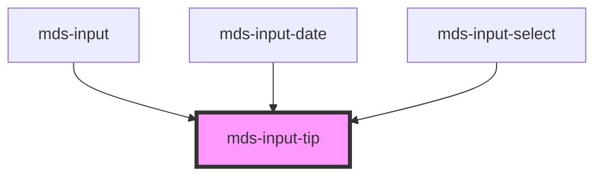

# mds-input-tip

<!-- Auto Generated Below -->

## Properties

| Property   | Attribute  | Description                                                             | Type                             | Default |
| ---------- | ---------- | ----------------------------------------------------------------------- | -------------------------------- | ------- |
| `active`   | `active`   | Specifies if the component is active and shows expanded children or not | `boolean \| undefined`           | `false` |
| `position` | `position` | Specifies the position of the element relative to its container         | `"bottom" \| "top" \| undefined` | `'top'` |

## CSS Custom Properties

| Name                                        | Description                                         |
| ------------------------------------------- | --------------------------------------------------- |
| `--mds-input-tip-active-translate`          | Transform applied to the tip when active            |
| `--mds-input-tip-background`                | Background color of the input tip                   |
| `--mds-input-tip-horizontal-offset`         | Default horizontal offset of the input tip          |
| `--mds-input-tip-horizontal-offset-focused` | Horizontal offset applied when the input is focused |
| `--mds-input-tip-vertical-offset`           | Vertical offset of the input tip                    |

## Dependencies

### Used by

 - [mds-input](../mds-input)
 - [mds-input-date](../mds-input-date)
 - [mds-input-select](../mds-input-select)

### Graph

----------------------------------------------

Built with love @ [Gruppo Maggioli](https://www.maggioli.com) from [R&D Department](https://www.maggioli.com/it-it/chi-siamo/ricerca-sviluppo)
