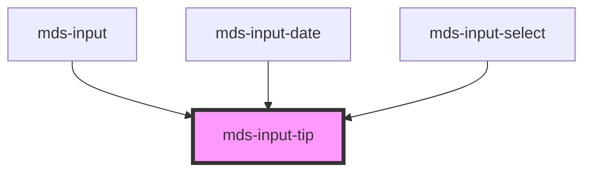

# mds-input-tip


<!-- Auto Generated Below -->


## Usage

### 1. Description

The `<mds-input-tip>` web component is the floating helper container of the Magma Design System input family: it overlays an input field and reveals supplementary content (slotted `mds-input-tip-item` chips, hints, or actions) that expands when the field becomes active. It is a presentational compound child positioned against its parent input rather than a standalone control.

#### Semantic Behavior

- **Floating overlay**: The tip floats over the parent input's edge without intercepting interaction; slotted children opt back into pointer events as needed.
- **Active expansion**: Setting `active` slides the tip into its expanded position; clearing it collapses the tip back flush with the input.
- **Empty collapse**: When the host has no slotted content it is hidden entirely, so an unused tip occupies no space.
- **Default slot is content**: The single default slot carries the tip's arbitrary children; there are no named slots, events, form association, or focus management of its own.

#### Properties & Visual Configurations

- **`active`** drives the expanded vs. collapsed state and is normally toggled by the parent input in response to focus, not set manually.
- **`position`** selects which edge of the input the tip anchors to and therefore the direction it expands: `'top'` (default) sits above the field, `'bottom'` sits below it.


### 2. Pattern

Correct and idiomatic ways to use the `<mds-input-tip>` component, ordered from most common to most specialized. Patterns assume a working knowledge of the compound component rules in [`docs/COMPONENTS.md`](../../../../../../docs/COMPONENTS.md) and the generic stencil rules in [`projects/stencil/SPEC.md`](../../../../SPEC.md).

`<mds-input-tip>` is an internal compound child used inside [`mds-input`](../../mds-input), [`mds-input-date`](../../mds-input-date), and [`mds-input-select`](../../mds-input-select). It is not meant for standalone use. The patterns below show what the parent components render internally, which is useful when building a custom input wrapper that needs the same behavior.

#### Status Chips Above the Field (position="top")

Position the tip above the input with `position="top"` (the default). Slot [`mds-input-tip-item`](../../mds-input-tip-item) children for each status badge to show. The `active` prop slides the tip into its expanded position when the field is focused.

```html
<div style="position: relative;">
  <mds-input-tip position="top" active>
    <mds-input-tip-item variant="required"></mds-input-tip-item>
  </mds-input-tip>
  <input type="text" placeholder="Campo obbligatorio" />
</div>
```

#### Hint and Counter Below the Field (position="bottom")

Use `position="bottom"` to anchor the tip below the input. This is the canonical placement for inline helper text and character-count feedback.

```html
<div style="position: relative;">
  <mds-input-tip position="bottom" active>
    <mds-input-tip-item variant="text">
      Inserisci almeno 8 caratteri
    </mds-input-tip-item>
    <mds-input-tip-item variant="count-incomplete">
      3 / 8
    </mds-input-tip-item>
  </mds-input-tip>
  <input type="text" />
</div>
```

#### Toggling the Active State on Focus

Drive `active` from a focus/blur handler to animate the tip in and out. Setting `active` slides the tip; removing it (or leaving it unset) collapses it back flush with the input edge.

```html
<div style="position: relative;" id="wrapper">
  <mds-input-tip position="top" id="tip">
    <mds-input-tip-item variant="required"></mds-input-tip-item>
  </mds-input-tip>
  <input
    type="text"
    id="field"
    placeholder="Nome utente"
  />
</div>

<script>
  const field = document.getElementById('field');
  const tip   = document.getElementById('tip');
  field.addEventListener('focus', () => { tip.active = true; });
  field.addEventListener('blur',  () => { tip.active = undefined; });
</script>
```

#### Disabled and Read-only State Chips

When the parent input is disabled or read-only, pass the matching `variant` to show a system-translated label. The `expanded` prop on the item keeps it permanently visible even without focus.

```html
<div style="position: relative;">
  <mds-input-tip position="top">
    <mds-input-tip-item variant="disabled" expanded></mds-input-tip-item>
  </mds-input-tip>
  <input type="text" disabled placeholder="Campo disabilitato" />
</div>
```

#### Required-field Success Feedback

Switch the `<mds-input-tip-item>` variant to `required-success` once the field passes validation. The item renders a checkmark icon instead of the "obbligatorio" label.

```html
<div style="position: relative;">
  <mds-input-tip position="top" active>
    <mds-input-tip-item variant="required-success" expanded></mds-input-tip-item>
  </mds-input-tip>
  <input type="text" value="Valore valido" />
</div>
```

#### Multiple Tip Items in One Container

Slot several `<mds-input-tip-item>` elements inside a single `<mds-input-tip>`. The container lays them out in a row and hides itself automatically when all slots are empty.

```html
<div style="position: relative;">
  <mds-input-tip position="bottom" active>
    <mds-input-tip-item variant="text">
      Solo lettere e numeri
    </mds-input-tip-item>
    <mds-input-tip-item variant="count-almost">
      18 / 20
    </mds-input-tip-item>
  </mds-input-tip>
  <input type="text" />
</div>
```

#### CSS Customization

Style the tip only through the documented `--mds-input-tip-*` CSS custom properties. Set them on the host or a parent selector; use Magma tokens via `rgb(var(--<token>))` so dark mode keeps working.

```css
.custom-input-wrapper mds-input-tip {
  --mds-input-tip-background: rgb(var(--tone-neutral-02));
  --mds-input-tip-vertical-offset: var(--spacing-200);
  --mds-input-tip-horizontal-offset: var(--spacing-300);
  --mds-input-tip-horizontal-offset-focused: 4px;
}
```


### 3. Antipattern

Common incorrect uses of `<mds-input-tip>`. Each entry pairs the wrong form with the right one and a one-line reason. System-wide rules (boolean-as-string, shadow piercing, Tailwind color utilities, raw native event listening) live in [`docs/COMPONENTS.md`](../../../../../../docs/COMPONENTS.md#system-level-anti-patterns) - they apply here too but are not repeated.

#### Do Not Use mds-input-tip as a Standalone Tooltip

`<mds-input-tip>` is an internal compound child of [`mds-input`](../../mds-input), [`mds-input-date`](../../mds-input-date), and [`mds-input-select`](../../mds-input-select). It relies on absolute positioning inside a relatively-positioned input shell; outside that context it has no anchor. Use [`mds-tooltip`](../../mds-tooltip) or [`mds-help`](../../mds-help) for standalone floating hints.

```html
<!-- 🚫 INCORRECT -->
<mds-input-tip active>
  <mds-input-tip-item variant="text">Suggerimento generico</mds-input-tip-item>
</mds-input-tip>

<!-- ✅ CORRECT -->
<mds-help text="Suggerimento generico"></mds-help>
```

#### Do Not Put Plain Text Directly in the Default Slot

The default slot of `<mds-input-tip>` accepts only [`mds-input-tip-item`](../../mds-input-tip-item) elements. Plain text nodes are not styled or accessible. Use `<mds-input-tip-item variant="text">` to carry freeform hint copy.

```html
<!-- 🚫 INCORRECT -->
<mds-input-tip position="bottom" active>
  Inserisci la tua email aziendale
</mds-input-tip>

<!-- ✅ CORRECT -->
<mds-input-tip position="bottom" active>
  <mds-input-tip-item variant="text">
    Inserisci la tua email aziendale
  </mds-input-tip-item>
</mds-input-tip>
```

#### Do Not Set active="false" to Collapse the Tip

`active` is a boolean attribute. Setting it to the string `"false"` keeps the tip expanded because any non-empty string is truthy. Remove the attribute (or set the prop to `undefined`) to collapse.

```html
<!-- 🚫 INCORRECT -->
<mds-input-tip position="top" active="false">
  <mds-input-tip-item variant="required"></mds-input-tip-item>
</mds-input-tip>

<!-- ✅ CORRECT -->
<mds-input-tip position="top">
  <mds-input-tip-item variant="required"></mds-input-tip-item>
</mds-input-tip>
```

#### Do Not Use an Undocumented position Value

`position` accepts only `"top"` and `"bottom"`. Any other value (e.g. `"left"`, `"right"`) is not typed and has no matching CSS rule; the tip falls back to the initial-value behavior silently.

```html
<!-- 🚫 INCORRECT -->
<mds-input-tip position="left" active>
  <mds-input-tip-item variant="text">Aiuto</mds-input-tip-item>
</mds-input-tip>

<!-- ✅ CORRECT -->
<mds-input-tip position="bottom" active>
  <mds-input-tip-item variant="text">Aiuto</mds-input-tip-item>
</mds-input-tip>
```

#### Do Not Slot Non-tip-item Elements for Custom Styles

Slotting arbitrary HTML or other Magma components (e.g. `<mds-badge>`, `<span>`) bypasses the item's own layout, color tokens, and border-radius joining logic. Always wrap content in `<mds-input-tip-item>`.

```html
<!-- 🚫 INCORRECT -->
<mds-input-tip position="bottom" active>
  <span style="color: red;">Testo personalizzato</span>
</mds-input-tip>

<!-- ✅ CORRECT -->
<mds-input-tip position="bottom" active>
  <mds-input-tip-item variant="text">Testo personalizzato</mds-input-tip-item>
</mds-input-tip>
```

#### Do Not Override Positioning via Inline Styles

The tip is absolutely positioned by its own CSS, driven by `--mds-input-tip-*` custom properties. Setting `position`, `top`, `left`, or `right` inline breaks the animation transform and the active-state offset calculation.

```css
/* 🚫 INCORRECT */
mds-input-tip {
  position: relative;
  top: 10px;
}

/* ✅ CORRECT */
mds-input-tip {
  --mds-input-tip-vertical-offset: var(--spacing-200);
  --mds-input-tip-horizontal-offset: var(--spacing-300);
}
```


## Properties

| Property   | Attribute  | Description                                                             | Type                             | Default |
| ---------- | ---------- | ----------------------------------------------------------------------- | -------------------------------- | ------- |
| `active`   | `active`   | Specifies if the component is active and shows expanded children or not | `boolean \| undefined`           | `false` |
| `position` | `position` | Specifies the position of the element relative to its container         | `"bottom" \| "top" \| undefined` | `'top'` |


## Dependencies

### Used by

 - [mds-input](../mds-input)
 - [mds-input-date](../mds-input-date)
 - [mds-input-select](../mds-input-select)

### Graph


----------------------------------------------

Built with love @ [Gruppo Maggioli](https://www.maggioli.com) from [R&D Department](https://www.maggioli.com/it-it/chi-siamo/ricerca-sviluppo)
