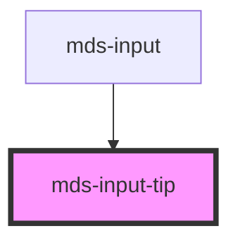

# mds-input-tip

<!-- Auto Generated Below -->

## Properties

| Property   | Attribute  | Description                                                     | Type                             | Default |
| ---------- | ---------- | --------------------------------------------------------------- | -------------------------------- | ------- |
| `active`   | `active`   | Specifies the position of the element relative to its container | `boolean \| undefined`           | `false` |
| `position` | `position` | Specifies the position of the element relative to its container | `"bottom" \| "top" \| undefined` | `'top'` |

## Dependencies

### Used by

 - [mds-input](../mds-input)

### Graph

----------------------------------------------

Built with love @ [Gruppo Maggioli](https://www.maggioli.com) from [R&D Department](https://www.maggioli.com/it-it/chi-siamo/ricerca-sviluppo)
