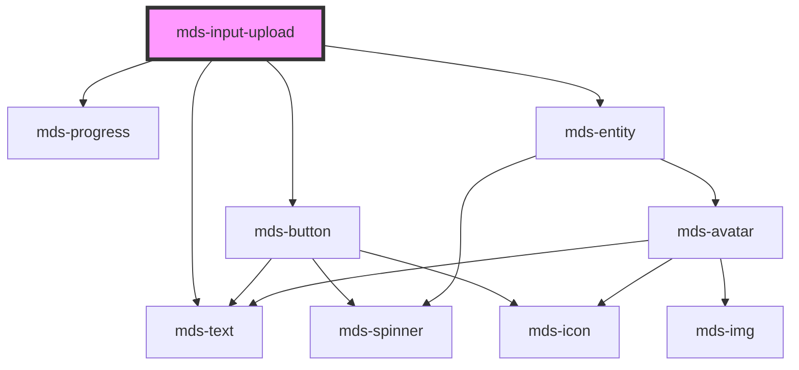

# mds-input-upload

<!-- Auto Generated Below -->

## Properties

| Property              | Attribute       | Description                                                        | Type      | Default     |
| --------------------- | --------------- | ------------------------------------------------------------------ | --------- | ----------- |
| `accept` _(required)_ | `accept`        | Defines the file types the file input should accept                | `string`  | `undefined` |
| `maxFileSize`         | `max-file-size` | Specifies the max size of a single file that can be uploaded in MB | `number`  | `20`        |
| `maxFiles`            | `max-files`     | Specifies the max number of files that can be uploaded             | `number`  | `5`         |
| `multiple`            | `multiple`      | Specifies if its possible to upload multiple file                  | `boolean` | `false`     |

## Dependencies

### Depends on

- [mds-text](../mds-text)
- [mds-button](../mds-button)
- [mds-progress](../mds-progress)
- [mds-entity](../mds-entity)

### Graph

----------------------------------------------

Built with love @ [Gruppo Maggioli](https://www.maggioli.com) from [R&D Department](https://www.maggioli.com/it-it/chi-siamo/ricerca-sviluppo)
