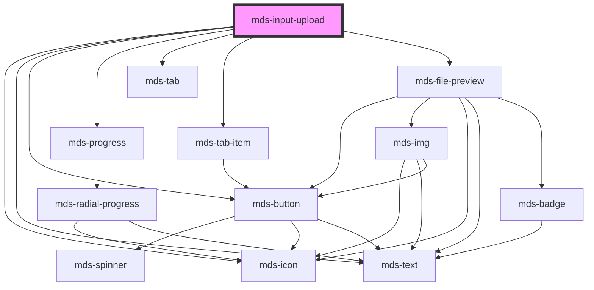

# mds-input-upload


<!-- Auto Generated Below -->


## Usage

### 1. Description

The `<mds-input-upload>` web component is the Magma Design System file-upload control. It wraps a hidden native `<input type="file">` in a drag-and-drop drop zone with progress, per-file previews, validation and optional sorting, exposing the selected files to a surrounding `<form>` through form association.

#### Semantic Behavior

- **Form association**: The accepted files are mirrored into the form value, so inside a `<form>` it submits like a native file input with no extra wiring; a form reset clears every selected file.
- **Validity reporting**: Per-file errors are reported as native validity flags - too many files, oversize, or wrong type - and the joined messages become the validation message.
- **Drag-and-drop**: The drop zone reacts to drag events; on dragenter the prompt text swaps to a drag hint, restoring on dragleave.
- **Per-file validation**: Each added file is checked against `accept` (MIME, wildcard MIME, or extension), `maxFileSize`, and `maxFiles`; valid files render as success previews, invalid ones render as error previews with a localized message and are excluded from the form value.
- **Change event**: `mdsInputUploadChange` fires with the current valid `FileList` (or `null`) on every add, cancel, or reset.
- **Imperative API**: Exposes `getFiles()`, `getFilesError()`, and `reset()` methods for host-driven control.
- **Localization**: All UI strings resolve against the host language (el / en / es / it).

#### Properties & Visual Configurations

- **`accept`** declares the allowed file types as a comma-separated list of MIME types, wildcard MIME types (e.g. `image/*`), or extensions; it both filters the native picker and drives the human-readable extension hint shown to the user.
- **`maxFileSize`** caps the size of any single file in MB (default `20`); files above it are rejected with a size error.
- **`maxFiles`** caps how many files may be uploaded (default `1`) and enables multi-file selection when greater than one.
- **`initialValue`** seeds the control with files already present; reassigning it re-runs the add pipeline.
- **`sort`** controls whether the sort chooser is shown. When `sort` is set to `'date'` or `'status'`, the sort tab bar appears once more than one file is present and lets the user switch the order interactively; the selected order also persists to `localStorage`. When `sort` is omitted, no tab bar is shown and the last `localStorage` preference (defaulting to `'date'`) is applied silently.


### 2. Pattern

Correct and idiomatic ways to use the `<mds-input-upload>` component, ordered from most common to most specialized. Patterns assume a working knowledge of the shared conventions in [`docs/COMPONENTS.md`](../../../../../../docs/COMPONENTS.md) and the generic stencil rules in [`projects/stencil/SPEC.md`](../../../../SPEC.md).

#### Single-File Upload (Default)

The simplest form. Without any attributes the drop zone accepts one file of any type up to 20 MB. Place it inside a `<form>` so the selected file is submitted natively with no extra wiring.

```html
<form action="/upload" method="post" enctype="multipart/form-data">
  <mds-input-upload name="allegato"></mds-input-upload>
  <mds-button type="submit" label="Invia" variant="primary" tone="strong"></mds-button>
</form>
```

#### Restricting Accepted File Types

Set `accept` to a comma-separated list of MIME types, wildcard MIME types, or extensions. The native file picker and the per-file validator both respect the same value.

```html
<!-- Solo PDF -->
<mds-input-upload accept=".pdf"></mds-input-upload>

<!-- Immagini di qualsiasi formato -->
<mds-input-upload accept="image/*"></mds-input-upload>

<!-- Mix di MIME esplicito ed estensione -->
<mds-input-upload accept="application/pdf, image/jpeg, .png"></mds-input-upload>
```

#### Limiting File Size

Set `max-file-size` (in MB) to reject files above that threshold. Each oversized file is shown as an error preview with a localized message and excluded from the form value.

```html
<mds-input-upload accept="image/*" max-file-size="5"></mds-input-upload>
```

#### Multi-File Upload

Set `max-files` to a number greater than one to enable multiple selection. The native picker switches to multi-select mode automatically; the progress bar tracks how many slots are filled.

```html
<mds-input-upload
  accept=".pdf, image/jpeg, image/png"
  max-file-size="70"
  max-files="3"
></mds-input-upload>
```

#### Seeding with Initial Files

Pass a `FileList` or `File[]` to `initialValue` to prepopulate the control - useful when editing an existing record that already has attachments. Reassigning the prop re-runs the add pipeline, including validation.

```html
<mds-input-upload id="allegati"></mds-input-upload>
<script>
  const upload = document.querySelector('#allegati');
  // seed with files already loaded from the server as File objects
  upload.initialValue = existingFiles;
</script>
```

#### Listening for File Changes

The `mdsInputUploadChange` event fires with the current valid `FileList` (or `null`) on every add, remove, or reset. Use it to drive UI outside the component - for example to enable a submit button only when files are present.

```html
<mds-input-upload id="doc-upload" accept=".pdf" max-files="5"></mds-input-upload>
<script>
  document.querySelector('#doc-upload').addEventListener('mdsInputUploadChange', (e) => {
    const files = e.detail;
    console.log('File selezionati:', files ? files.length : 0);
  });
</script>
```

#### Programmatic Control via Methods

Use the imperative API for host-driven workflows. `getFiles()` returns the current valid file list, `getFilesError()` returns any validation errors, and `reset()` clears all selections.

```html
<mds-input-upload id="upload-contratto" accept=".pdf" max-file-size="10"></mds-input-upload>
<script>
  const upload = document.querySelector('#upload-contratto');

  document.querySelector('#btn-verifica').addEventListener('click', async () => {
    const errors = await upload.getFilesError();
    if (errors) {
      console.warn('Errori nei file:', errors);
      return;
    }
    const files = await upload.getFiles();
    console.log('Pronti per il caricamento:', files);
  });

  document.querySelector('#btn-annulla').addEventListener('click', () => {
    upload.reset();
  });
</script>
```

#### Exposing the Sort Chooser

Setting `sort` to `"date"` or `"status"` makes the sort tab bar visible once more than one file is present, letting the user switch between date and status order interactively; the choice is persisted to `localStorage`. When `sort` is omitted, no tab bar is shown and the last `localStorage` preference is applied silently.

```html
<!-- Mostra il selettore di ordinamento, avviato su "per data" -->
<mds-input-upload sort="date" max-files="5"></mds-input-upload>

<!-- Mostra il selettore di ordinamento, avviato su "per stato" -->
<mds-input-upload sort="status" max-files="5"></mds-input-upload>
```

#### Form Reset Behavior

The component is form-associated: a form reset clears every selected file automatically, without calling `reset()` explicitly.

```html
<form id="modulo-allegati">
  <mds-input-upload name="allegati" accept=".pdf" max-files="3"></mds-input-upload>
  <mds-button type="submit" label="Invia" variant="primary" tone="strong"></mds-button>
  <mds-button type="reset" label="Cancella tutto" variant="error" tone="outline"></mds-button>
</form>
```

#### CSS Customization

Style the component only through its documented `--mds-input-upload-*` CSS custom properties. Set them on the host or a parent selector; use the Magma color tokens via `rgb(var(--<token>))` so dark mode keeps working.

```css
.upload-area-evidenziata mds-input-upload {
  --mds-input-upload-drag-area-background-color: rgb(var(--variant-primary-10));
  --mds-input-upload-drag-area-background-color-on-drag: rgb(var(--variant-primary-09));
  --mds-input-upload-drag-area-border: 3px dashed rgb(var(--variant-primary-05));
  --mds-input-upload-drag-area-border-on-drag: 3px dashed rgb(var(--variant-primary-03));
  --mds-input-upload-min-cols: 2;
}
```


### 3. Antipattern

Common incorrect uses of `<mds-input-upload>`. Each entry pairs the wrong form with the right one and a one-line reason. System-wide rules (boolean-as-string, shadow piercing, Tailwind color utilities, raw native event listening) live in [`docs/COMPONENTS.md`](../../../../../../docs/COMPONENTS.md#system-level-anti-patterns) - they apply here too but are not repeated.

#### Do Not Replace the Component with a Raw `<input type="file">`

`<input type="file">` gives you no drag-drop, no per-file validation, no progress bar, and no consistent styling. Use `<mds-input-upload>` whenever a file upload is needed.

```html
<!-- 🚫 INCORRECT -->
<input type="file" accept=".pdf" multiple>

<!-- ✅ CORRECT -->
<mds-input-upload accept=".pdf" max-files="5"></mds-input-upload>
```

#### Do Not Listen to the Native `change` Event

The internal `<input type="file">` lives inside shadow DOM; its native `change` event may not bubble out or may fire before internal validation completes. Always listen to the documented `mdsInputUploadChange` event instead.

```html
<!-- 🚫 INCORRECT -->
<mds-input-upload id="uploader"></mds-input-upload>
<script>
  document.querySelector('#uploader').addEventListener('change', (e) => {
    console.log(e.target.files); // undefined - input is in shadow DOM
  });
</script>

<!-- ✅ CORRECT -->
<mds-input-upload id="uploader"></mds-input-upload>
<script>
  document.querySelector('#uploader').addEventListener('mdsInputUploadChange', (e) => {
    console.log(e.detail); // valid FileList or null
  });
</script>
```

#### Do Not Disable the Component with `disabled="false"`

Setting any non-empty string is truthy in HTML. Remove the attribute entirely to enable the component - do not set it to the string `"false"`.

```html
<!-- 🚫 INCORRECT -->
<mds-input-upload disabled="false"></mds-input-upload>

<!-- ✅ CORRECT -->
<mds-input-upload></mds-input-upload>
```

#### Do Not Reach into Shadow DOM for the Hidden Input

The hidden `<input type="file">` is an implementation detail inside shadow DOM. Do not query it or read `.files` directly. Use the `getFiles()` method or listen to `mdsInputUploadChange`.

```html
<!-- 🚫 INCORRECT -->
<mds-input-upload id="upload"></mds-input-upload>
<script>
  const input = document.querySelector('#upload').shadowRoot.querySelector('input[type="file"]');
  console.log(input.files); // fragile - implementation detail
</script>

<!-- ✅ CORRECT -->
<mds-input-upload id="upload"></mds-input-upload>
<script>
  const files = await document.querySelector('#upload').getFiles();
  console.log(files);
</script>
```

#### Do Not Omit `sort` When You Want the Sort Chooser Visible

The sort tab bar only appears when `sort` is explicitly set to `"date"` or `"status"` and more than one file is present. Omitting `sort` silently applies the user's last `localStorage` preference and hides the chooser. Set `sort` when you want users to be able to switch the order interactively.

```html
<!-- 🚫 INCORRECT - sort chooser never appears because sort is omitted -->
<mds-input-upload max-files="10"></mds-input-upload>

<!-- ✅ CORRECT - sort chooser appears once more than one file is added -->
<mds-input-upload max-files="10" sort="date"></mds-input-upload>
```

#### Do Not Customize Through Undocumented Internal Selectors

The only supported customization surface is the five `--mds-input-upload-*` CSS custom properties. Do not target internal classes or parts not listed in the API.

```css
/* 🚫 INCORRECT */
mds-input-upload >>> .drag-area {
  background: lightblue;
}
mds-input-upload .main-action {
  display: none;
}

/* ✅ CORRECT */
mds-input-upload {
  --mds-input-upload-drag-area-background-color: rgb(var(--variant-primary-10));
  --mds-input-upload-drag-area-border: 3px dashed rgb(var(--variant-primary-05));
}
```

#### Do Not Use `initialValue` for Each New File Added by the User

`initialValue` is for seeding the control on first render with pre-existing data - for example files already saved to a server. Updating it repeatedly as the user adds files creates duplicate entries because the add pipeline is idempotent only for files already at `Status.SUCCESS`. Let the component manage user-selected files through its own UI.

```html
<!-- 🚫 INCORRECT - misusing initialValue as a live file binding -->
<mds-input-upload id="uploader"></mds-input-upload>
<script>
  document.querySelector('#uploader').addEventListener('mdsInputUploadChange', (e) => {
    document.querySelector('#uploader').initialValue = e.detail; // causes re-processing
  });
</script>

<!-- ✅ CORRECT - just read the value when you need it -->
<mds-input-upload id="uploader"></mds-input-upload>
<script>
  document.querySelector('#uploader').addEventListener('mdsInputUploadChange', (e) => {
    const files = e.detail; // use directly without re-assigning initialValue
    console.log('File correnti:', files ? files.length : 0);
  });
</script>
```


## Properties

| Property       | Attribute       | Description                                                                                                      | Type                              | Default     |
| -------------- | --------------- | ---------------------------------------------------------------------------------------------------------------- | --------------------------------- | ----------- |
| `accept`       | `accept`        | Defines the file types the file input should accept                                                              | `string`                          | `''`        |
| `initialValue` | --              | Specifies initial files uploaded                                                                                 | `FileList \| File[] \| undefined` | `undefined` |
| `maxFileSize`  | `max-file-size` | Specifies the max size of a single file that can be uploaded in MB                                               | `number`                          | `20`        |
| `maxFiles`     | `max-files`     | Specifies the max number of files that can be uploaded                                                           | `number`                          | `1`         |
| `sort`         | `sort`          | Specifies if the component should show a sort widget by status or date of upload, if not defined let user choose | `"date" \| "status" \| undefined` | `undefined` |


## Events

| Event                  | Description                                | Type                            |
| ---------------------- | ------------------------------------------ | ------------------------------- |
| `mdsInputUploadChange` | Emits when the component files are changed | `CustomEvent<FileList \| null>` |


## Methods

### `getFiles() => Promise<FileList | null>`

Returns a promise of files uploaded as Filelist or null if there's none

#### Returns

Type: `Promise<FileList | null>`


### `getFilesError() => Promise<FileError[] | null>`

Returns a promise of files error or null if there's none

#### Returns

Type: `Promise<FileError[] | null>`


### `reset() => Promise<void>`

Reset component's files

#### Returns

Type: `Promise<void>`


### `updateLang() => Promise<void>`


#### Returns

Type: `Promise<void>`


## Dependencies

### Depends on

- [mds-icon](../mds-icon)
- [mds-text](../mds-text)
- [mds-button](../mds-button)
- [mds-progress](../mds-progress)
- [mds-tab](../mds-tab)
- [mds-tab-item](../mds-tab-item)
- [mds-file-preview](../mds-file-preview)

### Graph


----------------------------------------------

Built with love @ [Gruppo Maggioli](https://www.maggioli.com) from [R&D Department](https://www.maggioli.com/it-it/chi-siamo/ricerca-sviluppo)
