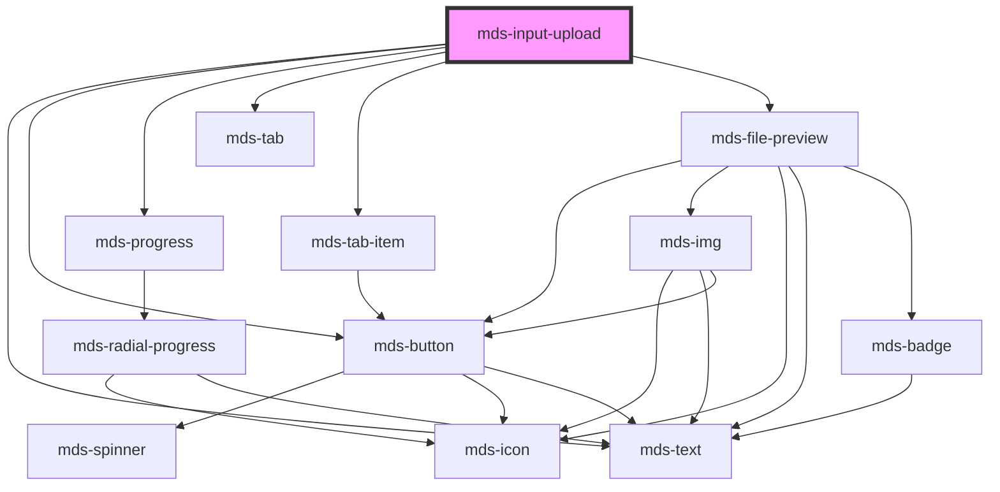

# mds-input-upload

<!-- Auto Generated Below -->

## Properties

| Property       | Attribute       | Description                                                                                                      | Type                              | Default     |
| -------------- | --------------- | ---------------------------------------------------------------------------------------------------------------- | --------------------------------- | ----------- |
| `accept`       | `accept`        | Defines the file types the file input should accept                                                              | `string`                          | `''`        |
| `initialValue` | --              | Specifies initial files uploaded                                                                                 | `FileList \| File[] \| undefined` | `undefined` |
| `maxFileSize`  | `max-file-size` | Specifies the max size of a single file that can be uploaded in MB                                               | `number`                          | `20`        |
| `maxFiles`     | `max-files`     | Specifies the max number of files that can be uploaded                                                           | `number`                          | `1`         |
| `sort`         | `sort`          | Specifies if the component should show a sort widget by status or date of upload, if not defined let user choose | `"date" \| "status" \| undefined` | `undefined` |

## Events

| Event                  | Description                                | Type                            |
| ---------------------- | ------------------------------------------ | ------------------------------- |
| `mdsInputUploadChange` | Emits when the component files are changed | `CustomEvent<FileList \| null>` |

## Methods

### `getFiles() => Promise<FileList | null>`

Returns a promise of files uploaded as Filelist or null if there's none

#### Returns

Type: `Promise<FileList | null>`

### `getFilesError() => Promise<FileError[] | null>`

Returns a promise of files error or null if there's none

#### Returns

Type: `Promise<FileError[] | null>`

### `reset() => Promise<void>`

Reset component's files

#### Returns

Type: `Promise<void>`

### `updateLang() => Promise<void>`

#### Returns

Type: `Promise<void>`

## CSS Custom Properties

| Name                                                    | Description                                                               |
| ------------------------------------------------------- | ------------------------------------------------------------------------- |
| `--mds-input-upload-drag-area-background-color`         | Sets the background-color of the drag area.                               |
| `--mds-input-upload-drag-area-background-color-on-drag` | Set the background color of the drag area when a file is dragged over it. |
| `--mds-input-upload-drag-area-border`                   | Sets the border of the drag area.                                         |
| `--mds-input-upload-drag-area-border-on-drag`           | Set the border of the drag area when a file is dragged over it.           |
| `--mds-input-upload-min-cols`                           | Set the minimum number of columns for the file list.                      |

## Dependencies

### Depends on

- [mds-text](../mds-text)
- [mds-button](../mds-button)
- [mds-progress](../mds-progress)
- [mds-tab](../mds-tab)
- [mds-tab-item](../mds-tab-item)
- [mds-file-preview](../mds-file-preview)

### Graph

----------------------------------------------

Built with love @ [Gruppo Maggioli](https://www.maggioli.com) from [R&D Department](https://www.maggioli.com/it-it/chi-siamo/ricerca-sviluppo)
