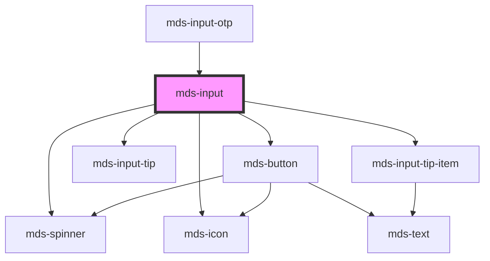

# mds-input

## Form interaction

This component is `scoped` and not `shadowed`, so the inner `input` element interacts natively with `form` element.


This is a web-component from Maggioli Design System [Magma](https://magma.maggiolicloud.it), built with StencilJS, TypeScript, Storybook. It's based on the web-component standard and it's designed to be agnostic from the JavaScript framework you are using.

<!-- Auto Generated Below -->


## Usage

### 1. Description

The `<mds-input>` web component is the primary single- and multi-line text entry control of the Magma Design System. It wraps a native `<input>` (or `<textarea>` when `type="textarea"`) and layers on form association, validation, inline tips, iconography, password masking, numeric steppers, datalist suggestions and speech-to-text dictation.

#### Semantic Behavior

- **Form association**: The component reports its value to the surrounding `<form>`, so it submits and participates in reset natively. On `disabled` or form reset the reported value is cleared.
- **Validation on blur**: Validation runs when the field loses focus (and re-runs on input once invalid). It drives the `variant` automatically to `'success'` or `'error'`, emits `mdsInputValidation` with the boolean result, and reverts to `'primary'` when an optional field is emptied.
- **Type-aware validators**: The active validator set is derived from `type` - `cf`, `isbn`, `cc`, `piva` install format/mask validators, while `required`, `min`/`max` and `minlength`/`maxlength` add the corresponding constraint validators. Custom validators can be attached at runtime through the `addValidator`/`removeValidator`/`hasValidator`/`getErrors` methods.
- **Disabled / read-only tips**: `disabled` and `readonly` surface a persistent top tip describing the state; read-only fields also auto-select their text on focus.
- **Character counter**: When `maxlength` is set a bottom counter tip shows `current / max` and shifts through fullness variants as the value approaches the limit. A `maxlength` of `0` or less is treated as unset.
- **Password masking**: With `type="password"` a toggle button reveals/hides the value.
- **Number steppers**: With `type="number"` increment/decrement buttons are rendered; their placement follows `controlsLayout` and their glyphs follow `controlsIcon`.
- **Speech-to-text**: When `mic` is set a dictation button transcribes speech into the value, emitting `mdsInputSpeechEnd` when recognition stops; it degrades gracefully when unavailable.
- **Emitted events**: `mdsInputChange` carries the new value, `mdsInputKeydown` forwards input keystrokes, and `mdsInputFocus`/`mdsInputBlur` fire on focus transitions.

#### Properties & Visual Configurations

The shared `variant` ladder (color role) is defined in [`projects/stencil/SPEC.md`](../../../../SPEC.md#tone-and-variant-system); `<mds-input>` consumes it for both intent styling and validation feedback, but does not expose a `tone` prop. It uses the full shared set and adds no component-specific variants.

- **`type`** selects both the rendered control and the validation profile: it covers the native HTML types plus Italian-specific masked formats (`'cf'`, `'piva'`, `'isbn'`, `'cc'`) and switches the host to a multi-line `<textarea>` for `'textarea'`.
- **`variant="ai"`** auto-assigns the AI chatbot icon when no `icon` is otherwise provided, signposting AI-assisted fields.

#### Other behavioral props

- **`icon`** is an SVG filename slug from the Magma icon library shown at the trailing edge of the field; it is suppressed while `await` is active, since the spinner takes its place.
- **`controlsLayout`** chooses between stacked (`'vertical'`) and split (`'horizontal'`) stepper buttons, and **`controlsIcon`** picks arrow vs. plus/minus glyphs - both apply only to `type="number"`.
- **`datalist`** supplies suggestion options for `type="search"` style autocompletion.
- **`tip`** renders inline helper text below the field, and **`typography`** selects the field's text scale.


### 2. Pattern

Correct and idiomatic ways to use the `<mds-input>` component, ordered from most common to most specialized. Patterns assume a working knowledge of the variant / tone ladders documented in [`docs/COMPONENTS.md`](../../../../../../docs/COMPONENTS.md) and the generic stencil rules in [`projects/stencil/SPEC.md`](../../../../SPEC.md).

#### Basic Text Input

The simplest form: set `name` for form participation and `placeholder` for a visual hint. Wrap the component in [`mds-input-field`](../../mds-input-field) to add a visible label and associated tip.

```html
<mds-input
  name="cognome"
  placeholder="Inserisci il tuo cognome"
></mds-input>
```

#### Required Field with `tip` Helper Text

Use `required` to enforce non-empty submission and `tip` to explain the constraint. The component surfaces a top-tip when focused and drives `variant` to `'error'` or `'success'` on blur.

```html
<mds-input
  name="email"
  type="email"
  placeholder="nome@esempio.it"
  required
  tip="Inserisci un indirizzo email valido"
></mds-input>
```

#### Textarea for Multi-line Content

Set `type="textarea"` to render a `<textarea>` instead of a single-line `<input>`. Use the `--mds-input-textarea-*` custom properties to control height and resize behaviour.

```html
<mds-input
  name="descrizione"
  type="textarea"
  placeholder="Descrivi il problema..."
  maxlength="500"
></mds-input>
```

#### Character Counter via `maxlength`

When `maxlength` is set the component renders a live `current / max` counter below the field. The counter shifts through fullness variants as the limit approaches. A value of `0` or less is treated as unset.

```html
<mds-input
  name="titolo"
  placeholder="Titolo dell'articolo"
  maxlength="120"
></mds-input>
```

#### Numeric Input with Steppers

Set `type="number"` to enable built-in increment/decrement buttons. Use `controlsLayout` to choose between stacked (`'vertical'`, default) and split (`'horizontal'`) placement, and `controlsIcon` to pick arrow vs. plus/minus glyphs. Use `min`, `max`, and `step` to constrain the legal range.

```html
<!-- Stacked (default) - arrow glyphs -->
<mds-input
  name="quantita"
  type="number"
  min="1"
  max="99"
  step="1"
  placeholder="1"
></mds-input>

<!-- Horizontal split - arithmetic glyphs -->
<mds-input
  name="quantita"
  type="number"
  min="0"
  max="100"
  controls-layout="horizontal"
  controls-icon="arithmetic"
  placeholder="0"
></mds-input>
```

#### Password Input

Set `type="password"` to render a masked field with a built-in visibility toggle. The component renders a custom dot-mask overlay and a show/hide button - no extra wiring is needed.

```html
<mds-input
  name="password"
  type="password"
  placeholder="Scegli una password"
  required
></mds-input>
```

#### Italian-Specific Masked Types

`type="cf"`, `type="piva"`, `type="cc"`, and `type="isbn"` install a format-aware validator and apply the appropriate keyboard mask. Use them whenever a masked format is expected.

```html
<mds-input name="codice_fiscale" type="cf" placeholder="RSSMRA80A01H501Z"></mds-input>
<mds-input name="partita_iva"    type="piva" placeholder="01234567890"></mds-input>
```

#### Search Input with Datalist

Use `type="search"` combined with the `datalist` prop to offer autocomplete suggestions from a fixed list. The list is rendered inside the shadow DOM and wired automatically.

```html
<mds-input
  name="comune"
  type="search"
  placeholder="Cerca comune..."
></mds-input>
```

```javascript
// Pass suggestions as a JavaScript array
document.querySelector('mds-input').datalist = ['Roma', 'Milano', 'Napoli', 'Torino'];
```

#### Icon Decoration

The `icon` prop renders an SVG slug from the Magma icon library at the leading edge of the field. The icon is suppressed while `await` is active and the spinner takes its place.

```html
<mds-input
  name="cerca"
  type="search"
  icon="mi/baseline/search"
  placeholder="Cerca..."
></mds-input>
```

#### AI-Assisted Field

Set `variant="ai"` to signal an AI-powered field. When no `icon` prop is present, the component auto-assigns the AI chatbot icon.

```html
<mds-input
  name="prompt"
  type="text"
  variant="ai"
  placeholder="Chiedi qualcosa all'assistente..."
></mds-input>
```

#### Async Loading via `await`

Set the `await` boolean attribute while an async operation (e.g. a lookup) is in flight. The component renders an inline spinner in place of the icon. Remove the attribute when done - do not set `await="false"`.

```html
<mds-input name="codice" placeholder="Verifica in corso..." await></mds-input>
```

#### Speech-to-Text Dictation

Set the `mic` boolean attribute to render a dictation button. The component appends recognized speech to the current value and emits `mdsInputSpeechEnd` when recognition stops. It degrades gracefully if the Web Speech API is unavailable.

```html
<mds-input
  name="note_vocali"
  type="text"
  mic
  placeholder="Parla o scrivi..."
></mds-input>
```

#### Listening to Events

Listen for `mdsInputChange` instead of native `input` or `change` - these native events may not bubble out of the shadow DOM reliably.

```javascript
document.querySelector('mds-input').addEventListener('mdsInputChange', (e) => {
  console.log(e.detail.value);
});

document.querySelector('mds-input').addEventListener('mdsInputValidation', (e) => {
  console.log('valido:', e.detail);
});
```

#### Form Participation

`<mds-input>` is form-associated. It submits, resets, and validates natively inside a `<form>`. Set `name` so the value is included in form data.

```html
<form action="/salva" method="post">
  <mds-input name="nome"    type="text"  placeholder="Nome"   required></mds-input>
  <mds-input name="cognome" type="text"  placeholder="Cognome" required></mds-input>
  <mds-input name="email"   type="email" placeholder="Email"   required></mds-input>

  <mds-button type="submit" label="Invia" variant="primary" tone="strong"></mds-button>
  <mds-button type="reset"  label="Annulla" variant="dark" tone="outline"></mds-button>
</form>
```

#### Read-Only Display

Use `readonly` when the value should be visible but not editable. A top tip describes the state on focus, and the field text is auto-selected on click for easy copying.

```html
<mds-input
  name="codice_riferimento"
  value="REF-2024-00123"
  readonly
></mds-input>
```

#### Styling Customization

Style the input only through its documented `--mds-input-*` CSS custom properties. Set them on the host or a parent selector. Use Magma color tokens via `rgb(var(--<token>))` so dark mode and high-contrast modes keep working.

```css
.search-bar mds-input {
  --mds-input-background: rgb(var(--tone-neutral-09));
  --mds-input-placeholder-default-color: rgb(var(--tone-neutral-05));
  --mds-input-icon-color: rgb(var(--variant-primary-03));
}

/* Textarea: fixed height, allow resize */
.notes-area mds-input {
  --mds-input-textarea-min-height: 8rem;
  --mds-input-textarea-max-height: 24rem;
  --mds-input-textarea-resize: vertical;
}
```


### 3. Antipattern

Common incorrect uses of `<mds-input>`. Each entry pairs the wrong form with the right one and a one-line reason. System-wide rules (boolean-as-string, shadow piercing, Tailwind color utilities, raw native event listening) live in [`docs/COMPONENTS.md`](../../../../../../docs/COMPONENTS.md#system-level-anti-patterns) - they apply here too but are not repeated.

#### Do Not Use a Raw `<input>` When `<mds-input>` Exists

Reaching for a plain `<input>` bypasses theming, validation, tips, accessible state announcements, and form-reset behavior provided by the component.

```html
<!-- 🚫 INCORRECT -->
<input type="text" name="nome" placeholder="Nome" class="my-input">

<!-- ✅ CORRECT -->
<mds-input name="nome" type="text" placeholder="Nome"></mds-input>
```

#### Do Not Set Boolean Attributes to the String `"false"`

`disabled="false"`, `required="false"`, `readonly="false"`, `mic="false"`, and `await="false"` are all truthy in HTML - any non-empty string activates the attribute. Remove the attribute entirely to turn it off.

```html
<!-- 🚫 INCORRECT -->
<mds-input name="note" disabled="false" required="false"></mds-input>

<!-- ✅ CORRECT -->
<mds-input name="note"></mds-input>
```

#### Do Not Force `variant` for Validation Feedback

The component drives `variant` to `'success'` or `'error'` automatically on blur when validators are active. Setting `variant` manually overrides the feedback and breaks the visual contract.

```html
<!-- 🚫 INCORRECT -->
<mds-input name="codice" variant="error" tip="Valore non valido"></mds-input>

<!-- ✅ CORRECT -->
<mds-input name="codice" required tip="Inserisci un valore valido"></mds-input>
```

#### Do Not Listen to Native `input` or `change` Events

Native DOM events may not bubble out of the shadow root reliably. Use the documented `mdsInputChange` event instead.

```javascript
// 🚫 INCORRECT
document.querySelector('mds-input').addEventListener('input', (e) => {
  console.log(e.target.value);
});

// ✅ CORRECT
document.querySelector('mds-input').addEventListener('mdsInputChange', (e) => {
  console.log(e.detail.value);
});
```

#### Do Not Use `type="number"` Native Browser Spinners and Then Override the Input

The component renders its own increment/decrement buttons and hides the native browser spinners. Do not try to re-enable them via CSS, and do not add inline JS `stepUp`/`stepDown` calls - use the `controlsLayout` and `controlsIcon` props to configure the built-in controls.

```html
<!-- 🚫 INCORRECT -->
<mds-input type="number" style="-moz-appearance: auto;"></mds-input>

<!-- ✅ CORRECT -->
<mds-input
  type="number"
  controls-layout="horizontal"
  controls-icon="arithmetic"
  min="0"
  max="100"
></mds-input>
```

#### Do Not Use a Legacy or Invalid `type` Value

`<mds-input>` accepts a specific set of `type` values: `text`, `email`, `number`, `password`, `search`, `tel`, `url`, `date`, `time`, `textarea`, `cf`, `piva`, `cc`, `isbn`. Supplying anything else (e.g. `"checkbox"`, `"radio"`, `"file"`) silently falls back to `text` behavior and ignores the type-specific logic. Use the dedicated Magma component for those controls.

```html
<!-- 🚫 INCORRECT -->
<mds-input type="checkbox" name="accetto"></mds-input>
<mds-input type="file"     name="allegato"></mds-input>

<!-- ✅ CORRECT -->
<mds-input-switch name="accetto"></mds-input-switch>
<mds-input-upload name="allegato"></mds-input-upload>
```

#### Do Not Use `placeholder` as the Accessible Label

`placeholder` disappears on input and is never read as a label by assistive tech. Always pair `<mds-input>` with [`mds-input-field`](../../mds-input-field) (which provides the visible `<label>` association) or supply `aria-label` directly on the host.

```html
<!-- 🚫 INCORRECT -->
<mds-input name="ricerca" placeholder="Cerca per nome"></mds-input>

<!-- ✅ CORRECT -->
<mds-input-field label="Cerca per nome">
  <mds-input name="ricerca" placeholder="Cerca per nome"></mds-input>
</mds-input-field>
```

#### Do Not Pierce the Shadow DOM to Style Internal Parts

The supported customization surface is `--mds-input-*` CSS custom properties plus the documented shadow parts (`field`, `tip-top`, `tip-bottom`, `tip-count`, `password-toggle-button`, `counter-button-increase`, `counter-button-decrease`, `mic-toggle-button`). Targeting undocumented internals via `>>>` or arbitrary class names couples your code to the Shadow DOM implementation.

```css
/* 🚫 INCORRECT */
mds-input >>> .input {
  border: 2px solid red;
}

/* ✅ CORRECT */
mds-input {
  --mds-input-ring: 0 0 0 2px rgb(var(--status-error-05));
  --mds-input-background: rgb(var(--status-error-09));
}
mds-input::part(field) {
  font-style: italic;
}
```


## Properties

| Property         | Attribute         | Description                                                                                                                                                                        | Type                                                                                                                                                                                                                                                                                                                                                                                                                                                                                                                                                                                                                                                                                                                                                                                                                                                                                                                                                  | Default      |
| ---------------- | ----------------- | ---------------------------------------------------------------------------------------------------------------------------------------------------------------------------------- | ----------------------------------------------------------------------------------------------------------------------------------------------------------------------------------------------------------------------------------------------------------------------------------------------------------------------------------------------------------------------------------------------------------------------------------------------------------------------------------------------------------------------------------------------------------------------------------------------------------------------------------------------------------------------------------------------------------------------------------------------------------------------------------------------------------------------------------------------------------------------------------------------------------------------------------------------------- | ------------ |
| `autocomplete`   | `autocomplete`    | Specifies whether the element should have autocomplete enabled                                                                                                                     | `"additional-name" \| "address" \| "address-level1" \| "address-level2" \| "address-level3" \| "address-level4" \| "address-line1" \| "address-line2" \| "address-line3" \| "bday" \| "bday-day" \| "bday-month" \| "bday-year" \| "cc-additional-name" \| "cc-csc" \| "cc-exp" \| "cc-exp-month" \| "cc-exp-year" \| "cc-family-name" \| "cc-given-name" \| "cc-name" \| "cc-number" \| "cc-type" \| "country" \| "country-name" \| "current-password" \| "email" \| "family-name" \| "given-name" \| "honorific-prefix" \| "honorific-suffix" \| "impp" \| "language" \| "name" \| "new-password" \| "nickname" \| "off" \| "on" \| "one-time-code" \| "organization" \| "organization-title" \| "photo" \| "postal-code" \| "sex" \| "street-address" \| "tel" \| "tel-area-code" \| "tel-country-code" \| "tel-extension" \| "tel-local" \| "tel-national" \| "transaction-amount" \| "transaction-currency" \| "url" \| "username" \| undefined` | `'off'`      |
| `autofocus`      | `autofocus`       | Specifies that the element should automatically get focus when the page loads                                                                                                      | `boolean`                                                                                                                                                                                                                                                                                                                                                                                                                                                                                                                                                                                                                                                                                                                                                                                                                                                                                                                                             | `false`      |
| `await`          | `await`           | Specifies if the spinner icon is shown, replacing the icon if present                                                                                                              | `boolean`                                                                                                                                                                                                                                                                                                                                                                                                                                                                                                                                                                                                                                                                                                                                                                                                                                                                                                                                             | `false`      |
| `controlsIcon`   | `controls-icon`   | Specifies the icon type of the counter button when the input type is set to `number`                                                                                               | `"arithmetic" \| "arrow" \| undefined`                                                                                                                                                                                                                                                                                                                                                                                                                                                                                                                                                                                                                                                                                                                                                                                                                                                                                                                | `'arrow'`    |
| `controlsLayout` | `controls-layout` | Specifies the layout of the counter button when the input type is set to `number`                                                                                                  | `"horizontal" \| "vertical" \| undefined`                                                                                                                                                                                                                                                                                                                                                                                                                                                                                                                                                                                                                                                                                                                                                                                                                                                                                                             | `'vertical'` |
| `datalist`       | --                | A list of search terms to be searched from the input field, it should be used with type="search" input.                                                                            | `string[] \| undefined`                                                                                                                                                                                                                                                                                                                                                                                                                                                                                                                                                                                                                                                                                                                                                                                                                                                                                                                               | `undefined`  |
| `disabled`       | `disabled`        | If true, the element is displayed as disabled                                                                                                                                      | `boolean \| undefined`                                                                                                                                                                                                                                                                                                                                                                                                                                                                                                                                                                                                                                                                                                                                                                                                                                                                                                                                | `false`      |
| `icon`           | `icon`            | An icon displayed at the right of the input                                                                                                                                        | `string \| undefined`                                                                                                                                                                                                                                                                                                                                                                                                                                                                                                                                                                                                                                                                                                                                                                                                                                                                                                                                 | `undefined`  |
| `max`            | `max`             | Specifies the maximum value use it with input type="number" or type="date" Example: max="180", max="2046-12-04"                                                                    | `number \| string \| undefined`                                                                                                                                                                                                                                                                                                                                                                                                                                                                                                                                                                                                                                                                                                                                                                                                                                                                                                                       | `undefined`  |
| `maxlength`      | `maxlength`       | Specifies the maximum number of characters allowed in an element. Use it with input type="text". If maxlength is set to 0 or a negative number it will be considered as undefined. | `number \| undefined`                                                                                                                                                                                                                                                                                                                                                                                                                                                                                                                                                                                                                                                                                                                                                                                                                                                                                                                                 | `undefined`  |
| `mic`            | `mic`             | Toggles text recognition                                                                                                                                                           | `boolean \| undefined`                                                                                                                                                                                                                                                                                                                                                                                                                                                                                                                                                                                                                                                                                                                                                                                                                                                                                                                                | `undefined`  |
| `min`            | `min`             | Specifies the minimum value use it with input type="number" or type="date" Example: min="-3", min="1988-04-15"                                                                     | `number \| string \| undefined`                                                                                                                                                                                                                                                                                                                                                                                                                                                                                                                                                                                                                                                                                                                                                                                                                                                                                                                       | `undefined`  |
| `minlength`      | `minlength`       | Specifies the minimum number of characters allowed in an element use it with input type="number"                                                                                   | `number \| undefined`                                                                                                                                                                                                                                                                                                                                                                                                                                                                                                                                                                                                                                                                                                                                                                                                                                                                                                                                 | `undefined`  |
| `name`           | `name`            | Is needed to reference the form data after the form is submitted                                                                                                                   | `string \| undefined`                                                                                                                                                                                                                                                                                                                                                                                                                                                                                                                                                                                                                                                                                                                                                                                                                                                                                                                                 | `undefined`  |
| `pattern`        | `pattern`         | Specifies a regular expression that element\'s value is checked against                                                                                                            | `string \| undefined`                                                                                                                                                                                                                                                                                                                                                                                                                                                                                                                                                                                                                                                                                                                                                                                                                                                                                                                                 | `undefined`  |
| `placeholder`    | `placeholder`     | Specifies a short hint that describes the expected value of the element                                                                                                            | `string \| undefined`                                                                                                                                                                                                                                                                                                                                                                                                                                                                                                                                                                                                                                                                                                                                                                                                                                                                                                                                 | `undefined`  |
| `readonly`       | `readonly`        | Specifies that the element is read-only                                                                                                                                            | `boolean \| undefined`                                                                                                                                                                                                                                                                                                                                                                                                                                                                                                                                                                                                                                                                                                                                                                                                                                                                                                                                | `false`      |
| `required`       | `required`        | Specifies that the element must be filled out before submitting the form                                                                                                           | `boolean \| undefined`                                                                                                                                                                                                                                                                                                                                                                                                                                                                                                                                                                                                                                                                                                                                                                                                                                                                                                                                | `false`      |
| `step`           | `step`            | Specifies the interval between legal numbers in an input field                                                                                                                     | `string \| undefined`                                                                                                                                                                                                                                                                                                                                                                                                                                                                                                                                                                                                                                                                                                                                                                                                                                                                                                                                 | `undefined`  |
| `tip`            | `tip`             | Sets the word(s) of the tip of the input field                                                                                                                                     | `string \| undefined`                                                                                                                                                                                                                                                                                                                                                                                                                                                                                                                                                                                                                                                                                                                                                                                                                                                                                                                                 | `undefined`  |
| `type`           | `type`            | Specifies the type of input element                                                                                                                                                | `"cc" \| "cf" \| "date" \| "email" \| "isbn" \| "number" \| "password" \| "piva" \| "search" \| "tel" \| "text" \| "textarea" \| "time" \| "url" \| undefined`                                                                                                                                                                                                                                                                                                                                                                                                                                                                                                                                                                                                                                                                                                                                                                                        | `'text'`     |
| `typography`     | `typography`      | Specifies the typography of input element                                                                                                                                          | `"detail" \| "snippet"`                                                                                                                                                                                                                                                                                                                                                                                                                                                                                                                                                                                                                                                                                                                                                                                                                                                                                                                               | `'detail'`   |
| `value`          | `value`           | Specifies the value of the input element                                                                                                                                           | `string`                                                                                                                                                                                                                                                                                                                                                                                                                                                                                                                                                                                                                                                                                                                                                                                                                                                                                                                                              | `''`         |
| `variant`        | `variant`         | Sets the variant of the input field                                                                                                                                                | `"ai" \| "error" \| "info" \| "primary" \| "success" \| "warning" \| undefined`                                                                                                                                                                                                                                                                                                                                                                                                                                                                                                                                                                                                                                                                                                                                                                                                                                                                       | `'primary'`  |


## Events

| Event                | Description                                                                       | Type                               |
| -------------------- | --------------------------------------------------------------------------------- | ---------------------------------- |
| `mdsInputBlur`       | Emits a void event when input element is blurred                                  | `CustomEvent<void>`                |
| `mdsInputChange`     | Emits an InputChangeEventDetail when the value of the input element changes       | `CustomEvent<MdsInputEventDetail>` |
| `mdsInputFocus`      | Emits a void event when input element is focused                                  | `CustomEvent<void>`                |
| `mdsInputKeydown`    | Emits a KeyboardEvent when a keyboard key is pressed on the focused input element | `CustomEvent<KeyboardEvent>`       |
| `mdsInputSpeechEnd`  | Emits a void event when input speech recognition ends                             | `CustomEvent<void>`                |
| `mdsInputValidation` | Emits a boolean event when a input execute validation                             | `CustomEvent<boolean>`             |


## Methods

### `addValidator(validator: MdsValidatorFn) => Promise<void>`

Adds a validator to the input.

#### Parameters

| Name        | Type                                             | Description                   |
| ----------- | ------------------------------------------------ | ----------------------------- |
| `validator` | `(input: string) => MdsValidationErrors \| null` | the validator function to add |

#### Returns

Type: `Promise<void>`


### `getErrors() => Promise<MdsValidationErrors | null>`

Returns the current validation errors, or `null` if the value is valid.

#### Returns

Type: `Promise<MdsValidationErrors | null>`

the validation errors, or `null` when valid

### `getInputElement() => Promise<HTMLInputElement | HTMLTextAreaElement>`

Returns the native `<input>` element used under the hood.

#### Returns

Type: `Promise<HTMLTextAreaElement | HTMLInputElement>`


### `hasValidator(validator?: MdsValidatorFn) => Promise<boolean>`

Returns if validator is presen

#### Parameters

| Name        | Type                          | Description                         |
| ----------- | ----------------------------- | ----------------------------------- |
| `validator` | `MdsValidatorFn \| undefined` | validator to check if it is present |

#### Returns

Type: `Promise<boolean>`

if a validator is present or not, if no validator given, return if there are at least one validator

### `removeValidator(validator: MdsValidatorFn) => Promise<void>`

Removes a previously added validator from the input.

#### Parameters

| Name        | Type                                             | Description                      |
| ----------- | ------------------------------------------------ | -------------------------------- |
| `validator` | `(input: string) => MdsValidationErrors \| null` | the validator function to remove |

#### Returns

Type: `Promise<void>`


### `setFocus() => Promise<void>`

Sets focus on the specified `my-input`.
Use this method instead
of the global `input.focus()`.

#### Returns

Type: `Promise<void>`


### `updateLang() => Promise<void>`

Updates the component's texts to the locale currently set on the host element.

#### Returns

Type: `Promise<void>`


## Shadow Parts

| Part                        | Description |
| --------------------------- | ----------- |
| `"counter-button-decrease"` |             |
| `"counter-button-increase"` |             |
| `"field"`                   |             |
| `"mic-toggle-button"`       |             |
| `"password-mask-item"`      |             |
| `"password-mask-items"`     |             |
| `"password-toggle-button"`  |             |
| `"tip-bottom"`              |             |
| `"tip-count"`               |             |
| `"tip-top"`                 |             |


## CSS Custom Properties

| Name                                        | Description                                                  |
| ------------------------------------------- | ------------------------------------------------------------ |
| `--mds-input-background`                    | The background color of the input field.                     |
| `--mds-input-icon-color`                    | The RGB channels used to color icons inside the input.       |
| `--mds-input-placeholder-default-color`     | The placeholder color in the default state.                  |
| `--mds-input-placeholder-focus-color`       | The placeholder color when the input is focused.             |
| `--mds-input-placeholder-hover-color`       | The placeholder color when the input is hovered.             |
| `--mds-input-ring`                          | The outline ring applied to the input on interactive states. |
| `--mds-input-shadow`                        | The box-shadow applied to the input component.               |
| `--mds-input-textarea-field-sizing`         | The field-sizing behavior of the textarea.                   |
| `--mds-input-textarea-max-height`           | The max-height applied to the textarea.                      |
| `--mds-input-textarea-min-height`           | The min-height applied to the textarea.                      |
| `--mds-input-textarea-resize`               | Controls whether the textarea is resizable.                  |
| `--mds-input-tip-background`                | The background color of the input tip/inline help.           |
| `--mds-input-tip-horizontal-offset`         | The default horizontal offset applied to the input tip       |
| `--mds-input-tip-horizontal-offset-focused` | The horizontal offset applied when the input tip is focused  |
| `--mds-input-tip-vertical-offset`           | The vertical offset applied to the input tip                 |
| `--mds-input-variant-color-rgb`             | The raw RGB channels used for variant-driven styling.        |


## Dependencies

### Used by

 - [mds-input-otp](../mds-input-otp)

### Depends on

- [mds-button](../mds-button)
- [mds-input-tip](../mds-input-tip)
- [mds-input-tip-item](../mds-input-tip-item)
- [mds-icon](../mds-icon)
- [mds-spinner](../mds-spinner)

### Graph


----------------------------------------------

Built with love @ [Gruppo Maggioli](https://www.maggioli.com) from [R&D Department](https://www.maggioli.com/it-it/chi-siamo/ricerca-sviluppo)
