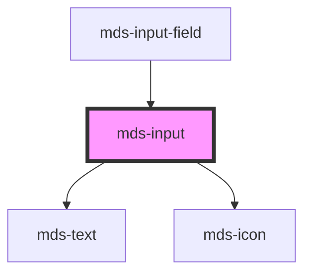

# mds-input

## Form interaction

This component is `scoped` and not `shadowed`, so the inner `input` element interacts natively with `form` element.

<!-- Auto Generated Below -->

## Properties

| Property       | Attribute      | Description                                                                                                     | Type                                                                                                                                                                                                                                                                                                                                                                                                                                                                                                                                                                                                                                                                                                                                                                                                                                                                                                                                     | Default     |
| -------------- | -------------- | --------------------------------------------------------------------------------------------------------------- | ---------------------------------------------------------------------------------------------------------------------------------------------------------------------------------------------------------------------------------------------------------------------------------------------------------------------------------------------------------------------------------------------------------------------------------------------------------------------------------------------------------------------------------------------------------------------------------------------------------------------------------------------------------------------------------------------------------------------------------------------------------------------------------------------------------------------------------------------------------------------------------------------------------------------------------------- | ----------- |
| `autocomplete` | `autocomplete` | Specifies whether the element should have autocomplete enabled                                                  | `"off" \| "on" \| "additional-name" \| "address" \| "address-level1" \| "address-level2" \| "address-level3" \| "address-level4" \| "address-line1" \| "address-line2" \| "address-line3" \| "bday" \| "bday-day" \| "bday-month" \| "bday-year" \| "cc-additional-name" \| "cc-csc" \| "cc-exp" \| "cc-exp-month" \| "cc-exp-year" \| "cc-family-name" \| "cc-given-name" \| "cc-name" \| "cc-number" \| "cc-type" \| "country" \| "country-name" \| "current-password" \| "email" \| "family-name" \| "given-name" \| "honorific-prefix" \| "honorific-suffix" \| "impp" \| "language" \| "name" \| "new-password" \| "nickname" \| "one-time-code" \| "organization" \| "organization-title" \| "photo" \| "postal-code" \| "sex" \| "street-address" \| "tel" \| "tel-area-code" \| "tel-country-code" \| "tel-extension" \| "tel-local" \| "tel-national" \| "transaction-amount" \| "transaction-currency" \| "url" \| "username"` | `'off'`     |
| `autofocus`    | `autofocus`    | Specifies that the element should automatically get focus when the page loads                                   | `boolean`                                                                                                                                                                                                                                                                                                                                                                                                                                                                                                                                                                                                                                                                                                                                                                                                                                                                                                                                | `false`     |
| `datalist`     | --             | A list of search terms to be searched from the input field, it should be used with type="search" input.         | `string[]`                                                                                                                                                                                                                                                                                                                                                                                                                                                                                                                                                                                                                                                                                                                                                                                                                                                                                                                               | `undefined` |
| `disabled`     | `disabled`     | If true, the element is displayed as disabled                                                                   | `boolean`                                                                                                                                                                                                                                                                                                                                                                                                                                                                                                                                                                                                                                                                                                                                                                                                                                                                                                                                | `false`     |
| `icon`         | `icon`         | An icon displayed at the right of the input                                                                     | `string`                                                                                                                                                                                                                                                                                                                                                                                                                                                                                                                                                                                                                                                                                                                                                                                                                                                                                                                                 | `undefined` |
| `max`          | `max`          | Specifies the maximum value use it with input type="number" or type="date" Example: max="180", max="2046-12-04" | `number`                                                                                                                                                                                                                                                                                                                                                                                                                                                                                                                                                                                                                                                                                                                                                                                                                                                                                                                                 | `undefined` |
| `maxlength`    | `maxlength`    | Specifies the maximum number of characters allowed in an element use it with input type="number"                | `number`                                                                                                                                                                                                                                                                                                                                                                                                                                                                                                                                                                                                                                                                                                                                                                                                                                                                                                                                 | `undefined` |
| `min`          | `min`          | Specifies the minimum value use it with input type="number" or type="date" Example: min="-3", min="1988-04-15"  | `string`                                                                                                                                                                                                                                                                                                                                                                                                                                                                                                                                                                                                                                                                                                                                                                                                                                                                                                                                 | `undefined` |
| `minlength`    | `minlength`    | Specifies the minimum number of characters allowed in an element use it with input type="number"                | `number`                                                                                                                                                                                                                                                                                                                                                                                                                                                                                                                                                                                                                                                                                                                                                                                                                                                                                                                                 | `undefined` |
| `name`         | `name`         | Is needed to reference the form data after the form is submitted                                                | `string`                                                                                                                                                                                                                                                                                                                                                                                                                                                                                                                                                                                                                                                                                                                                                                                                                                                                                                                                 | `undefined` |
| `pattern`      | `pattern`      | Specifies a regular expression that element\'s value is checked against                                         | `string`                                                                                                                                                                                                                                                                                                                                                                                                                                                                                                                                                                                                                                                                                                                                                                                                                                                                                                                                 | `undefined` |
| `placeholder`  | `placeholder`  | Specifies a short hint that describes the expected value of the element                                         | `string`                                                                                                                                                                                                                                                                                                                                                                                                                                                                                                                                                                                                                                                                                                                                                                                                                                                                                                                                 | `undefined` |
| `readonly`     | `readonly`     | Specifies that the element is read-only                                                                         | `boolean`                                                                                                                                                                                                                                                                                                                                                                                                                                                                                                                                                                                                                                                                                                                                                                                                                                                                                                                                | `false`     |
| `required`     | `required`     | Specifies that the element must be filled out before submitting the form                                        | `boolean`                                                                                                                                                                                                                                                                                                                                                                                                                                                                                                                                                                                                                                                                                                                                                                                                                                                                                                                                | `false`     |
| `step`         | `step`         | Specifies the interval between legal numbers in an input field                                                  | `string`                                                                                                                                                                                                                                                                                                                                                                                                                                                                                                                                                                                                                                                                                                                                                                                                                                                                                                                                 | `undefined` |
| `type`         | `type`         | Specifies the type of input element                                                                             | `"date" \| "email" \| "number" \| "password" \| "search" \| "tel" \| "text" \| "textarea" \| "time" \| "url"`                                                                                                                                                                                                                                                                                                                                                                                                                                                                                                                                                                                                                                                                                                                                                                                                                            | `'text'`    |
| `value`        | `value`        | Specifies the value of the input element                                                                        | `number \| string`                                                                                                                                                                                                                                                                                                                                                                                                                                                                                                                                                                                                                                                                                                                                                                                                                                                                                                                       | `''`        |
| `variant`      | `variant`      | Sets the variant of the input field                                                                             | `"error" \| "info" \| "success" \| "warning"`                                                                                                                                                                                                                                                                                                                                                                                                                                                                                                                                                                                                                                                                                                                                                                                                                                                                                            | `undefined` |
| `variantTip`   | `variant-tip`  | Sets the word(s) of the variant of the input field                                                              | `string`                                                                                                                                                                                                                                                                                                                                                                                                                                                                                                                                                                                                                                                                                                                                                                                                                                                                                                                                 | `undefined` |

## Events

| Event          | Description                                                                      | Type                         |
| -------------- | -------------------------------------------------------------------------------- | ---------------------------- |
| `blurEvent`    | Emits a void event when input element is blurred                                 | `CustomEvent<void>`          |
| `changeEvent`  | Emits an InputChangeEventDetail when the value of the input element changes      | `CustomEvent<InputValue>`    |
| `focusEvent`   | Emits a void event when input element is focused                                 | `CustomEvent<void>`          |
| `keyDownEvent` | Emits a KeyboardEvent when a keboard key is pressed on the focused input element | `CustomEvent<KeyboardEvent>` |

## Methods

### `getInputElement() => Promise<HTMLInputElement | HTMLTextAreaElement>`

Returns the native `<input>` element used under the hood.

#### Returns

Type: `Promise<HTMLInputElement | HTMLTextAreaElement>`

### `setFocus() => Promise<void>`

Sets focus on the specified `my-input`.
Use this method instead
of the global `input.focus()`.

#### Returns

Type: `Promise<void>`

## CSS Custom Properties

| Name           | Description                                |
| -------------- | ------------------------------------------ |
| `--background` | Sets the background-color of the component |

## Dependencies

### Used by

 - [mds-input-field](../mds-input-field)

### Depends on

- [mds-text](../mds-text)
- [mds-icon](../mds-icon)

### Graph

----------------------------------------------

Built with love @ **Maggioli Informatica / R&D Department**
