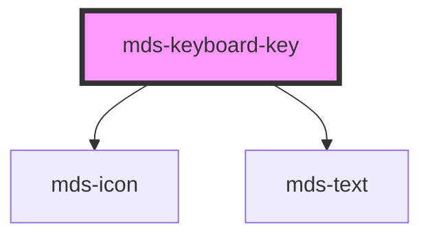

# mds-keyboard-key


<!-- Auto Generated Below -->


## Usage

### 1. Description

The `<mds-keyboard-key>` web component renders a single physical-looking keycap inside a [`<mds-keyboard>`](../../mds-keyboard) parent, supplying the visual unit for one key of a shortcut combination (e.g. the `Ctrl` or `C` in `Ctrl + C`). It has no direct HTML equivalent - it is a presentational glyph whose meaning and test behavior are orchestrated by the parent.

#### Semantic Behavior

- **Compound child only**: It must be a direct slot child of `<mds-keyboard>`; it is not used standalone or mixed with other element types, since the parent reads its `name` to build the key combination and inserts `+` separators between keys.
- **Glyph resolution from `name`**: When `name` maps to a known icon (arrows, command, shift, enter, tab, space, etc.) it renders that icon; otherwise it renders the key's localized text.
- **Keyboard-side indicator**: For keys that exist on both sides of the keyboard, it appends an `l` / `r` label.
- **Pressed state is parent-driven**: The `pressed` prop is toggled by `<mds-keyboard>` during a verification test as the user types; it is not meant to be set manually for presentational use.
- **Localized title**: The host receives a localized `title` describing the key (el/en/es/it).
- **No interactive role**: The keycap is purely visual - it exposes no role, focus handling, or emitted events of its own.

#### Properties & Visual Configurations

This child has essentially no presentational configuration; it does not use the shared `variant` / `tone` ladders from [`projects/stencil/SPEC.md`](../../../../SPEC.md#tone-and-variant-system).

- **`name`** is the only meaningful authoring prop: set it to the canonical key code (one value from the keyboard key dictionary, e.g. `control`, `arrowup`, `c`) for the key this cap represents. It selects the displayed glyph or alias and feeds the parent's combination matching.
- **`pressed`** is a state hook, not an authoring choice - let the parent set it during a test. Leave it unset for a static shortcut display.


### 2. Pattern

Correct and idiomatic ways to use the `<mds-keyboard-key>` component, ordered from most common to most specialized. Patterns assume a working knowledge of the compound component rules documented in [`docs/COMPONENTS.md`](../../../../../../docs/COMPONENTS.md) and the generic stencil rules in [`projects/stencil/SPEC.md`](../../../../SPEC.md).

#### Single Key Inside `<mds-keyboard>`

Always nest `<mds-keyboard-key>` inside [`<mds-keyboard>`](../../mds-keyboard). The parent inserts the `+` separators and wires up key-combination testing; the key is meaningless outside this context.

```html
<mds-keyboard>
  <mds-keyboard-key name="control"></mds-keyboard-key>
</mds-keyboard>
```

#### Multi-Key Shortcut Combination

List every key in the combination as a direct child. The parent inserts `+` separators automatically - do not add them manually.

```html
<mds-keyboard>
  <mds-keyboard-key name="control"></mds-keyboard-key>
  <mds-keyboard-key name="s"></mds-keyboard-key>
</mds-keyboard>

<mds-keyboard>
  <mds-keyboard-key name="command"></mds-keyboard-key>
  <mds-keyboard-key name="shift"></mds-keyboard-key>
  <mds-keyboard-key name="z"></mds-keyboard-key>
</mds-keyboard>
```

#### Icon-Resolved Keys

Keys such as arrows, enter, tab, space, command, shift, backspace, and others resolve to an icon automatically. No extra configuration is needed - `name` alone is sufficient.

```html
<mds-keyboard>
  <mds-keyboard-key name="arrowup"></mds-keyboard-key>
  <mds-keyboard-key name="enter"></mds-keyboard-key>
</mds-keyboard>

<mds-keyboard>
  <mds-keyboard-key name="tab"></mds-keyboard-key>
  <mds-keyboard-key name="space"></mds-keyboard-key>
</mds-keyboard>
```

#### Keyboard-Side Disambiguation

For keys that exist on both sides of a physical keyboard, use the directional variant (`shiftleft`, `shiftright`, `controlleft`, etc.). The component appends an `l` / `r` indicator to disambiguate.

```html
<mds-keyboard>
  <mds-keyboard-key name="shiftleft"></mds-keyboard-key>
  <mds-keyboard-key name="controlleft"></mds-keyboard-key>
  <mds-keyboard-key name="a"></mds-keyboard-key>
</mds-keyboard>
```

#### Interactive Combination Test via `try`

Add `try` to `<mds-keyboard>` to let users verify they can type the shortcut. The parent drives `pressed` on child keys as the user types - do not set `pressed` yourself in this mode.

```html
<mds-keyboard try>
  <mds-keyboard-key name="control"></mds-keyboard-key>
  <mds-keyboard-key name="z"></mds-keyboard-key>
</mds-keyboard>
```

#### Styling Customization via CSS Custom Properties

Adjust the keycap appearance through the documented `--mds-keyboard-key-*` CSS custom properties. Set them on the host element or a parent selector.

```css
/* Increase padding for a larger keycap feel */
.keycap-large mds-keyboard-key {
  --mds-keyboard-key-padding: var(--spacing-300);
}

/* Slow down the press animation */
.keycap-slow mds-keyboard-key {
  --mds-keyboard-key-transition-duration: 600ms;
}

/* Deepen the bottom shadow for more three-dimensional depth */
.keycap-deep mds-keyboard-key {
  --mds-keyboard-key-illumination-dark-size: var(--spacing-400);
  --mds-keyboard-key-illumination-light-size: var(--spacing-100);
}
```


### 3. Antipattern

Common incorrect uses of `<mds-keyboard-key>`. Each entry pairs the wrong form with the right one and a one-line reason. System-wide rules (boolean-as-string, shadow piercing, Tailwind color utilities, raw native event listening) live in [`docs/COMPONENTS.md`](../../../../../../docs/COMPONENTS.md#system-level-anti-patterns) - they apply here too but are not repeated.

#### Do Not Use `<mds-keyboard-key>` Outside `<mds-keyboard>`

The key is a compound child component and must be a direct slot child of [`<mds-keyboard>`](../../mds-keyboard). Used standalone it renders visually but has no separator wiring, no test capability, and violates the compound component contract.

```html
<!-- 🚫 INCORRECT -->
<mds-keyboard-key name="control"></mds-keyboard-key>
<span>+</span>
<mds-keyboard-key name="c"></mds-keyboard-key>

<!-- ✅ CORRECT -->
<mds-keyboard>
  <mds-keyboard-key name="control"></mds-keyboard-key>
  <mds-keyboard-key name="c"></mds-keyboard-key>
</mds-keyboard>
```

#### Do Not Add `+` Separators Manually

The parent `<mds-keyboard>` inserts `+` separators between child keys automatically. Adding them manually results in duplicate or misaligned separators.

```html
<!-- 🚫 INCORRECT -->
<mds-keyboard>
  <mds-keyboard-key name="command"></mds-keyboard-key>
  <span>+</span>
  <mds-keyboard-key name="v"></mds-keyboard-key>
</mds-keyboard>

<!-- ✅ CORRECT -->
<mds-keyboard>
  <mds-keyboard-key name="command"></mds-keyboard-key>
  <mds-keyboard-key name="v"></mds-keyboard-key>
</mds-keyboard>
```

#### Do Not Set `pressed` Manually When `try` Is Active

When `<mds-keyboard try>` is enabled, the parent owns `pressed` and sets it as the user types. Setting it manually conflicts with the parent state machine and produces incorrect visual feedback.

```html
<!-- 🚫 INCORRECT -->
<mds-keyboard try>
  <mds-keyboard-key name="control" pressed></mds-keyboard-key>
  <mds-keyboard-key name="z"></mds-keyboard-key>
</mds-keyboard>

<!-- ✅ CORRECT -->
<mds-keyboard try>
  <mds-keyboard-key name="control"></mds-keyboard-key>
  <mds-keyboard-key name="z"></mds-keyboard-key>
</mds-keyboard>
```

#### Do Not Use a Generic `name` String Outside the Key Dictionary

`name` is a `KeyboardKeyName` union type. Passing an arbitrary string (e.g. `"ctrl"`, `"cmd"`, `"esc"`) that is not in the dictionary causes a runtime lookup failure because the component reads `keyboardKeysData[name]` without a guard.

```html
<!-- 🚫 INCORRECT -->
<mds-keyboard>
  <mds-keyboard-key name="ctrl"></mds-keyboard-key>
  <mds-keyboard-key name="cmd"></mds-keyboard-key>
  <mds-keyboard-key name="esc"></mds-keyboard-key>
</mds-keyboard>

<!-- ✅ CORRECT -->
<mds-keyboard>
  <mds-keyboard-key name="control"></mds-keyboard-key>
  <mds-keyboard-key name="command"></mds-keyboard-key>
  <mds-keyboard-key name="escape"></mds-keyboard-key>
</mds-keyboard>
```

#### Do Not Slot Content Inside `<mds-keyboard-key>`

`<mds-keyboard-key>` exposes no default or named slot. Any slotted content is ignored; the glyph is derived entirely from the `name` prop.

```html
<!-- 🚫 INCORRECT -->
<mds-keyboard>
  <mds-keyboard-key name="control">Ctrl</mds-keyboard-key>
</mds-keyboard>

<!-- ✅ CORRECT -->
<mds-keyboard>
  <mds-keyboard-key name="control"></mds-keyboard-key>
</mds-keyboard>
```

#### Customize via CSS Custom Properties, Not Shadow-Piercing Selectors

The supported customization surface is the documented `--mds-keyboard-key-*` CSS custom properties. Piercing shadow DOM via `::part()` on undocumented internals, `>>>`, or class hacks couples your code to the implementation and will break on minor releases.

```css
/* 🚫 INCORRECT */
mds-keyboard-key >>> .physical-key {
  background-color: blue;
}

/* ✅ CORRECT */
mds-keyboard-key {
  --mds-keyboard-key-padding: var(--spacing-300);
  --mds-keyboard-key-transition-duration: 400ms;
}
```


## Properties

| Property  | Attribute | Description                                                                                                            | Type                                                                                                                                                                                                                                                                                                                                                                                                                                                                                                                                                                                                                                                                                                                                                                                                                                 | Default     |
| --------- | --------- | ---------------------------------------------------------------------------------------------------------------------- | ------------------------------------------------------------------------------------------------------------------------------------------------------------------------------------------------------------------------------------------------------------------------------------------------------------------------------------------------------------------------------------------------------------------------------------------------------------------------------------------------------------------------------------------------------------------------------------------------------------------------------------------------------------------------------------------------------------------------------------------------------------------------------------------------------------------------------------ | ----------- |
| `name`    | `name`    | Sets the code of the keyboard key for combination tests if `try` attribute is set from `mds-keyboard` parent component | `"option" \| "a" \| "1" \| "2" \| "b" \| "i" \| "p" \| "q" \| "s" \| "u" \| "end" \| "0" \| "3" \| "4" \| "5" \| "6" \| "7" \| "g" \| "8" \| "9" \| "alt" \| "altleft" \| "altright" \| "arrowdown" \| "arrowleft" \| "arrowright" \| "arrowup" \| "backspace" \| "c" \| "capslock" \| "command" \| "commandleft" \| "commandright" \| "control" \| "controlleft" \| "controlright" \| "d" \| "delete" \| "e" \| "enter" \| "escape" \| "f" \| "f1" \| "f10" \| "f11" \| "f12" \| "f2" \| "f3" \| "f4" \| "f5" \| "f6" \| "f7" \| "f8" \| "f9" \| "h" \| "home" \| "j" \| "k" \| "l" \| "m" \| "n" \| "o" \| "optionleft" \| "optionright" \| "pagedown" \| "pageup" \| "r" \| "shift" \| "shiftleft" \| "shiftright" \| "space" \| "t" \| "tab" \| "v" \| "w" \| "windows" \| "windowsleft" \| "windowsright" \| "x" \| "y" \| "z"` | `undefined` |
| `pressed` | `pressed` | Sets if the key is pressed or not                                                                                      | `boolean \| undefined`                                                                                                                                                                                                                                                                                                                                                                                                                                                                                                                                                                                                                                                                                                                                                                                                               | `undefined` |


## Methods

### `updateLang() => Promise<void>`


#### Returns

Type: `Promise<void>`


## CSS Custom Properties

| Name                                         | Description                                                 |
| -------------------------------------------- | ----------------------------------------------------------- |
| `--mds-keyboard-key-illumination-dark`       | Set the dark illumination of the keyboard key.              |
| `--mds-keyboard-key-illumination-dark-size`  | Set the size of the dark illumination of the keyboard key.  |
| `--mds-keyboard-key-illumination-light`      | Set the light illumination of the keyboard key.             |
| `--mds-keyboard-key-illumination-light-size` | Set the size of the light illumination of the keyboard key. |
| `--mds-keyboard-key-padding`                 | Set the padding of the keyboard key.                        |
| `--mds-keyboard-key-transition-duration`     | Set the transition duration of the keyboard key.            |


## Dependencies

### Depends on

- [mds-icon](../mds-icon)
- [mds-text](../mds-text)

### Graph


----------------------------------------------

Built with love @ [Gruppo Maggioli](https://www.maggioli.com) from [R&D Department](https://www.maggioli.com/it-it/chi-siamo/ricerca-sviluppo)
