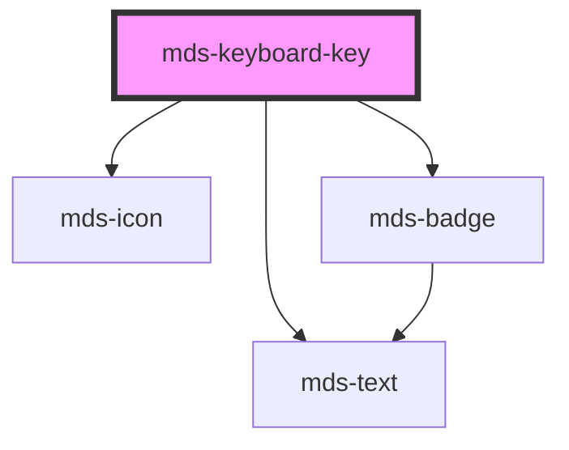

# mds-keyboard-key

<!-- Auto Generated Below -->

## Properties

| Property  | Attribute | Description                                                                                                            | Type                                                                                                                                                                                                                                                                                                                                                                                                                                                                                                                                                                                                                                                                                                                                                                                                                                 | Default     |
| --------- | --------- | ---------------------------------------------------------------------------------------------------------------------- | ------------------------------------------------------------------------------------------------------------------------------------------------------------------------------------------------------------------------------------------------------------------------------------------------------------------------------------------------------------------------------------------------------------------------------------------------------------------------------------------------------------------------------------------------------------------------------------------------------------------------------------------------------------------------------------------------------------------------------------------------------------------------------------------------------------------------------------ | ----------- |
| `name`    | `name`    | Sets the code of the keyboard key for combination tests if `try` attribute is set from `mds-keyboard` parent component | `"option" \| "a" \| "b" \| "i" \| "p" \| "q" \| "s" \| "u" \| "end" \| "0" \| "1" \| "2" \| "3" \| "4" \| "5" \| "6" \| "7" \| "8" \| "9" \| "alt" \| "altleft" \| "altright" \| "arrowdown" \| "arrowleft" \| "arrowright" \| "arrowup" \| "backspace" \| "c" \| "capslock" \| "command" \| "commandleft" \| "commandright" \| "control" \| "controlleft" \| "controlright" \| "d" \| "delete" \| "e" \| "enter" \| "escape" \| "f" \| "f1" \| "f10" \| "f11" \| "f12" \| "f2" \| "f3" \| "f4" \| "f5" \| "f6" \| "f7" \| "f8" \| "f9" \| "g" \| "h" \| "home" \| "j" \| "k" \| "l" \| "m" \| "n" \| "o" \| "optionleft" \| "optionright" \| "pagedown" \| "pageup" \| "r" \| "shift" \| "shiftleft" \| "shiftright" \| "space" \| "t" \| "tab" \| "v" \| "w" \| "windows" \| "windowsleft" \| "windowsright" \| "x" \| "y" \| "z"` | `undefined` |
| `pressed` | `pressed` | Sets if the key is pressed or not                                                                                      | `boolean \| undefined`                                                                                                                                                                                                                                                                                                                                                                                                                                                                                                                                                                                                                                                                                                                                                                                                               | `undefined` |

## Methods

### `updateLang() => Promise<void>`

#### Returns

Type: `Promise<void>`

## Dependencies

### Depends on

- [mds-icon](../mds-icon)
- [mds-text](../mds-text)
- [mds-badge](../mds-badge)

### Graph

----------------------------------------------

Built with love @ [Gruppo Maggioli](https://www.maggioli.com) from [R&D Department](https://www.maggioli.com/it-it/chi-siamo/ricerca-sviluppo)
