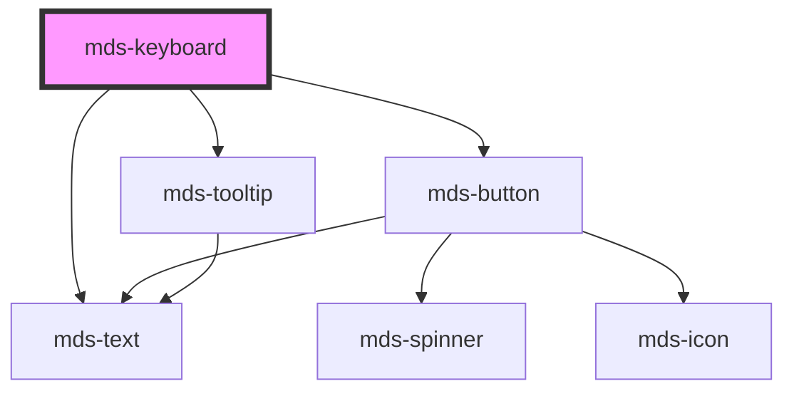

# mds-keyboard


<!-- Auto Generated Below -->


## Usage

### 1. Description

The `<mds-keyboard>` web component renders a keyboard shortcut as a row of physical-looking keycaps, acting as the compound parent for one or more slotted `<mds-keyboard-key>` children. It has no direct HTML equivalent; it visualizes a key combination (e.g. `Ctrl + C`) and can optionally let the user verify that combination by typing it.

#### Semantic Behavior

- **Default slot is the key sequence**: The component projects slotted `<mds-keyboard-key>` elements and automatically inserts a `+` separator between consecutive keys.
- **Compound parent**: It reads each child key's `name` to build the expected combination; during a test the children are toggled to their `pressed` state.
- **Test mode (`try`)**: When enabled the component appends a trigger button and a tooltip; clicking the button captures keystrokes and compares the typed combination against the slotted keys.
- **Result feedback**: A pass shows a "done" icon, a fail shows a "close" icon, and the tooltip surfaces the localized success or error message; the outcome is also reflected on the host via the `test` attribute.
- **Localization**: Trigger title, tooltip copy, and error messages resolve through the locale system (el/en/es/it).

#### Properties & Visual Configurations

This component does not use the shared `variant` / `tone` ladders from [`projects/stencil/SPEC.md`](../../../../SPEC.md#tone-and-variant-system).

#### Other behavioral props

- **`try`** opts the keyboard into interactive verification mode. Enable it only when you want the user to be able to confirm a shortcut by typing it; leave it unset for a purely presentational shortcut display.
- **`test`** reflects the verification outcome (`'pass'` / `'fail'`) onto the host. It is primarily driven by the test flow and is mainly useful as a styling/state hook rather than a value you set yourself.


### 2. Pattern

Correct and idiomatic ways to use the `<mds-keyboard>` component, ordered from most common to most specialized. Patterns assume a working knowledge of the variant / tone ladders documented in [`docs/COMPONENTS.md`](../../../../../../docs/COMPONENTS.md) and the generic stencil rules in [`projects/stencil/SPEC.md`](../../../../SPEC.md).

#### Single Key Display

The simplest use: one `<mds-keyboard-key>` child inside `<mds-keyboard>`. The `name` attribute selects a key from the built-in key dictionary; the component renders the physical-looking keycap with the localized alias.

```html
<mds-keyboard>
  <mds-keyboard-key name="f1"></mds-keyboard-key>
</mds-keyboard>
```

#### Multi-Key Shortcut Combination

Slot two or more `<mds-keyboard-key>` elements. The component automatically inserts a `+` separator between consecutive keys, so you never need to add it manually.

```html
<mds-keyboard>
  <mds-keyboard-key name="control"></mds-keyboard-key>
  <mds-keyboard-key name="s"></mds-keyboard-key>
</mds-keyboard>
```

#### Specifying Key Side (Left / Right Modifier)

Use the side-specific `name` values (`controlleft`, `controlright`, `shiftleft`, `shiftright`, `commandleft`, `commandright`, etc.) when the shortcut must be typed with a specific hand. The keycap renders a small positional indicator.

```html
<!-- Only the left Shift key is accepted during a test -->
<mds-keyboard try>
  <mds-keyboard-key name="shiftleft"></mds-keyboard-key>
  <mds-keyboard-key name="d"></mds-keyboard-key>
</mds-keyboard>
```

#### Interactive Verification Mode (`try`)

Add the `try` attribute to let the user confirm the shortcut by typing it. A trigger button appears; clicking it puts the component into capture mode. After the user releases all keys the component reflects the outcome (`pass` / `fail`) on the `test` attribute and shows a localized tooltip.

```html
<mds-keyboard try>
  <mds-keyboard-key name="command"></mds-keyboard-key>
  <mds-keyboard-key name="z"></mds-keyboard-key>
</mds-keyboard>
```

#### Shortcut Reference Table

Embed `<mds-keyboard>` inside a `<mds-table>` to build a keyboard-shortcut reference sheet. Each row pairs the visual shortcut with its description.

```html
<mds-table>
  <mds-table-header>
    <mds-table-header-cell label="Combinazione"></mds-table-header-cell>
    <mds-table-header-cell label="Azione"></mds-table-header-cell>
  </mds-table-header>
  <mds-table-body>
    <mds-table-row>
      <mds-table-cell>
        <mds-keyboard>
          <mds-keyboard-key name="control"></mds-keyboard-key>
          <mds-keyboard-key name="c"></mds-keyboard-key>
        </mds-keyboard>
      </mds-table-cell>
      <mds-table-cell><mds-text>Copia</mds-text></mds-table-cell>
    </mds-table-row>
    <mds-table-row>
      <mds-table-cell>
        <mds-keyboard>
          <mds-keyboard-key name="control"></mds-keyboard-key>
          <mds-keyboard-key name="v"></mds-keyboard-key>
        </mds-keyboard>
      </mds-table-cell>
      <mds-table-cell><mds-text>Incolla</mds-text></mds-table-cell>
    </mds-table-row>
    <mds-table-row>
      <mds-table-cell>
        <mds-keyboard>
          <mds-keyboard-key name="control"></mds-keyboard-key>
          <mds-keyboard-key name="z"></mds-keyboard-key>
        </mds-keyboard>
      </mds-table-cell>
      <mds-table-cell><mds-text>Annulla</mds-text></mds-table-cell>
    </mds-table-row>
  </mds-table-body>
</mds-table>
```

#### Reading the `test` Outcome Attribute

When `try` is set the `test` attribute is reflected onto the host as `"pass"` or `"fail"` after each attempt. Use it as a CSS attribute selector or read it from JavaScript to drive follow-on UI.

```html
<mds-keyboard id="shortcut-ctrl-s" try>
  <mds-keyboard-key name="control"></mds-keyboard-key>
  <mds-keyboard-key name="s"></mds-keyboard-key>
</mds-keyboard>
```

```javascript
document.querySelector('#shortcut-ctrl-s').addEventListener('click', () => {
  const result = document.querySelector('#shortcut-ctrl-s').getAttribute('test');
  if (result === 'pass') {
    console.log('Combinazione corretta!');
  }
});
```

#### Styling Customization

Adjust colors and lighting only through the documented `--mds-keyboard-*` CSS custom properties. Use Magma color tokens via `rgb(var(--<token>))` so dark mode continues to work.

```css
.custom-keyboard mds-keyboard {
  --mds-keyboard-background: rgb(var(--tone-neutral-02));
  --mds-keyboard-color: rgb(var(--tone-neutral-10));
  --mds-keyboard-key-background: rgb(var(--tone-neutral-04));
  --mds-keyboard-padding: var(--spacing-300);
}
```


### 3. Antipattern

Common incorrect uses of `<mds-keyboard>`. Each entry pairs the wrong form with the right one and a one-line reason. System-wide rules (boolean-as-string, shadow piercing, Tailwind color utilities, raw native event listening) live in [`docs/COMPONENTS.md`](../../../../../../docs/COMPONENTS.md#system-level-anti-patterns) - they apply here too but are not repeated.

#### Do Not Slot Raw Text or `<kbd>` Elements

The default slot expects `<mds-keyboard-key>` children only. Slotting plain text, `<kbd>`, or other HTML breaks the separator injection logic and the test-mode key matching.

```html
<!-- 🚫 INCORRECT -->
<mds-keyboard>
  <kbd>Ctrl</kbd>
  <kbd>S</kbd>
</mds-keyboard>

<!-- ✅ CORRECT -->
<mds-keyboard>
  <mds-keyboard-key name="control"></mds-keyboard-key>
  <mds-keyboard-key name="s"></mds-keyboard-key>
</mds-keyboard>
```

#### Do Not Add `+` Separators Manually

The component inserts a styled `+` between consecutive keys automatically. Adding your own separator duplicates it and breaks the visual rhythm.

```html
<!-- 🚫 INCORRECT -->
<mds-keyboard>
  <mds-keyboard-key name="control"></mds-keyboard-key>
  <span>+</span>
  <mds-keyboard-key name="c"></mds-keyboard-key>
</mds-keyboard>

<!-- ✅ CORRECT -->
<mds-keyboard>
  <mds-keyboard-key name="control"></mds-keyboard-key>
  <mds-keyboard-key name="c"></mds-keyboard-key>
</mds-keyboard>
```

#### Do Not Set `try="false"` to Disable Test Mode

Boolean attributes in HTML treat any non-empty string as truthy. Use attribute removal (or leave the attribute unset) to keep the component in display-only mode.

```html
<!-- 🚫 INCORRECT -->
<mds-keyboard try="false">
  <mds-keyboard-key name="escape"></mds-keyboard-key>
</mds-keyboard>

<!-- ✅ CORRECT -->
<mds-keyboard>
  <mds-keyboard-key name="escape"></mds-keyboard-key>
</mds-keyboard>
```

#### Do Not Set `test` as a Static Attribute to Signal State

`test` is a reflected output prop driven by the component's own verification flow. Setting it as a static HTML attribute manually bypasses the internal logic and has no reliable effect on the visual state.

```html
<!-- 🚫 INCORRECT -->
<mds-keyboard test="pass">
  <mds-keyboard-key name="enter"></mds-keyboard-key>
</mds-keyboard>

<!-- ✅ CORRECT -->
<mds-keyboard try>
  <mds-keyboard-key name="enter"></mds-keyboard-key>
</mds-keyboard>
```

#### Do Not Use `<mds-keyboard-key>` Outside `<mds-keyboard>`

`<mds-keyboard-key>` is a compound child and communicates with the parent via the Stencil DOM tree. Rendering it standalone loses the compound layout, the `+` separator, and test-mode driven `pressed` toggling.

```html
<!-- 🚫 INCORRECT -->
<mds-keyboard-key name="tab"></mds-keyboard-key>

<!-- ✅ CORRECT -->
<mds-keyboard>
  <mds-keyboard-key name="tab"></mds-keyboard-key>
</mds-keyboard>
```

#### Do Not Customize Colors with Raw CSS Values Instead of Tokens

Setting `--mds-keyboard-background` or `--mds-keyboard-key-background` to a raw hex or `rgba()` literal bypasses the palette layer and breaks dark mode. Always wrap color values in `rgb(var(--<token>))`.

```css
/* 🚫 INCORRECT */
mds-keyboard {
  --mds-keyboard-background: #1a1a2e;
  --mds-keyboard-key-background: #16213e;
}

/* ✅ CORRECT */
mds-keyboard {
  --mds-keyboard-background: rgb(var(--tone-neutral-02));
  --mds-keyboard-key-background: rgb(var(--tone-neutral-04));
}
```


## Properties

| Property | Attribute | Description                                          | Type                            | Default     |
| -------- | --------- | ---------------------------------------------------- | ------------------------------- | ----------- |
| `test`   | `test`    | Shows the keyboard key combination test result       | `"fail" \| "pass" \| undefined` | `undefined` |
| `try`    | `try`     | Sets if the keyboard key combination test is enabled | `boolean \| undefined`          | `undefined` |


## Methods

### `updateLang() => Promise<void>`


#### Returns

Type: `Promise<void>`


## Dependencies

### Depends on

- [mds-text](../mds-text)
- [mds-button](../mds-button)
- [mds-tooltip](../mds-tooltip)

### Graph


----------------------------------------------

Built with love @ [Gruppo Maggioli](https://www.maggioli.com) from [R&D Department](https://www.maggioli.com/it-it/chi-siamo/ricerca-sviluppo)
