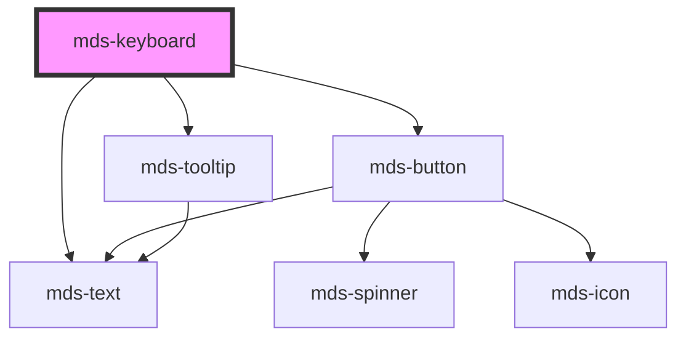

# mds-keyboard

<!-- Auto Generated Below -->

## Properties

| Property | Attribute | Description                                          | Type                            | Default     |
| -------- | --------- | ---------------------------------------------------- | ------------------------------- | ----------- |
| `test`   | `test`    | Shows the keyboard key combination test result       | `"fail" \| "pass" \| undefined` | `undefined` |
| `try`    | `try`     | Sets if the keyboard key combination test is enabled | `boolean \| undefined`          | `undefined` |

## Methods

### `updateLang() => Promise<void>`

#### Returns

Type: `Promise<void>`

## CSS Custom Properties

| Name                                            | Description                                                                           |
| ----------------------------------------------- | ------------------------------------------------------------------------------------- |
| `--mds-keyboard-background`                     | Set the background color of the keyboard area.                                        |
| `--mds-keyboard-background-default`             | `private` Set the default background color of the keyboard area.                      |
| `--mds-keyboard-background-fail`                | Set the background color of the keyboard area when the test fails.                    |
| `--mds-keyboard-background-pass`                | Set the background color of the keyboard area when the test passes.                   |
| `--mds-keyboard-color`                          | Set the text color of the keyboard area, will impact on `mds-keyboard-key` component. |
| `--mds-keyboard-fill-fail`                      | Set the fill color of the combination-checker button when the test fails.             |
| `--mds-keyboard-fill-pass`                      | Set the fill color of the combination-checker button when the test passes.            |
| `--mds-keyboard-illumination-dark`              | Set the dark illumination.                                                            |
| `--mds-keyboard-illumination-dark-opacity`      | Set the opacity of the dark illumination.                                             |
| `--mds-keyboard-illumination-dark-size`         | Set the size of the dark illumination.                                                |
| `--mds-keyboard-illumination-light`             | Set the light illumination.                                                           |
| `--mds-keyboard-illumination-light-opacity`     | Set the opacity of the light illumination.                                            |
| `--mds-keyboard-illumination-light-size`        | Set the size of the light illumination.                                               |
| `--mds-keyboard-illumination-shadow`            | Set the shadow of the keyboard area.                                                  |
| `--mds-keyboard-key-background`                 | Set the background color of the keyboard key.                                         |
| `--mds-keyboard-key-illumination-dark-opacity`  | Set the opacity of the dark illumination of the keyboard key.                         |
| `--mds-keyboard-key-illumination-light-opacity` | Set the opacity of the light illumination of the keyboard key.                        |
| `--mds-keyboard-key-illumination-shadow`        | Set the shadow of the keyboard key.                                                   |
| `--mds-keyboard-padding`                        | Set the padding of the keyboard area.                                                 |
| `--mds-keyboard-spinner-duration`               | Set the duration of the spinner animation.                                            |

## Dependencies

### Depends on

- [mds-text](../mds-text)
- [mds-button](../mds-button)
- [mds-tooltip](../mds-tooltip)

### Graph

----------------------------------------------

Built with love @ [Gruppo Maggioli](https://www.maggioli.com) from [R&D Department](https://www.maggioli.com/it-it/chi-siamo/ricerca-sviluppo)
