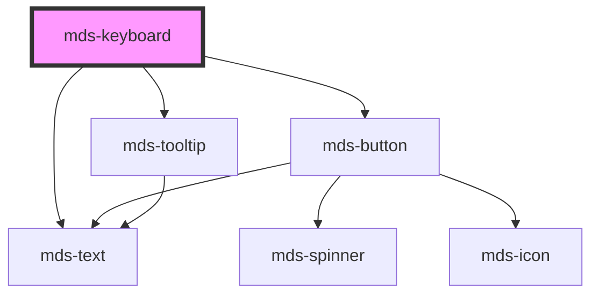

# mds-keyboard

<!-- Auto Generated Below -->

## Properties

| Property | Attribute | Description                                          | Type                            | Default     |
| -------- | --------- | ---------------------------------------------------- | ------------------------------- | ----------- |
| `test`   | `test`    | Shows the keyboard key combination test result       | `"fail" \| "pass" \| undefined` | `undefined` |
| `try`    | `try`     | Sets if the keyboard key combination test is enabled | `boolean \| undefined`          | `undefined` |

## Methods

### `updateLang() => Promise<void>`

#### Returns

Type: `Promise<void>`

## Dependencies

### Depends on

- [mds-text](../mds-text)
- [mds-button](../mds-button)
- [mds-tooltip](../mds-tooltip)

### Graph

----------------------------------------------

Built with love @ [Gruppo Maggioli](https://www.maggioli.com) from [R&D Department](https://www.maggioli.com/it-it/chi-siamo/ricerca-sviluppo)
