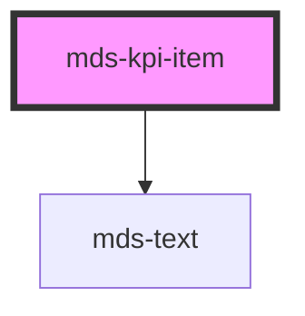

# mds-kpi-item

<!-- Auto Generated Below -->

## Properties

| Property                   | Attribute     | Description                                                  | Type     | Default     |
| -------------------------- | ------------- | ------------------------------------------------------------ | -------- | ----------- |
| `description` _(required)_ | `description` | Specifies the description under the value in the KPI element | `string` | `undefined` |
| `icon`                     | `icon`        | Specifies the icon on the top of the KPI element             | `string` | `undefined` |
| `value` _(required)_       | `value`       | Specifies the number to be displayed in the KPI element      | `number` | `undefined` |

## Dependencies

### Depends on

- [mds-text](../mds-text)

### Graph

----------------------------------------------

Built with love @ **Maggioli Informatica / R&D Department**
