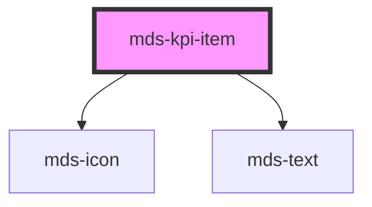

# mds-kpi-item


This is a web-component from Maggioli Design System [Magma](https://magma.maggiolicloud.it), built with StencilJS, TypeScript, Storybook. It's based on the web-component standard and it's designed to be agnostic from the JavaScript framework you are using.

<!-- Auto Generated Below -->


## Usage

### 1. Description

The `<mds-kpi-item>` web component is a compound child that represents a single key-performance-indicator entry - a prominent numeric `label` with an optional `description` and `icon` - inside its parent container [`<mds-kpi>`](../../mds-kpi). It carries no native HTML primitive of its own; it is a presentational list row that `<mds-kpi>` exposes as a list.

#### Semantic Behavior

- **Compound constraint**: Must be placed as a direct default-slot child of [`<mds-kpi>`](../../mds-kpi); it is not used standalone, and the parent's list semantics only make sense when its children are `mds-kpi-item` elements (do not mix in other child types).
- **Accessible name**: Each item is announced as one list entry, with its spoken text consolidated as `"{label}: {description}"`.
- **Scroll-triggered animation**: When `threshold` is greater than `0`, the `label`/`description` reveal with the `yugop` text animation once the item scrolls into the viewport. With `threshold === 0` (the default) the text is rendered immediately with no animation.
- **Conditional rendering**: The icon, value, and description each render only when their respective prop is provided, so an item can show any subset of icon, value, and caption.

#### Properties & Visual Configurations

- **`threshold`**: Controls the reveal-on-scroll behavior. Leave at `0` for static KPIs that should be visible immediately; set a value between `0` and `1` (the fraction of the element that must enter the viewport) to defer the count-up style animation until the item is scrolled into view - useful for KPI strips lower on a page.
- **`label`** holds the headline figure (rendered as `h2` typography) and **`description`** the supporting caption (rendered as `label` typography); together they form the item's spoken accessible name, so prefer concise, self-explanatory values.
- **`icon`** takes an `mds-icon` name and adds a leading visual marker above the figure; omit it for text-only KPIs.

Animation pacing and colors are tunable per item via the CSS custom properties documented in the readme (`--mds-kpi-item-text-animation-speed`, `--mds-kpi-item-icon-color`, and related).


### 2. Pattern

Correct and idiomatic ways to use the `<mds-kpi-item>` component, ordered from most common to most specialized. Patterns assume a working knowledge of the variant / tone ladders documented in [`docs/COMPONENTS.md`](../../../../../../docs/COMPONENTS.md) and the generic stencil rules in [`projects/stencil/SPEC.md`](../../../../SPEC.md).

#### Basic KPI Entry with Label and Description

The canonical form: a headline figure in `label` and a supporting caption in `description`, placed inside [`<mds-kpi>`](../../mds-kpi). Both props feed the item's accessible spoken name automatically.

```html
<mds-kpi>
  <mds-kpi-item
    label="1.240"
    description="Pratiche elaborate"
  ></mds-kpi-item>
</mds-kpi>
```

#### KPI Entry with an Icon

Add `icon` to display a visual marker above the figure. Use an icon slug from the Magma icon library - no `.svg` extension.

```html
<mds-kpi>
  <mds-kpi-item
    label="98%"
    description="Soddisfazione clienti"
    icon="mi/baseline/thumb-up"
  ></mds-kpi-item>
</mds-kpi>
```

#### Multiple KPI Items in a Panel

Group related metrics by placing several `<mds-kpi-item>` elements as direct children of `<mds-kpi>`. The parent sets up the `list` role; each item registers as a `listitem`.

```html
<mds-kpi>
  <mds-kpi-item label="3.500" description="Utenti attivi" icon="mi/baseline/group"></mds-kpi-item>
  <mds-kpi-item label="128" description="Servizi erogati" icon="mi/baseline/work"></mds-kpi-item>
  <mds-kpi-item label="99,9%" description="Disponibilita del sistema" icon="mi/baseline/check-circle"></mds-kpi-item>
</mds-kpi>
```

#### Scroll-Triggered Reveal Animation

Set `threshold` to a value between `0` and `1` to defer the yugop text animation until the item enters the viewport. A value of `0.5` means at least 50 % of the item must be visible before the animation starts. Use this for KPI strips placed lower on a landing page.

```html
<mds-kpi>
  <mds-kpi-item
    label="45.000"
    description="Documenti archiviati"
    icon="mi/baseline/folder"
    threshold="0.5"
  ></mds-kpi-item>
</mds-kpi>
```

#### Label-Only KPI (No Description)

Omit `description` when the figure is self-explanatory. The accessible name falls back to just the label value; ensure the surrounding context provides enough meaning.

```html
<mds-kpi>
  <mds-kpi-item label="2026"></mds-kpi-item>
</mds-kpi>
```

#### Icon-Only Visual Accent (No Numeric Value)

Omit `label` and `description` to display only the icon as a decorative tile. In this case the accessible name is empty - add an explicit `aria-label` on the host to describe the tile to screen-reader users.

```html
<mds-kpi>
  <mds-kpi-item
    icon="mi/baseline/star"
    aria-label="Valutazione eccellente"
  ></mds-kpi-item>
</mds-kpi>
```

#### Styling Customization

Tune icon color, text-area background, and animation timing through the documented `--mds-kpi-item-*` CSS custom properties. Set them on the host or a parent selector; use Magma color tokens via `rgb(var(--<token>))` so dark mode keeps working.

```css
.highlight-kpi mds-kpi-item {
  --mds-kpi-item-icon-color: rgb(var(--variant-success-04));
  --mds-kpi-item-info-background: rgb(var(--tone-neutral-02));
  --mds-kpi-item-text-animation-speed: 0.08;
  --mds-kpi-item-text-animation-placeholder-char: "0";
}
```

#### Targeting Shadow Parts for Deep Customization

When the CSS custom properties are insufficient, target the three documented shadow parts: `icon-container`, `icon`, and `content`. Reserve this for exceptional cases - prefer `--mds-kpi-item-*` vars whenever they cover your need.

```css
mds-kpi-item::part(icon-container) {
  background-color: rgb(var(--variant-primary-09));
  border-radius: var(--radius-2xl);
}

mds-kpi-item::part(icon) {
  fill: rgb(var(--variant-primary-03));
}
```


### 3. Antipattern

Common incorrect uses of `<mds-kpi-item>`. Each entry pairs the wrong form with the right one and a one-line reason. System-wide rules (boolean-as-string, shadow piercing, Tailwind color utilities, raw native event listening) live in [`docs/COMPONENTS.md`](../../../../../../docs/COMPONENTS.md#system-level-anti-patterns) - they apply here too but are not repeated.

#### Do Not Use `mds-kpi-item` Outside `mds-kpi`

`<mds-kpi-item>` is a compound child designed to be a direct slot child of [`<mds-kpi>`](../../mds-kpi). Using it standalone strips the list semantics that `<mds-kpi>` provides and breaks the expected visual layout.

```html
<!-- 🚫 INCORRECT -->
<mds-kpi-item label="1.240" description="Pratiche elaborate"></mds-kpi-item>

<!-- ✅ CORRECT -->
<mds-kpi>
  <mds-kpi-item label="1.240" description="Pratiche elaborate"></mds-kpi-item>
</mds-kpi>
```

#### Do Not Slot HTML Content for the Label or Description

`<mds-kpi-item>` has no default slot - all text content is driven by the `label` and `description` props. Slotting child nodes produces no output because the component renders nothing from its slot.

```html
<!-- 🚫 INCORRECT -->
<mds-kpi>
  <mds-kpi-item>
    <span>1.240</span>
    <small>Pratiche elaborate</small>
  </mds-kpi-item>
</mds-kpi>

<!-- ✅ CORRECT -->
<mds-kpi>
  <mds-kpi-item label="1.240" description="Pratiche elaborate"></mds-kpi-item>
</mds-kpi>
```

#### Do Not Slot `<mds-icon>` to Add an Icon

The `icon` prop passes the slug to the internal `<mds-icon>` instance. Slotting an `<mds-icon>` directly has no effect because the component has no named slot for icons.

```html
<!-- 🚫 INCORRECT -->
<mds-kpi>
  <mds-kpi-item label="98%" description="Soddisfazione clienti">
    <mds-icon name="mi/baseline/thumb-up"></mds-icon>
  </mds-kpi-item>
</mds-kpi>

<!-- ✅ CORRECT -->
<mds-kpi>
  <mds-kpi-item
    label="98%"
    description="Soddisfazione clienti"
    icon="mi/baseline/thumb-up"
  ></mds-kpi-item>
</mds-kpi>
```

#### Do Not Set `threshold="0"` to Disable Animation - Omit It

`threshold` defaults to `0`, so setting it explicitly to `"0"` is a no-op. More importantly, passing `threshold="false"` or `threshold="none"` sends a non-numeric string to the IntersectionObserver, which will throw at runtime.

```html
<!-- 🚫 INCORRECT -->
<mds-kpi-item label="3.500" description="Utenti" threshold="false"></mds-kpi-item>
<mds-kpi-item label="3.500" description="Utenti" threshold="none"></mds-kpi-item>

<!-- ✅ CORRECT - omit threshold entirely for no animation (defaults to 0) -->
<mds-kpi-item label="3.500" description="Utenti"></mds-kpi-item>
```

#### Do Not Pierce Shadow DOM to Style Internal Elements

The supported customization surface is `--mds-kpi-item-*` CSS custom properties and the three documented shadow parts (`icon-container`, `icon`, `content`). Reaching inside the shadow DOM via `>>>` or undocumented class names couples your code to the implementation and will break on minor releases.

```css
/* 🚫 INCORRECT */
mds-kpi-item >>> .info {
  background: white;
}
mds-kpi-item >>> .value {
  font-size: 3rem;
}

/* ✅ CORRECT */
mds-kpi-item {
  --mds-kpi-item-info-background: rgb(var(--tone-neutral-02));
}
mds-kpi-item::part(content) {
  padding: var(--spacing-600);
}
```

#### Do Not Leave Icon-Only Items Without an Accessible Name

When both `label` and `description` are omitted the component's `aria-label` resolves to `": "`, which is meaningless to screen-reader users. Supply an explicit `aria-label` on the host when the item carries no text props.

```html
<!-- 🚫 INCORRECT -->
<mds-kpi>
  <mds-kpi-item icon="mi/baseline/star"></mds-kpi-item>
</mds-kpi>

<!-- ✅ CORRECT -->
<mds-kpi>
  <mds-kpi-item
    icon="mi/baseline/star"
    aria-label="Valutazione eccellente"
  ></mds-kpi-item>
</mds-kpi>
```


## Properties

| Property      | Attribute     | Description                                                  | Type                  | Default     |
| ------------- | ------------- | ------------------------------------------------------------ | --------------------- | ----------- |
| `description` | `description` | Specifies the description under the value in the KPI element | `string \| undefined` | `undefined` |
| `icon`        | `icon`        | Specifies the icon on the top of the KPI element             | `string \| undefined` | `undefined` |
| `label`       | `label`       | Specifies the number to be displayed in the KPI element      | `string \| undefined` | `undefined` |
| `threshold`   | `threshold`   | Specifies the page threshold which starts the text animation | `number \| undefined` | `0`         |


## Shadow Parts

| Part               | Description                                       |
| ------------------ | ------------------------------------------------- |
| `"content"`        | Selects the label and description wrapper element |
| `"icon"`           | Selects the icon element                          |
| `"icon-container"` | Selects the icon wrapper element                  |


## CSS Custom Properties

| Name                                             | Description                                         |
| ------------------------------------------------ | --------------------------------------------------- |
| `--mds-kpi-item-icon-color`                      | Set the fill color of the icon element              |
| `--mds-kpi-item-info-background`                 | Set the `background-color` of the text area element |
| `--mds-kpi-item-text-animation-placeholder-char` | Sets the animation placeholder char of the text     |
| `--mds-kpi-item-text-animation-speed`            | Sets the animation speed of the text                |


## Dependencies

### Depends on

- [mds-icon](../mds-icon)
- [mds-text](../mds-text)

### Graph


----------------------------------------------

Built with love @ [Gruppo Maggioli](https://www.maggioli.com) from [R&D Department](https://www.maggioli.com/it-it/chi-siamo/ricerca-sviluppo)
