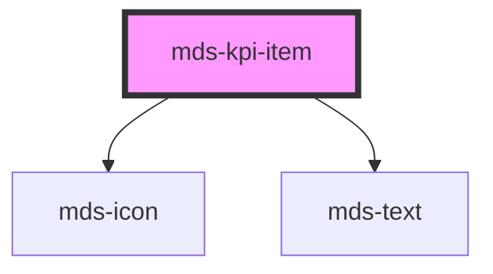

# mds-kpi-item

This is a web-component from Maggioli Design System [Magma](https://magma.maggiolicloud.it), built with StencilJS, TypeScript, Storybook. It's based on the web-component standard and it's designed to be agnostic from the JavaScript framework you are using.

<!-- Auto Generated Below -->

## Properties

| Property      | Attribute     | Description                                                  | Type                  | Default     |
| ------------- | ------------- | ------------------------------------------------------------ | --------------------- | ----------- |
| `description` | `description` | Specifies the description under the value in the KPI element | `string \| undefined` | `undefined` |
| `icon`        | `icon`        | Specifies the icon on the top of the KPI element             | `string \| undefined` | `undefined` |
| `label`       | `label`       | Specifies the number to be displayed in the KPI element      | `string \| undefined` | `undefined` |
| `threshold`   | `threshold`   | Specifies the page threshold which starts the text animation | `number \| undefined` | `0`         |

## Shadow Parts

| Part               | Description                                       |
| ------------------ | ------------------------------------------------- |
| `"content"`        | Selects the label and description wrapper element |
| `"icon"`           | Selects the icon element                          |
| `"icon-container"` | Selects the icon wrapper element                  |

## CSS Custom Properties

| Name                                             | Description                                         |
| ------------------------------------------------ | --------------------------------------------------- |
| `--mds-kpi-item-icon-color`                      | Set the fill color of the icon element              |
| `--mds-kpi-item-info-background`                 | Set the `background-color` of the text area element |
| `--mds-kpi-item-text-animation-placeholder-char` | Sets the animation placeholder char of the text     |
| `--mds-kpi-item-text-animation-speed`            | Sets the animation speed of the text                |

## Dependencies

### Depends on

- [mds-icon](../mds-icon)
- [mds-text](../mds-text)

### Graph

----------------------------------------------

Built with love @ [Gruppo Maggioli](https://www.maggioli.com) from [R&D Department](https://www.maggioli.com/it-it/chi-siamo/ricerca-sviluppo)
