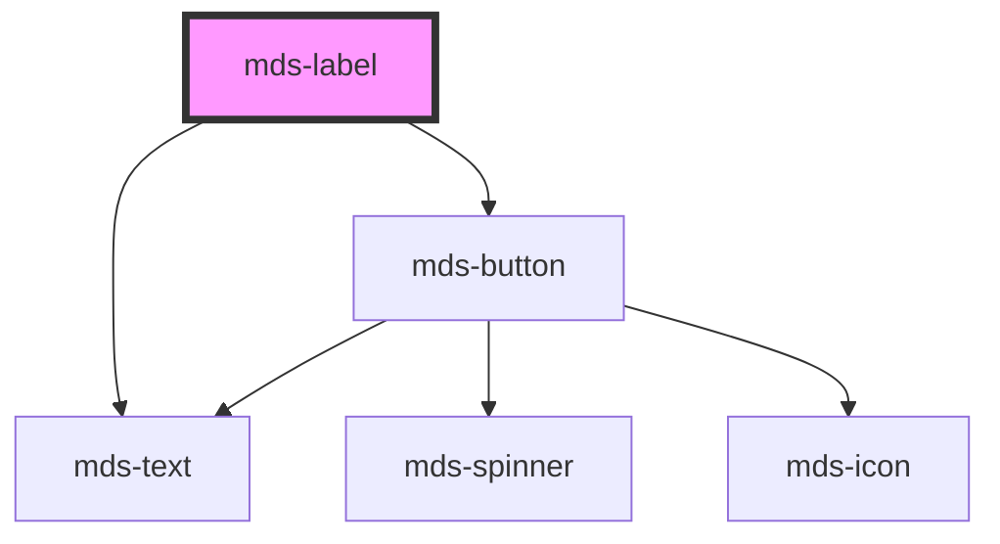

# mds-label


This is a web-component from Maggioli Design System [Magma](https://magma.maggiolicloud.it), built with StencilJS, TypeScript, Storybook. It's based on the web-component standard and it's designed to be agnostic from the JavaScript framework you are using.

<!-- Auto Generated Below -->


## Usage

### 1. Description

The `<mds-label>` web component is the Magma Design System tag/chip used to display a short, non-interactive piece of text such as a status, a category, or a removable selection.

#### Semantic Behavior

- **Text content**: The visible text comes from the `label` prop; the default slot is documented for text only - avoid placing HTML elements or components in it.
- **Deletable affordance**: When `deletable` is set, the component renders a trailing close button and emits the `mdsLabelDelete` event on activation; the deletion does not bubble to a surrounding clickable container.
- **Keyboard interaction**: While `deletable`, the close button can be triggered by keyboard as well as pointer.
- **Localization**: The close button's `title` is localized (el/en/es/it).

#### Properties & Visual Configurations

The `variant` and `tone` props follow the shared ladders defined in [`projects/stencil/SPEC.md`](../../../../SPEC.md#tone-and-variant-system); `tone` is limited to the minimal `'strong'` / `'weak'` set and defaults to `'weak'`.

#### Component-specific variants and tones

`variant` accepts both the theme label palette (e.g. `'sky'`, the default) and the status palette (`'error'`, `'warning'`, `'success'`, `'info'`). Pick a status value when the label communicates an outcome or state; pick a theme color when it is a neutral category or decorative tag.

#### Other behavioral props

- **`truncate`** controls overflow handling of the inner text: `'word'` (default) keeps it on one line, `'all'` truncates aggressively, and `'none'` allows multiline wrapping.
- **`typography`** selects a compact type scale (`'caption'`, `'detail'`, `'tip'`) appropriate to the label's small footprint, defaulting to `'caption'`.


### 2. Pattern

Correct and idiomatic ways to use the `<mds-label>` component, ordered from most common to most specialized. Patterns assume a working knowledge of the variant / tone ladders documented in [`docs/COMPONENTS.md`](../../../../../../docs/COMPONENTS.md) and the generic stencil rules in [`projects/stencil/SPEC.md`](../../../../SPEC.md).

#### Basic Label via `label` Prop

The canonical form. Use the `label` prop for the text; it is the only way to set visible content because the component renders no `<slot>` element.

```html
<mds-label label="Categoria"></mds-label>
```

#### Decorative Color via `variant`

Pick from the twelve label palette colors for neutral, decorative tags. Default is `sky`; change only when the color carries meaning to the user.

```html
<mds-label label="Ambiente" variant="green"></mds-label>
<mds-label label="Priorita'" variant="orange"></mds-label>
<mds-label label="Archivio" variant="violet"></mds-label>
<mds-label label="Bozza" variant="sky"></mds-label>
```

#### Status Variant for Outcome Communication

Use a status variant when the label communicates a system outcome or validation state, not just a decorative category.

```html
<mds-label label="Approvato" variant="success"></mds-label>
<mds-label label="In attesa" variant="warning"></mds-label>
<mds-label label="Rifiutato" variant="error"></mds-label>
<mds-label label="Informazione" variant="info"></mds-label>
```

#### Tone for Emphasis

Pair `tone="strong"` for higher-contrast situations; the default `weak` is lighter and suits most inline contexts.

```html
<!-- Default: subtle tinted background -->
<mds-label label="Etichetta" variant="blue" tone="weak"></mds-label>

<!-- Higher contrast: solid background -->
<mds-label label="Etichetta" variant="blue" tone="strong"></mds-label>
```

#### Deletable Label with `mdsLabelDelete` Event

Set `deletable` to render the trailing close button. Listen to `mdsLabelDelete` to remove the label from your model; the close button stops event propagation so clicks do not reach a surrounding interactive container.

```html
<mds-label label="Tag rimovibile" variant="purple" deletable></mds-label>
```

```javascript
document.querySelector('mds-label').addEventListener('mdsLabelDelete', () => {
  // rimuovi il tag dal modello
});
```

#### Truncation Control via `truncate`

Use `truncate="word"` (default) to clamp to one line on word boundaries. Use `truncate="none"` to allow multiline wrapping inside a constrained container.

```html
<!-- Single-line truncation (default) -->
<mds-label
  label="Testo molto lungo che supera il limite"
  truncate="word"
  variant="lime"
  class="w-3200"
></mds-label>

<!-- Multiline inside a narrow container -->
<mds-label
  label="Testo molto lungo che supera il limite"
  truncate="none"
  variant="lime"
  class="w-3200"
></mds-label>
```

#### Typography Scale

Choose `typography` to match the surrounding text hierarchy. The default `caption` suits most label contexts; use `detail` or `tip` only when the label sits alongside even smaller text.

```html
<mds-label label="Caption (default)" variant="aqua" typography="caption"></mds-label>
<mds-label label="Detail" variant="aqua" typography="detail"></mds-label>
<mds-label label="Tip" variant="aqua" typography="tip"></mds-label>
```

#### Styling Customization

Style the label only through its documented `--mds-label-*` CSS custom properties. Set them on the host or a parent selector; use Magma color tokens via `rgb(var(--<token>))` so dark mode and high-contrast modes keep working.

```css
.categoria-speciale mds-label {
  --mds-label-background: rgb(var(--label-orchid-08));
  --mds-label-color: rgb(var(--label-orchid-02));
  --mds-label-radius: var(--radius-sm);
  --mds-label-button-background: rgb(var(--label-orchid-07));
  --mds-label-button-icon-color: rgb(var(--label-orchid-03));
}
```


### 3. Antipattern

Common incorrect uses of `<mds-label>`. Each entry pairs the wrong form with the right one and a one-line reason. System-wide rules (boolean-as-string, shadow piercing, Tailwind color utilities, raw native event listening) live in [`docs/COMPONENTS.md`](../../../../../../docs/COMPONENTS.md#system-level-anti-patterns) - they apply here too but are not repeated.

#### Do Not Rely on the Default Slot for Visible Text

The component's `render()` method does not include a `<slot>` element, so content placed in the default slot is never rendered. Use the `label` prop exclusively.

```html
<!-- 🚫 INCORRECT -->
<mds-label>Stato documento</mds-label>

<!-- ✅ CORRECT -->
<mds-label label="Stato documento"></mds-label>
```

#### Do Not Use `<mds-label>` as a Form Input Label

`<mds-label>` is a standalone decorative tag for categories and statuses. It is not a replacement for `<label>` or for `mds-input-field`'s label slot, and it has no `for` / `htmlFor` association with form controls.

```html
<!-- 🚫 INCORRECT -->
<mds-label label="Nome utente"></mds-label>
<mds-input name="username"></mds-input>

<!-- ✅ CORRECT -->
<mds-input-field>
  <span slot="label">Nome utente</span>
  <mds-input slot="input" name="username"></mds-input>
</mds-input-field>
```

#### Do Not Set `deletable="false"` as a String

`deletable` is a boolean prop. Setting it to the string `"false"` is truthy in HTML and enables the close button. Remove the attribute entirely to disable the affordance.

```html
<!-- 🚫 INCORRECT -->
<mds-label label="Tag" deletable="false"></mds-label>

<!-- ✅ CORRECT -->
<mds-label label="Tag"></mds-label>
```

#### Do Not Use a Status Variant for Decorative Tags

Status variants (`error`, `warning`, `success`, `info`) communicate system outcomes. Using them for neutral categories misleads users about the meaning of the label.

```html
<!-- 🚫 INCORRECT: "Fauna" is a category, not an error state -->
<mds-label label="Fauna" variant="error"></mds-label>

<!-- ✅ CORRECT: use a decorative palette color -->
<mds-label label="Fauna" variant="green"></mds-label>
```

#### Do Not Nest Interactive Elements Inside `<mds-label>`

The component renders no slot; placing buttons or links in the default slot position has no effect. For a deletable label use `deletable` and listen to `mdsLabelDelete`.

```html
<!-- 🚫 INCORRECT -->
<mds-label label="Categoria">
  <button onclick="remove()">x</button>
</mds-label>

<!-- ✅ CORRECT -->
<mds-label label="Categoria" deletable></mds-label>
```

#### Customize via Documented Vars, Not Internal Selectors

The supported customization surface is `--mds-label-*` CSS custom properties. Targeting shadow internals via `::part()`, `>>>`, or undocumented class names couples your code to the Shadow DOM implementation and will break on minor releases.

```css
/* 🚫 INCORRECT */
mds-label >>> .text {
  font-weight: bold;
}

/* ✅ CORRECT */
mds-label {
  --mds-label-background: rgb(var(--label-blue-08));
  --mds-label-color: rgb(var(--label-blue-02));
  --mds-label-radius: var(--radius-sm);
}
```


## Properties

| Property     | Attribute    | Description                                                           | Type                                                                                                                                                                               | Default     |
| ------------ | ------------ | --------------------------------------------------------------------- | ---------------------------------------------------------------------------------------------------------------------------------------------------------------------------------- | ----------- |
| `deletable`  | `deletable`  | Enables the cross icon to perform cancel/delete action on element     | `boolean`                                                                                                                                                                          | `false`     |
| `label`      | `label`      | The label of the component                                            | `string \| undefined`                                                                                                                                                              | `undefined` |
| `tone`       | `tone`       | Sets the tone of the color variant                                    | `"strong" \| "weak"`                                                                                                                                                               | `'weak'`    |
| `truncate`   | `truncate`   | Truncates text inside the label or displays it in multiline if needed | `"all" \| "none" \| "word" \| undefined`                                                                                                                                           | `'word'`    |
| `typography` | `typography` | Specifies the typography of the element                               | `"caption" \| "detail" \| "tip"`                                                                                                                                                   | `'caption'` |
| `variant`    | `variant`    | Sets the theme variant colors                                         | `"amaranth" \| "aqua" \| "blue" \| "error" \| "green" \| "info" \| "lime" \| "orange" \| "orchid" \| "purple" \| "red" \| "sky" \| "success" \| "violet" \| "warning" \| "yellow"` | `'sky'`     |


## Events

| Event            | Description                              | Type                |
| ---------------- | ---------------------------------------- | ------------------- |
| `mdsLabelDelete` | Emits when the label has to be cancelled | `CustomEvent<void>` |


## Methods

### `updateLang() => Promise<void>`


#### Returns

Type: `Promise<void>`


## Dependencies

### Depends on

- [mds-text](../mds-text)
- [mds-button](../mds-button)

### Graph


----------------------------------------------

Built with love @ [Gruppo Maggioli](https://www.maggioli.com) from [R&D Department](https://www.maggioli.com/it-it/chi-siamo/ricerca-sviluppo)
