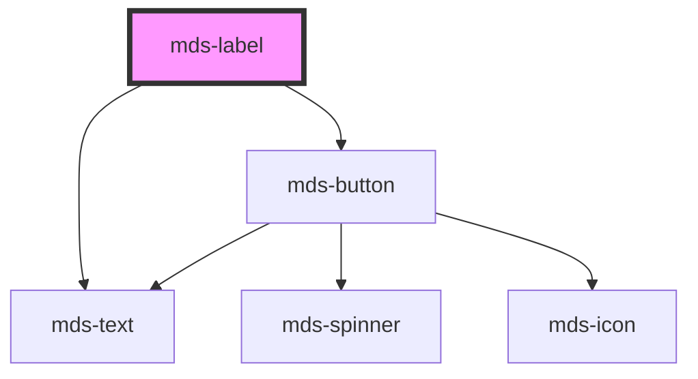

# mds-label

This is a web-component from Maggioli Design System [Magma](https://magma.maggiolicloud.it), built with StencilJS, TypeScript, Storybook. It's based on the web-component standard and it's designed to be agnostic from the JavaScript framework you are using.

<!-- Auto Generated Below -->

## Properties

| Property     | Attribute    | Description                                                           | Type                                                                                                                                                                               | Default     |
| ------------ | ------------ | --------------------------------------------------------------------- | ---------------------------------------------------------------------------------------------------------------------------------------------------------------------------------- | ----------- |
| `deletable`  | `deletable`  | Enables the cross icon to perform cancel/delete action on element     | `boolean`                                                                                                                                                                          | `false`     |
| `label`      | `label`      | The label of the component                                            | `string \| undefined`                                                                                                                                                              | `undefined` |
| `tone`       | `tone`       | Sets the tone of the color variant                                    | `"strong" \| "weak"`                                                                                                                                                               | `'weak'`    |
| `truncate`   | `truncate`   | Truncates text inside the label or displays it in multiline if needed | `"all" \| "none" \| "word" \| undefined`                                                                                                                                           | `'word'`    |
| `typography` | `typography` | Specifies the typography of the element                               | `"caption" \| "detail" \| "tip"`                                                                                                                                                   | `'caption'` |
| `variant`    | `variant`    | Sets the theme variant colors                                         | `"amaranth" \| "aqua" \| "blue" \| "error" \| "green" \| "info" \| "lime" \| "orange" \| "orchid" \| "purple" \| "red" \| "sky" \| "success" \| "violet" \| "warning" \| "yellow"` | `'sky'`     |

## Events

| Event            | Description                              | Type                |
| ---------------- | ---------------------------------------- | ------------------- |
| `mdsLabelDelete` | Emits when the label has to be cancelled | `CustomEvent<void>` |

## Methods

### `updateLang() => Promise<void>`

#### Returns

Type: `Promise<void>`

## CSS Custom Properties

| Name                                  | Description                                              |
| ------------------------------------- | -------------------------------------------------------- |
| `--mds-label-background`              | The background color of the label component.             |
| `--mds-label-button-background`       | The background color of a button inside the label.       |
| `--mds-label-button-background-hover` | The background color of the button when hovered.         |
| `--mds-label-button-icon-color`       | The color of the icon inside the button.                 |
| `--mds-label-color`                   | The text color of the label.                             |
| `--mds-label-icon-color`              | The color applied to any icon inside the label.          |
| `--mds-label-radius`                  | The border-radius of the label.                          |
| `--mds-label-selection-background`    | The background color applied when the label is selected. |
| `--mds-label-selection-color`         | The text color applied when the label is selected.       |

## Dependencies

### Depends on

- [mds-text](../mds-text)
- [mds-button](../mds-button)

### Graph

----------------------------------------------

Built with love @ [Gruppo Maggioli](https://www.maggioli.com) from [R&D Department](https://www.maggioli.com/it-it/chi-siamo/ricerca-sviluppo)
