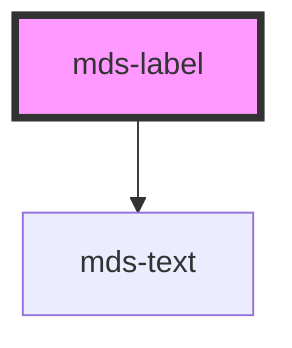

# mds-label

<!-- Auto Generated Below -->

## Properties

| Property      | Attribute      | Description                                                           | Type                                                                                                                                                                               | Default     |
| ------------- | -------------- | --------------------------------------------------------------------- | ---------------------------------------------------------------------------------------------------------------------------------------------------------------------------------- | ----------- |
| `deletable`   | `deletable`    | Enables the cross icon to perform cancel/delete action on element     | `boolean`                                                                                                                                                                          | `false`     |
| `labelAction` | `label-action` | Specifies the ARIA label for remove element                           | `string`                                                                                                                                                                           | `'Rimuovi'` |
| `tone`        | `tone`         | Sets the tone of the color variant                                    | `"quiet" \| "strong" \| "weak"`                                                                                                                                                    | `'quiet'`   |
| `truncate`    | `truncate`     | Truncates text inside the label or displays it in multiline if needed | `boolean`                                                                                                                                                                          | `true`      |
| `typography`  | `typography`   | Specifies the typography of the element                               | `"action" \| "caption" \| "detail" \| "h1" \| "h2" \| "h3" \| "h4" \| "h5" \| "h6" \| "hack" \| "label" \| "option" \| "paragraph" \| "snippet" \| "tip"`                          | `'caption'` |
| `variant`     | `variant`      | Sets the theme variant colors                                         | `"amaranth" \| "aqua" \| "blue" \| "dark" \| "error" \| "green" \| "info" \| "light" \| "lime" \| "orange" \| "orchid" \| "sky" \| "success" \| "violet" \| "warning" \| "yellow"` | `'sky'`     |

## Events

| Event            | Description                              | Type                |
| ---------------- | ---------------------------------------- | ------------------- |
| `mdsLabelDelete` | Emits when the label has to be cancelled | `CustomEvent<void>` |

## CSS Custom Properties

| Name                               | Description                                     |
| ---------------------------------- | ----------------------------------------------- |
| `--mds-label-background`           | Sets the background-color of the component      |
| `--mds-label-color`                | Sets the text color of the component            |
| `--mds-label-icon-color`           | Sets the color of the icon                      |
| `--mds-label-selection-background` | Sets the selection background color of the text |
| `--mds-label-selection-color`      | Sets the selection color of the text            |

## Dependencies

### Depends on

- [mds-text](../mds-text)

### Graph

----------------------------------------------

Built with love @ **Maggioli Informatica / R&D Department**
