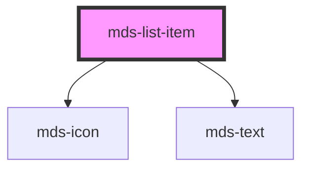

# mds-list-item


This is a web-component from Maggioli Design System [Magma](https://magma.maggiolicloud.it), built with StencilJS, TypeScript, Storybook. It's based on the web-component standard and it's designed to be agnostic from the JavaScript framework you are using.

<!-- Auto Generated Below -->


## Usage

### 1. Description

The `<mds-list-item>` web component is the single entry of a Magma list, designed to be slotted exclusively inside its parent [`<mds-list>`](../../mds-list). It plays the role of a native `<li>`, pairing a leading icon with a text string so that the parent `<mds-list>` can present a coherent, accessible list.

#### Semantic Behavior

- **Compound child only**: Must be placed as a direct default-slot child of `<mds-list>`; it is not used standalone or mixed with other element types.
- **Leading icon is always present**: The component renders an icon before its text; when no `icon` is supplied it falls back to a built-in list-dot glyph, which is decorative.
- **Text-only default slot**: The default slot is intended for a plain text string; adding HTML elements or other components here is discouraged.

#### Properties & Visual Configurations

- **`typography`**: Selects the text style of the item (default `detail`), drawn from the shared typography scale; pick the value that matches the density and hierarchy of the surrounding list content.
- **`variant`**: Refines the chosen `typography` (default `info`); use `read` for long-form reading contexts and `info` for compact informational lists.
- **`icon`**: Overrides the default list-dot with a named icon when a list entry benefits from a meaningful leading glyph; leave unset to keep the standard bullet.


### 2. Pattern

Correct and idiomatic ways to use the `<mds-list-item>` component, ordered from most common to most specialized. Patterns assume a working knowledge of the typography scale documented in [`projects/stencil/SPEC.md`](../../../../SPEC.md) and the generic stencil rules in [`docs/COMPONENTS.md`](../../../../../../docs/COMPONENTS.md).

#### Basic List with Default Bullet

The canonical form. Place one or more `<mds-list-item>` elements as direct children of [`<mds-list>`](../../mds-list). Text content goes in the default slot. When no `icon` is provided the component renders the built-in list-dot glyph automatically.

```html
<mds-list>
  <mds-list-item>Pane</mds-list-item>
  <mds-list-item>Acqua</mds-list-item>
  <mds-list-item>Pasta</mds-list-item>
</mds-list>
```

#### Typography Scale

Use the `typography` prop to match the text density of the surrounding content. The default is `detail`; switch to `paragraph` for body-text contexts or `caption` / `tip` for fine-print lists.

```html
<mds-list>
  <!-- Body-text list -->
  <mds-list-item typography="paragraph">Seleziona un elemento dalla lista</mds-list-item>
  <mds-list-item typography="paragraph">Conferma la scelta effettuata</mds-list-item>
  <mds-list-item typography="paragraph">Salva le modifiche apportate</mds-list-item>
</mds-list>

<mds-list>
  <!-- Fine-print annotation list -->
  <mds-list-item typography="caption">I campi contrassegnati sono obbligatori</mds-list-item>
  <mds-list-item typography="caption">La password deve contenere almeno 8 caratteri</mds-list-item>
</mds-list>
```

#### Reading Variant

Use `variant="read"` for long-form reading contexts (articles, documentation); keep the default `variant="info"` for compact informational lists in UI panels.

```html
<!-- Long-form reading context -->
<mds-list>
  <mds-list-item typography="paragraph" variant="read">
    Il servizio e disponibile dal lunedi al venerdi, dalle 9 alle 18.
  </mds-list-item>
  <mds-list-item typography="paragraph" variant="read">
    Per assistenza urgente contattare il numero verde dedicato.
  </mds-list-item>
</mds-list>
```

#### Custom Leading Icon

Supply an icon slug via the `icon` prop to replace the default bullet with a meaningful glyph. Use this when each entry maps to a distinct category or action.

```html
<mds-list>
  <mds-list-item icon="mi/baseline/check-circle">Account verificato</mds-list-item>
  <mds-list-item icon="mi/baseline/lock">Accesso sicuro attivato</mds-list-item>
  <mds-list-item icon="mi/baseline/notifications">Notifiche abilitate</mds-list-item>
</mds-list>
```

#### Uniform Icon Across All Items

When every item shares the same icon - for example a checklist or a feature list - set the same `icon` on each item for visual consistency.

```html
<mds-list>
  <mds-list-item icon="mi/baseline/check">Supporto multilingua incluso</mds-list-item>
  <mds-list-item icon="mi/baseline/check">Aggiornamenti automatici</mds-list-item>
  <mds-list-item icon="mi/baseline/check">Assistenza prioritaria 24/7</mds-list-item>
</mds-list>
```

#### Styling Customization via CSS Custom Property

Adjust the icon margin through the documented `--mds-list-item-icon-margin` CSS custom property. Set it on the host or a parent selector; use Magma spacing tokens for consistency.

```css
.compact-list mds-list-item {
  --mds-list-item-icon-margin: 0 var(--spacing-100) 0 0;
}
```

#### Styling the Icon Part

Use the documented `::part(icon)` surface to tint or resize the leading icon. Prefer Magma color tokens to keep dark-mode compatibility.

```css
.status-list mds-list-item::part(icon) {
  fill: rgb(var(--status-success-05));
}
```


### 3. Antipattern

Common incorrect uses of `<mds-list-item>`. Each entry pairs the wrong form with the right one and a one-line reason. System-wide rules (boolean-as-string, shadow piercing, Tailwind color utilities, raw native event listening) live in [`docs/COMPONENTS.md`](../../../../../../docs/COMPONENTS.md#system-level-anti-patterns) - they apply here too but are not repeated.

#### Do Not Use `<mds-list-item>` Outside `<mds-list>`

`<mds-list-item>` is a compound child; it must be a direct default-slot child of [`<mds-list>`](../../mds-list). Using it standalone removes the list context that assistive technology relies on.

```html
<!-- 🚫 INCORRECT -->
<div>
  <mds-list-item>Primo elemento</mds-list-item>
  <mds-list-item>Secondo elemento</mds-list-item>
</div>

<!-- ✅ CORRECT -->
<mds-list>
  <mds-list-item>Primo elemento</mds-list-item>
  <mds-list-item>Secondo elemento</mds-list-item>
</mds-list>
```

#### Do Not Put HTML Elements in the Default Slot

The default slot accepts plain text only; nested elements are stripped or break layout. Use the `typography` and `variant` props to control text style instead.

```html
<!-- 🚫 INCORRECT -->
<mds-list>
  <mds-list-item>
    <strong>Titolo voce</strong>
    <small> - descrizione aggiuntiva</small>
  </mds-list-item>
</mds-list>

<!-- ✅ CORRECT -->
<mds-list>
  <mds-list-item typography="detail">Titolo voce - descrizione aggiuntiva</mds-list-item>
</mds-list>
```

#### Do Not Slot `<mds-icon>` to Add a Leading Icon

The `icon` prop renders the glyph through the shared icon service and positions it correctly. Slotting `<mds-icon>` puts it in the text-only default slot, where it is stripped or misaligned.

```html
<!-- 🚫 INCORRECT -->
<mds-list>
  <mds-list-item>
    <mds-icon name="mi/baseline/check"></mds-icon>
    Servizio attivo
  </mds-list-item>
</mds-list>

<!-- ✅ CORRECT -->
<mds-list>
  <mds-list-item icon="mi/baseline/check">Servizio attivo</mds-list-item>
</mds-list>
```

#### Do Not Use a `typography` Value Outside the Accepted Set

`<mds-list-item>` accepts only `TypographyInfoType | TypographyReadType`: `caption`, `detail`, `label`, `option`, `paragraph`, `tip`. Heading values like `h1`-`h6` or `action` are not accepted and will silently fall back to the default.

```html
<!-- 🚫 INCORRECT -->
<mds-list-item typography="h3">Titolo sezione</mds-list-item>
<mds-list-item typography="action">Azione</mds-list-item>

<!-- ✅ CORRECT -->
<mds-list-item typography="detail">Voce elenco</mds-list-item>
<mds-list-item typography="paragraph">Descrizione estesa della voce</mds-list-item>
```

#### Do Not Pierce Shadow DOM to Style the Icon or Text

The supported customization surface is `--mds-list-item-icon-margin` for layout and `::part(icon)` / `::part(text)` for the two documented shadow parts. Targeting internals via `>>>` or undocumented class names couples code to the implementation.

```css
/* 🚫 INCORRECT */
mds-list-item >>> .icon {
  fill: red;
}

/* ✅ CORRECT */
mds-list-item::part(icon) {
  fill: rgb(var(--status-error-05));
}
```

#### Do Not Replace `<mds-list>` + `<mds-list-item>` with a Raw `<ul>` + `<li>`

When a Magma list is needed, use the component pair - not raw HTML. Raw elements bypass the design-system theming, token integration, and high-contrast support.

```html
<!-- 🚫 INCORRECT -->
<ul>
  <li>Documento ricevuto</li>
  <li>In attesa di approvazione</li>
</ul>

<!-- ✅ CORRECT -->
<mds-list>
  <mds-list-item>Documento ricevuto</mds-list-item>
  <mds-list-item>In attesa di approvazione</mds-list-item>
</mds-list>
```


## Properties

| Property     | Attribute    | Description                                 | Type                                                                   | Default     |
| ------------ | ------------ | ------------------------------------------- | ---------------------------------------------------------------------- | ----------- |
| `icon`       | `icon`       | Specifies the icon displayed in the element | `string \| undefined`                                                  | `undefined` |
| `typography` | `typography` | Specifies the typography of the element     | `"caption" \| "detail" \| "label" \| "option" \| "paragraph" \| "tip"` | `'detail'`  |
| `variant`    | `variant`    | Specifies the variant for `typography`      | `"info" \| "read" \| undefined`                                        | `'info'`    |


## Slots

| Slot | Description                                                                            |
| ---- | -------------------------------------------------------------------------------------- |
|      | Add `text string` to this slot, **avoid** to add `HTML elements` or `components` here. |


## Shadow Parts

| Part     | Description |
| -------- | ----------- |
| `"icon"` |             |
| `"text"` |             |


## CSS Custom Properties

| Name                          | Description                             |
| ----------------------------- | --------------------------------------- |
| `--mds-list-item-icon-margin` | Sets the margin of the component's icon |


## Dependencies

### Depends on

- [mds-icon](../mds-icon)
- [mds-text](../mds-text)

### Graph


----------------------------------------------

Built with love @ [Gruppo Maggioli](https://www.maggioli.com) from [R&D Department](https://www.maggioli.com/it-it/chi-siamo/ricerca-sviluppo)
