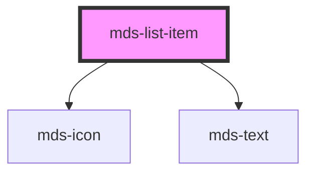

# mds-list-item

This is a web-component from Maggioli Design System [Magma](https://magma.maggiolicloud.it), built with StencilJS, TypeScript, Storybook. It's based on the web-component standard and it's designed to be agnostic from the JavaScirpt framework you are using.

<!-- Auto Generated Below -->

## Properties

| Property     | Attribute    | Description                                 | Type                                                                   | Default     |
| ------------ | ------------ | ------------------------------------------- | ---------------------------------------------------------------------- | ----------- |
| `icon`       | `icon`       | Specifies the icon displayed in the element | `string \| undefined`                                                  | `undefined` |
| `typography` | `typography` | Specifies the typography of the element     | `"caption" \| "detail" \| "label" \| "option" \| "paragraph" \| "tip"` | `'detail'`  |
| `variant`    | `variant`    | Specifies the variant for `typography`      | `"info" \| "read" \| undefined`                                        | `'info'`    |

## Slots

| Slot        | Description                                                                            |
| ----------- | -------------------------------------------------------------------------------------- |
| `"default"` | Add `text string` to this slot, **avoid** to add `HTML elements` or `components` here. |

## Shadow Parts

| Part     | Description |
| -------- | ----------- |
| `"icon"` |             |
| `"text"` |             |

## CSS Custom Properties

| Name                          | Description                             |
| ----------------------------- | --------------------------------------- |
| `--mds-list-item-icon-margin` | Sets the margin of the component's icon |

## Dependencies

### Depends on

- [mds-icon](../mds-icon)
- [mds-text](../mds-text)

### Graph

----------------------------------------------

Built with love @ [Gruppo Maggioli](https://www.maggioli.com) from [R&D Department](https://www.maggioli.com/it-it/chi-siamo/ricerca-sviluppo)
