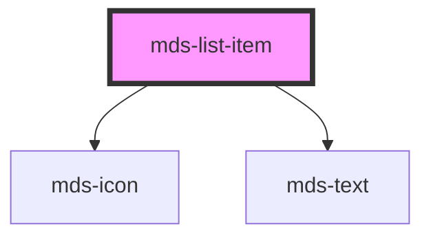

# mds-list-item

<!-- Auto Generated Below -->

## Properties

| Property     | Attribute    | Description                             | Type                                                                   | Default    |
| ------------ | ------------ | --------------------------------------- | ---------------------------------------------------------------------- | ---------- |
| `icon`       | `icon`       | Specifies the typography of the element | `string \| undefined`                                                  | `null`     |
| `typography` | `typography` | Specifies the typography of the element | `"caption" \| "detail" \| "label" \| "option" \| "paragraph" \| "tip"` | `'detail'` |
| `variant`    | `variant`    | Specifies the variant for `typography`  | `"info" \| "read" \| undefined`                                        | `'info'`   |

## Shadow Parts

| Part     | Description |
| -------- | ----------- |
| `"icon"` |             |
| `"text"` |             |

## CSS Custom Properties

| Name                          | Description                             |
| ----------------------------- | --------------------------------------- |
| `--mds-list-item-icon-margin` | Sets the margin of the component's icon |

## Dependencies

### Depends on

- [mds-icon](../mds-icon)
- [mds-text](../mds-text)

### Graph

----------------------------------------------

Built with love @ **Maggioli Informatica / R&D Department**
