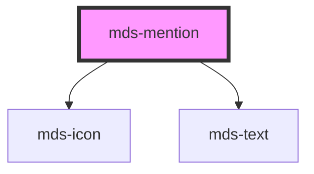

# mds-mention

<!-- Auto Generated Below -->

## Properties

| Property | Attribute | Description                                  | Type                                | Default     |
| -------- | --------- | -------------------------------------------- | ----------------------------------- | ----------- |
| `icon`   | `icon`    | Sets the icon shown at the left of the label | `string \| undefined`               | `undefined` |
| `label`  | `label`   | Sets the label of the component              | `string \| undefined`               | `undefined` |
| `size`   | `size`    | Sets the label of the component              | `"lg" \| "md" \| "sm" \| undefined` | `'sm'`      |

## CSS Custom Properties

| Name                      | Description                                           |
| ------------------------- | ----------------------------------------------------- |
| `--mds-mention-icon-size` | Sets the size (width and height) of the mention icon. |

## Dependencies

### Depends on

- [mds-icon](../mds-icon)
- [mds-text](../mds-text)

### Graph

----------------------------------------------

Built with love @ [Gruppo Maggioli](https://www.maggioli.com) from [R&D Department](https://www.maggioli.com/it-it/chi-siamo/ricerca-sviluppo)
